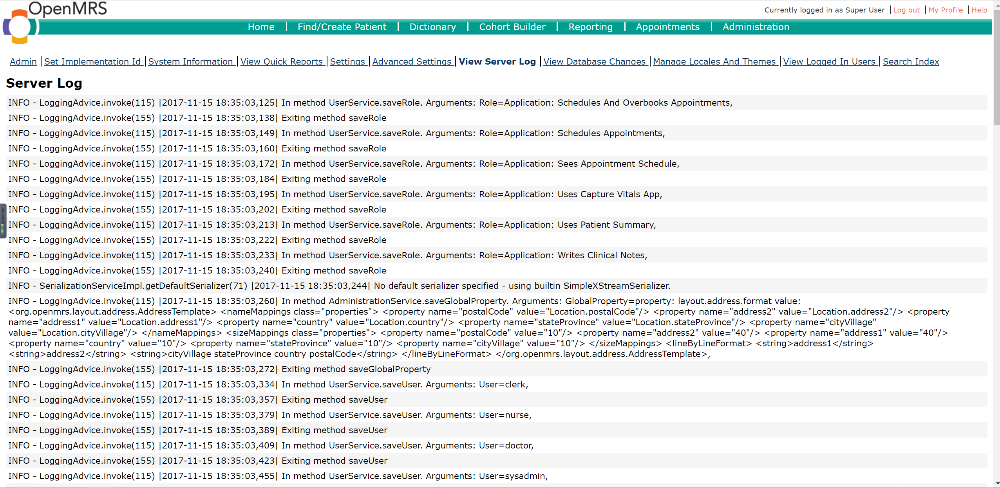
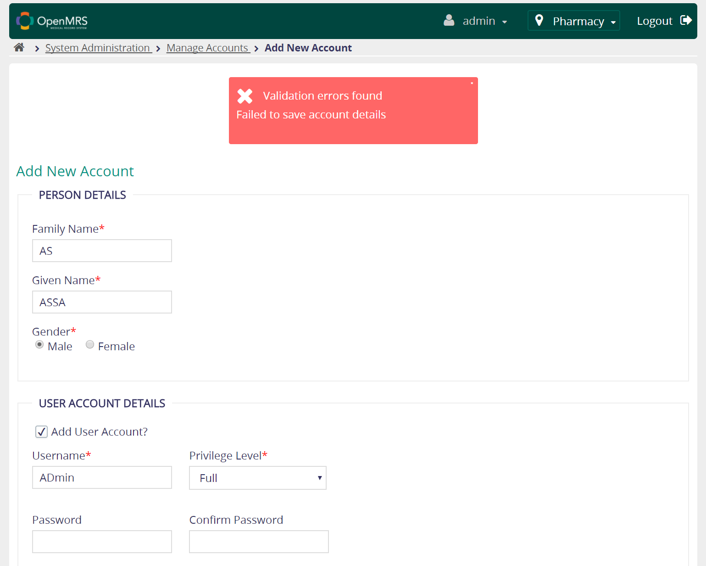
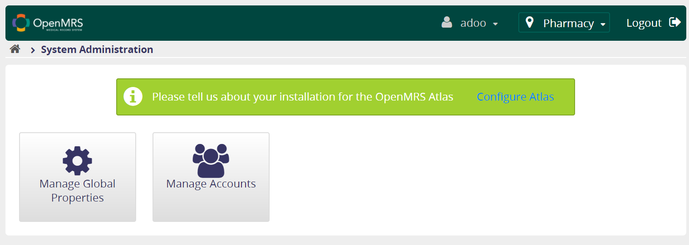

# CSC 515 - Milestone 4 #

## 1 - Architectural Design Principles

### ADP01
Least Privilege : A subject (user/other system) should be given only those privileges it needs to complete its task.

Test Step:
* Step 1: Log in as System admin(sysadmin).
* Step 2: Then enter Appointment Scheduling and click Manage Service Types.
* Step 3: Click New Service Type then copy the url.http://localhost:8082/openmrs-standalone/appointmentschedulingui/appointmentType.page
* Step 4: Log out and Log in as an clerk.
* Step 5: Paste the url and then you will find you can manage the service type as a clerk.

Result: Failed. As we can see, the privilege of a clerk only include manage appointments, daily appointments and appointments required. Service type is not a function that the clerk can manage.

Solution: The system should manage the access control using something like Role Based Access Control instead of url access. The system should check the role on both client and server side.

### ADP02
Don’t allow modification or access without a trace : Users should not be able to add, edit or delete data without the action being logged. Moreover, the log file should log who takes the action.

Test Step:
* Step 1: Log in as admin(admin).
* Step 2: Then click Find Patient Record.
* Step 3: Click on an existing Patient Record.
* Step 4: Delete this patient.
* Step 5: Check if there are log files which has monitored who delete this patient.

Result: Failed. The log file only records the delete reason and fail to record who delete this patient. Moreover, the log file use separate log lines to record one delete action. This would make mistakes when multiple user are using the system. The system doesn't recognize who delete the patient.

Solution : Log files should remember the user who click on every add, delete or other changes on the database. The delete function should be the same with add or save in the log files regards the Argument. So the log files related to delete function should be In method PatientService.voidPatient(this is better to be deletePatient). Argument: user = "", Patient = "", String = "".

### ADP03
Quiet Your Error Messages : Attackers can cause system errors intentionally to gather information about the system. Error messages should be minimalist, without giving details on the failure.

Test Step:
* Step 1: Log in as admin(admin).
* Step 2: Click register a patient.
* Step 3: Delete the appId part of the url. http://localhost:8082/openmrs-standalone/registrationapp/registerPatient.page
* Step 4: See if there are some detailed error message.

Result: Failed. There are detailed error message about the source code. The hacker can try multiple error to get the logic and detail about the source code.

Solution: The system should only return a simple error message without showing any detail about the code. E.g. 404 Error.

## 2 - Usable Security Principles ##

### A. Visibility: ###

The administrative interface should allow users to easily review any active authority relationships that would affect security-relevant decisions. However OpenMRS don’t have this function. All the log information is stored within server information, and it is hard to find out the active authority relationships.

**Static Analysis**

**Test ID**: V-1

| Test step         | Test data     | States  |
| :---              | :---           | :---        |
|1. Log in as Admin	| account: admin   password: Admin123   location: Pharmacy | You should see **System Administration**   |
|2. Click **System Administration** | | You could find **Advance Administration** option |
|2. Click **Advance Administration** | | You could find **Manage Roles** option |
|3. Click **Manage Roles** | |  |
|4. Make any change (like adding a role) and click save | | |
|5. Go back to **Advance Administration** and click **View Server Log** | | You should able to see that your operation is stored in the log with many other server logs |

**Assumption:** OpenMRS runs normally through the whole test process.

**Expected Result:** OpenMRS should have a function or UI allowing the user to easily review any active authority relationships that would affect security-relevant decisions.

**Actual Result:** 
The operation is stored in the log with many other server logs.

**Solution:** OpenMRS should implement a function to only show the active authority relationships that would affect security-relevant decisions.

### B. Clarity: ###
The administrative interface should not be misleading, ambiguous. However OpenMRS has some ambiguous error messages when registering a new user. Admin user needs to check the log information to know what is wrong during registration process.

**Static Analysis**

**Test ID**: C-1

| Test step         | Test data     | States  |
| :---              | :---           | :---        |
|1. Log in the system with wrong password | account: admin   password: wrong   location: Pharmacy  | You should see **System Administration**   |
|2. Click **System Administration** | | You should see **Manage Account** |
|3. Click **Manage Account** | | You should be able to **Add New Account**.|
|5. Add a new account with any name, username and other setting, but with password as abcd1234 and click **save** | password: abcd1234 | |

**Assumption:** OpenMRS runs normally through the whole test process.

**Expected Result:** OpenMRS should give user a clear error message about which part is wrong instead of just saving them in the log file.

**Actual Result:** 
The error message only shows it is a "Validation Error" without specifying which part goes wrong.

**Solution:** OpenMRS could summarize the error from the log and change the error message displayed into a more specific one. 

### C. Expected ability: ###
The administrative interface must not generate the impression that it is possible to do something that cannot actually be done. But OpenMRS sometimes gives user a feeling that they can do what they can’t do.

**Static Analysis**

**Test ID**: E-1

| Test step         | Test data     | States  |
| :---              | :---           | :---        |
|1. Log in the system with wrong password | account: admin   password: wrong   location: Pharmacy  | You should see **System Administration**   |
|2. Click **System Administration** | | You should see **Manage Account** |
|3. Click **Manage Account** | | You should be able to **Add New Account**.|
|4. Add a new account with only **Requests Appointments** privilege. Other fields are any personal choices that pass the validation |||
|5. Log out from admin account and Log in as the new user created|| No button in the main Page |
|6. Put URL *http://localhost:8080/openmrs-standalone/coreapps/systemadministration/systemAdministration.page* into browser and go to the page ||  |

**Assumption:** OpenMRS runs normally through the whole test process on port 8080.

**Expected Result:** The new user still could not see any options or buttons in the that page. And OpenMRS should not display any page that is above current user’s privilege.

**Actual Result:**
*Manage Global Properties* and *Manage Account* functions are now accessible to the new user.

**Solution:** OpenMRS should not redirect user to any page that they should not access. Full authentication function in the backend needs to be implemented.

## 3 - Protection Poker ##

### Requirements ###

#### Overview ####
In this part we proposed five functional requirements to be evaluated by protection poker . 

#### Requirement 1: Adding Message of Failing Logging in ####
To improve user experience, when user fails logging in and is redirected back to the logging page, there should be a failure message displayed on the logging page. To be visible enough to users, the font of the message should be larger than common text. In addition, the message should not be placed in the corner of the page and should be displayed in red. To be unambiguous to users, the message should be written in human language and contain the reason why logging in fails (e.g. "Wrong Username or Password").

#### Requirement 2: Adding Field of Driver License Number ####
To achieve better identification of patient, when registering new patient, the user could ask patient for his/her driver license number and input it to the system. Correspondingly, a new field for driver license number should be added to the Registering Page. This field should not be a necessary field for registration.

#### Requirement 3: Better System Error Message ####
To prevent sensitive information being leaked, once the user meets a system error, the user interface should show the user appropriate error message instead of a stack/error trace which contain useful information about the application’s internal design, like java classes, libraries used or database table names. The message should be a summary of the error in human language without containing any sensitive information.

#### Requirement 4: Registering only at Registration Desk ####
To achieve better management, common users (e.g. clerk) with the ability of registering new patient could only register patients when logging in with location as "Registration Desk". Correspondingly, without logging in with selecting location as "Registration Desk", the "Register new Patient" button should not be accessible to users. However, the admin user could register a new patient everywhere.

#### Requirement 5: Removing Data Management Function ####
Since user could merge patients in the patient's page, the is no need of keeping "Data Management" module (The only function in this module is merging patients). The "Data Management" button should be no longer accessible to users in the main page. The ""Data Management" page should be removed.

### Database Domains Value Points ###

Instead of using tables in this part, we used domains which organize the database tables in terms of the various information and also usage of the system. The points to choose from: **[ 1, 2, 3, 5, 8, 13, 20, 40, 100 ]**.

| Domain			| Description		| Value		| 
| :---              | :---      		| :--- 		|
| Concept | Concepts are defined and used to support strongly coded data throughout the system. Drug data are stored in this domain | 40 |
| Encounter | Contains the meta-data regarding health care providers interventions with a patient. Some data like location and provider are stored in this domain | 20 |
| Form | The user interface description for the various components. Not important but may contain some information could be used by attacker. | 13 |
| Observation | This is where the actual health care information is stored. This domain contains some private medical information like drug usage. | 20 |
| Order | Things/actions that have been requested to occur | 20 |
| Patient | Basic information about patients in this system. This domain does not contain much private information (which is actually stored in Person domain). So it is not set as the most valuable one. | 40 |
| User | Basic information about the people that use this system. Username and password of system account are stored in this domain. | 100 |
| Person | Basic information about person in the system. Most private information such as address, mobile are stored in this domain. | 100 |
| Business | Non medical data used to administrate openMRS. This domain contains some data like report, which may contain sensitive data  | 20 |
| Groups/Workflow | Workflows and Cohort data. Patient program and patient state are stored in this domain | 20 |

Reference:  [https://wiki.openmrs.org/display/docs/Data+Model](https://wiki.openmrs.org/display/docs/Data+Model)

### Database Domains Used by Requirement ###

| Requirement		| Domain Used	| Value Sum |
| :---              | :---      	| :--- 	|
| R1             	| Form			 		| 13		|
| R2             	| Form, Person			| 113		| 
| R3             	| Form 					| 13		| 
| R4             	| Form, Encounter 		| 33 		| 
| R5             	| Form		 			| 13 		| 

### Security Ranking ###

| Requirement | Ease of Attack Points | Value of Asset Points | Security Risk | Rank of Security Risk |
| :---      | :---      			| :--- 				  | :---			| :---		| 
| R1        | 	     	3		  	| 	13				  | 39				| 4			| 
| R2       	| 	     	13		  	| 	113				  | 1469			| 1			|   
| R3      	| 	 		1			| 	13 				  | 13				| 5			| 
| R4       	| 	      	2		  	| 	33				  | 66				| 3			| 
| R5       	| 	      	8		  	| 	13				  | 104				| 2			| 

### Explanation ###

To evaluate security risk of each requirement, the first step is evaluating values of different domains. How each domains is assigned is described in the **Description** column in the table of **Database Domains Value Points**. The value of asset points of each requirement is the sum of values of the domain it used. 

The ease of attack points of each requirement is decided by protection poker and discussions among group members. The points are also chosen from **[ 1, 2, 3, 5, 8, 13, 20, 40, 100 ]**. Among the five requirements, the 3rd requirement is selected as the hardest to attack. It removes detailed stack trace and uses appropriate error message. As a result, sensitive information contained in the stack trace could be avoided from being leaked. Thus it is assigned with 1 ease of attack point.

Starting from the 1st requirement, it adds UI elements in client side which could be integrated with malicious script. However, the content of the message is usually fixed and not related with user input. As a result, the ease of attack point should be about 3.
The 2nd requirement adds a new field (attack surface) of driver license number in registration page. Especially for the new field may not validate input as old fields, the attacker could easily inject malicious scripts via client side. However, considering the input validation in server side and Hibernate framework, the ease of attack point of this requirement is assigned with 13.
The 4th requirement doesn't increase or reduce attack surface. But considering that the implementation of the requirement may add some condition checking, breaking the condition checking may be one attack method. The ease of attack point of this requirement is assigned with 2.
The 5th requirement (Removing Data Management Function) reduces redundant pages (attack surfaces).  However, removing existing functionality and page may cause new vulnerability (e.g. exposed interface). Thus the ease of attack points is estimated to be 8.

In the end, the security risk can be calculated by **Security Risk = (Ease of Attack Points) * (Value of Asset Points)**. And the rank of security risk is assigned based on the security points.

## 4 - Bug Fixes ##

### Client Bypass -1- LOGIN PAGE INTEGER BUFFER OVER FLOW

##### * Description
##### Name of module : OpenMRS login
+ Page location : http://localhost:8081/openmrs-standalone/login.htm
+ Attack type : Buffer overflow
+ Attack value : 99999999999999999999
+ Location value was overflow leading to exposure of stack trace info

#### * Bug Fix
#### Original code

 
#### Modified code

 
We trim the raw location session string into 3 characters in length to avoid the overflow error when the program tries to cast the string into integer.

----------

### Client Bypass -3- LOGIN PAGE REDIRECT

### * Description
#### Name of module : OpenMRS login
+ Page location : http://localhost:8081/openmrs-standalone/login.htm
+ Attack type : unauthorized redirect after login
+ Attack value : %2Fopenmrs-standalone%2Fappui%2Fheader%2Flogout.action%3FsuccessUrl%3Dopenmrs-standalone
In this test, we will redirect logged in user to a logout page, aiming for an illusion that user's credential was not correct. The exploit is simple yet can cause a massive confusion as well as effective denial of service

### * Bug Fix
#### Original code

 
#### Modified code

 
We replace all referral URL value that contains "logout.page" and turn it into "home.page"

----------

### Fortify analysis -2- COMMAND LINE INJECTION

### * Description
#### Name of module : OpenMRS login
The method execMysqlCmd() in MigrateDataSet.java:187 calls exec() with a command built from untrusted data. This call can cause the program to execute malicious commands on behalf of an attacker.

### * Bug Fix
#### Original code

 
#### Modified code

 
Make the variable private and use a maping table to map certain whitelisted inputs to certain relevant database parameters (table names, etc). The case in the screenshot is done by explicitly assign the database name to the variable. This warning is common in many files so it has to be up to each developer to do his/her own whitelisting

----------

#### Fortify analysis -3- PRIVACY VIOLATION

### * Description
#### Name of module : OpenMRS login
The method authenticate() in Context.java:287 mishandles confidential information, which can compromise user privacy and is often illegal. More specifically, the password enters the program, and the statement log.debug("Authenticating with username: " + username); in authenticate() will display the username in log when debug is enabled.

### * Bug Fix
#### Original code

 
#### Modified code

 
Follow recommendations at https://wiki.openmrs.org/display/docs/Security+and+Encryption we encode the plain password using the built-in "encodeString" function. This change has to be made accross all authentication functions that use plain password as input.

----------

### Fortify analysis -4- PASSWORD IN CONFIGURATION FILE

### * Description
#### Name of module : OpenMRS login
In liquibase-core-data.xml:5, the password is stored as plaintext in the configuration file. Storing a plaintext password in a configuration file may result in a system compromise.

### * Bug Fix
#### Original code

 
#### Modified code

 
Follow recommendations at https://wiki.openmrs.org/display/docs/Security+and+Encryption we encode the plain password using the built-in "encodeString" function. This change has to be made accross all authentication functions that output password into XML files.
